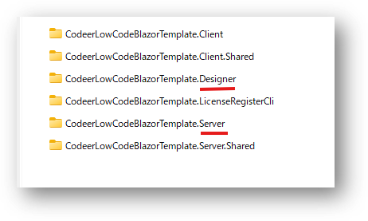
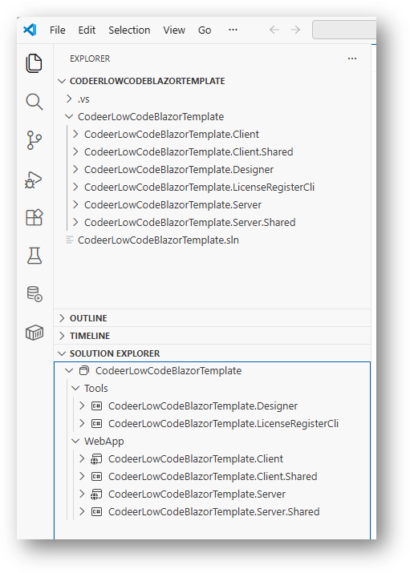
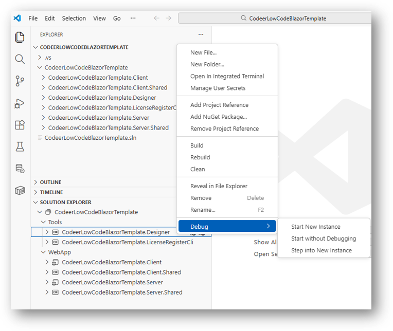

# Visual Studio Codeを使う

## 概要
Codeer.LowCode.Blazorが提供するプロジェクトテンプレートは、
Visual Studio以外に、Visual Studio Code(以下VS Codeと略す)を使うこともできます。  
VS Codeを使って、以下のことができます:
- デザイナ、Webサーバーアプリ等、Codeer.LowCode.Blazorが提供するプロジェクトテンプレートをビルド・デバッグ・発行する
- C#/JS/CSS等を用いてローコードアプリに新しい機能を追加する

## 準備
- .NET SDK 8.0
- VS Code
- VS Code拡張機能 `C# Dev Kit` (Microsoft社製)
- Codeer.LowCode.Blazorのソリューションテンプレート  
以下のURLからクローンできます:

`https://github.com/Codeer-Software/Codeer.LowCode.Blazor.Manual/tree/main/ProjectTemplates/CodeerLowCodeBlazor/CodeerLowCodeBlazorTemplate`

## ソリューションの構成
テンプレートの構成は以下のとおりです。

- DesignerとServerプロジェクトをビルドすることで、それぞれのアプリが作成されます。
- Client.Sharedプロジェクトはカスタムフィールドやプロコード等の共通コードの配置に用いられ、DesignerやServerから参照されます。
- LicenseRegisterCliプロジェクトでライセンス認証用のコマンドラインツールが作成されます。
- その他のプロジェクトは、共通コードの配置や、Designer/Serverのビルドに必要なプロジェクトです。

## VS Codeでの各種操作
### `C# Dev Kit`が正常に動作していることを確認します
VS Codeでソリューションフォルダを開きます。  
メニューバー `File` → `Open Folder...` でソリューションファイル(`.sln`)が入っているフォルダを開いてください。

`C# Dev Kit`が正常に作動している場合は、`SOLUTION EXPLORER` が表示されます。  

### DesignerをDebug実行します
1. 必要に応じてブレークポイントを設定します。
2. `SOLUTION EXPLORER` で `Designer` プロジェクトを右クリックして `Debug` →　`Start New Instance` を選択します。  
3. デザイナアプリが起動します。

### ServerをDebug実行します
1. 必要に応じてブレークポイントを設定します。
2. `SOLUTION EXPLORER` で `Server` プロジェクトを右クリックして `Debug` →　`Start New Instance` を選択します。
3. ブラウザが自動的に起動し、サーバーにアクセスします。

### Designerを発行します
1. VS Codeのターミナルを開きます。
2. Designerプロジェクトのパスに移動します。 
3. リリースビルドで発行:
   `dotnet publish -c Release -r win-x64`
4. 実行が成功すれば`Designer\bin\Release\net8.0-windows\win-x64\publish`に発行されたファイルが出力されます。

### Serverを発行します
1. VS Codeのターミナルを開きます。
2. Serverプロジェクトのパスに移動します。 
3. リリースビルドで発行:
   `dotnet publish -c Release -r win-x64`
4. 実行が成功すれば`Server\bin\Release\net8.0-windows\win-x64\publish`に発行されたファイルが出力されます。

#### Tips
サーバーはWindowsのみならず、Linuxでも動作します。

発行コマンド例：

- Linux x64のフレームワーク依存発行　`dotnet publish -c Release -r linux-x64`
- Linux Arm64の自己完結発行　`dotnet publish -c Release -r linux-arm64 --self-contained true`

