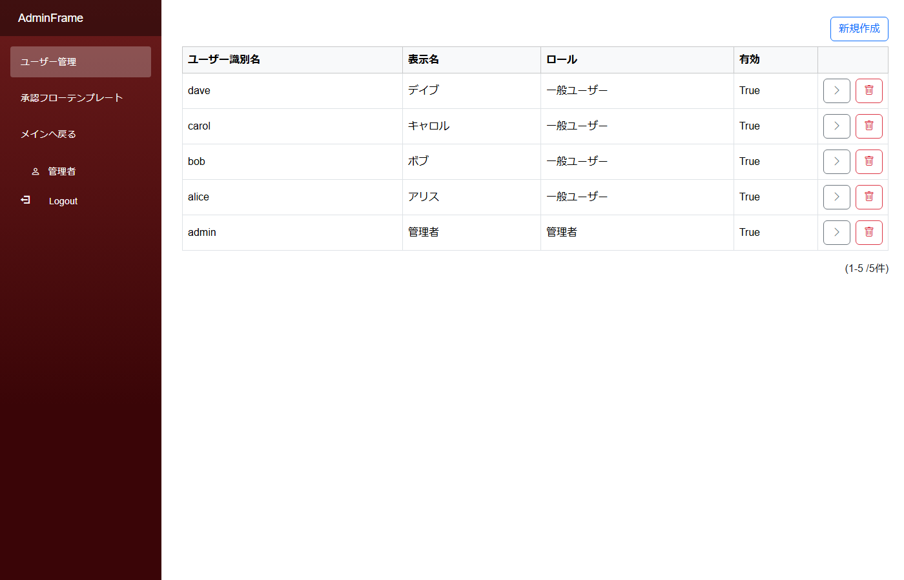

# 一般画面と管理画面の分離 (複数 PageFrame)

「**一般ユーザーには業務画面だけ見せる**」「**管理者にはマスタ管理画面を別 URL で提供する**」というよくある構成。`PageFrame` を 2 つ用意して、サイドバーで切り替えるパターン。

## アプリの作り

- 一般ユーザー (alice 等): サイドバーに「マイプロフィール / 個人メモ / タスク / 経費精算 / 休暇申請 / 承認待ち / 管理画面へ」が表示
- 「管理画面へ」リンクをクリック → 管理画面 PageFrame (`AdminFrame`) に遷移
- 管理画面のサイドバーは「ユーザー管理 / 承認フローテンプレート / メインへ戻る」
- 管理画面は **`UserReadCondition` で管理者のみ閲覧可** に絞ってある → 一般ユーザーが直接 URL を叩いても弾かれる

## モジュールとテーブルの対応

PageFrame の分割で実現するため、モジュール側というよりは **PageFrame** の構成パターン:

| PageFrame | サイドバー | 主なリンク |
|---|---|---|
| `Main` | 一般ユーザー向け | マイプロフィール / 個人メモ / タスク / 経費精算 / 休暇申請 / 承認待ち / **管理画面へ** |
| `AdminFrame` | 管理者向け (UserReadCondition で制限) | ユーザー管理 / 承認フローテンプレート / **メインへ戻る** |
| `AdminHome` モジュール | 管理画面のホーム | `UserReadCondition` に「`CurrentUser.IsAdmin == true`」等を書いて、管理者だけアクセス可 |

## CLB ではこう作る

### 1. PageFrame を 2 つ用意

- `PageFrames/Main.frm.json` ─ 一般ユーザー用 (デフォルト)
- `PageFrames/AdminFrame.frm.json` ─ 管理者用 (色テーマ・配色を変えて視覚的にも区別すると親切)

### 2. 切り替えリンク

- `Main.frm.json` の Link「管理画面へ」: `PageFrame: "AdminFrame"` + `Module: "AdminHome"` を指定
- `AdminFrame.frm.json` の Link「メインへ戻る」: `PageFrame: "Main"` + `Module: "Home"` を指定

### 3. 管理者だけアクセス可にする

管理画面の入口モジュール (`AdminHome`) の `UserReadCondition` に `FieldValueMatchCondition` で「`CurrentUser.IsAdmin == true`」のような条件を書く。これで権限なしのユーザーは URL 直接アクセスしても画面が出ない。

サイドバーリンクの出し分けは Link の `UserReadCondition` でも制御可能。

## 認証付きパターン集の対応

- サイドバー **`管理画面へ`** → `Main` → `AdminFrame` への切替リンク
- 管理画面サイドバー **`ユーザー管理`** / **`承認フローテンプレート`** → `AdminFrame` 配下のリンク
- 一般用に戻る **`メインへ戻る`** → `AdminFrame` → `Main` への切替リンク

## 落とし穴

- 一般ユーザーから管理画面のサイドバーリンクは非表示にしたい場合、**遷移先モジュールの `UserReadCondition`** (Module 側) を絞ると Link が自動的に非表示になる。**PageFrame の Link 側**だけ絞ると「リンクは見えるがクリックすると拒否」される (= 見える + 弾かれるの組み合わせなのでイマイチ)
- フレーム切替の Link は `PageFrame` プロパティ + `Module` プロパティ両方の指定が必要 (片方だけだと正しく遷移しない)

## 関連ドキュメント

- [認証パターン集 入口](auth_patterns.md)
- [PageFrame の設定](../designer/page_frame.md)
- [認証 / 認可の概要](../authorization/authorization.md)
