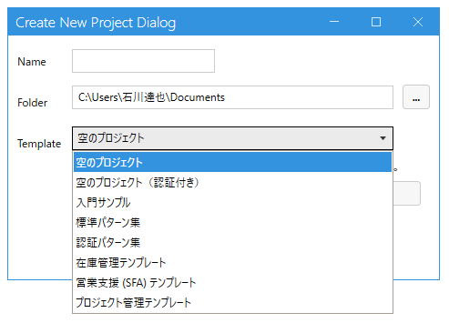

# 認証パターン集

業務アプリで欠かせない「**ログインユーザーの管理**」「**自分のデータだけ見せる**」「**申請 → 承認のワークフロー**」「**一般ユーザーと管理者の画面分離**」といったパターンをまとめたページです。

## デザイナの「認証パターン集」テンプレートで実機確認できる

デザイナで新規プロジェクトを作るときに、テンプレートから **「認証パターン集」** (内部名 `PatternShowcaseAuth`) を選ぶと、これらのパターンの実装サンプルが展開されます。

- Cookie 認証 (ASP.NET Identity) で alice / bob / carol / dave / admin の 5 ユーザーが seed されている (パスワード: `test`、admin は `admin`)
- 一般ユーザー画面 (`Main` フレーム) と管理者画面 (`AdminFrame`) の 2 つの PageFrame で構成

> [標準パターン集](patterns.md) (`PatternShowcase`) は認証なしでパターン単位の機能を見せるためのもの。**業務アプリらしい認証/権限/ワークフローを総合的に見たいときは認証パターン集**を開いてください。

---

## パターン一覧

| パターン | 内容 |
|---|---|
| [ユーザーモジュールと認証連動](auth_user_module.md) | `AppUser` 定義、ログイン中ユーザー (`CurrentUser`) の参照、パスワード変更 |
| [個人データのフィルタと権限](auth_personal_data.md) | 自分が作ったレコードだけ見せる (`DataReadCondition`)、検索初期値で自分のデータ絞り込み |
| [承認フローのワークフロー](auth_workflow.md) | 申請 (休暇/経費) → 承認フロー → 履歴のテンプレート駆動ワークフロー |
| [一般画面と管理画面の分離 (複数 PageFrame)](auth_admin_frame.md) | `Main` フレームと `AdminFrame` の使い分け、`UserReadCondition` で管理者だけ入れる画面 |

---

## 関連ドキュメント

- [標準パターン集 入口](patterns.md) ─ 認証なしの全パターン
- [認証 / 認可の概要](../authorization/authorization.md)
- [PageFrame の設定](../designer/page_frame.md)
