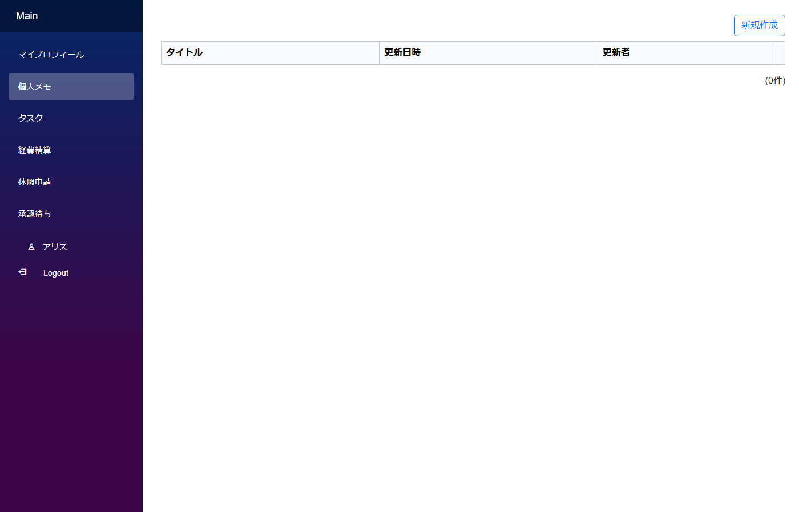

# 個人データのフィルタと権限

「**自分が作成したレコードだけ見える / 編集できる**」「**自分が担当のタスクだけデフォルト表示**」といった、ログインユーザーに連動したデータフィルタのパターン。

## アプリの作り



- alice でログインして個人メモを書く → bob でログインしても見えない
- 一覧画面に表示されるのはログイン中ユーザー自身のレコードだけ
- タスク画面では「担当者 = 自分」が初期検索条件としてセットされているが、検索条件を変えれば他人のタスクも見られる (権限としては別)

## 支えるデータ構造

```
personal_memos
├── Id           PK
├── Title        TEXT
├── Body         TEXT
├── Creator      INT (FK → AppUser)  ← 予約名で CLB が自動セット
├── CreatedAt    DATETIME
└── ...
```

「誰が作成したか」を表す `Creator` 列は CLB の予約名で Submit 時に自動的にログインユーザー ID がセットされる。

## モジュールとテーブルの対応

| モジュール | テーブル | フィルタ方式 |
|---|---|---|
| `PersonalMemo` | `personal_memos` | `DataReadCondition` / `DataWriteCondition` で「`Creator == CurrentUser.Id`」を宣言 → DB クエリにフィルタが自動付与 |
| `MyTask` | `my_tasks` | `OnSearchInitialization` で `担当者.SearchValue = CurrentUser.Id.Value` をセット (権限フィルタではない、デフォルト表示の話) |

## CLB ではこう作る

### 厳格な権限フィルタ (PersonalMemo 系)

モジュールの `DataReadCondition` / `DataWriteCondition` に `FieldVariableMatchCondition` で:
- `SearchTargetVariable: Creator.Value`
- `Variable: CurrentUser.Id.Value`
- `Comparison: Equal`

を設定。これで CLB が **全 SELECT / UPDATE / DELETE クエリに `WHERE Creator = ?` を自動付与**する。本人以外の URL 直アクセスでも見えない・編集できない。

### デフォルト表示の絞り込み (MyTask 系)

`OnSearchInitialization` スクリプトで:
```csharp
担当者.SearchValue = CurrentUser.Id.Value;
```
を書くと、サイドバーリンクから開いたとき**初期検索条件として担当者=自分**がセットされる。ユーザーが検索条件を変えれば他人のタスクも見られる ([検索初期値パターン](search_patterns.md#検索条件の初期化) と同様の仕組み)。

## 認証付きパターン集の対応

- サイドバー **`個人メモ`** → `PersonalMemo` (`DataReadCondition` で本人のみ閲覧可)
- サイドバー **`タスク`** → `MyTask` (`OnSearchInitialization` で自分のタスクをデフォルト表示)

## 落とし穴

- `DataReadCondition` は**サーバー側で SQL に自動付与**される (= URL 直接アクセスでも漏れない)。逆に `OnSearchInitialization` は**画面の初期値**にすぎず権限ではない (検索条件を変えれば他人のデータも見える)。**「権限としての絞り込み」と「便利さのためのデフォルト」は明確に使い分ける**こと
- `Creator` / `CreatedAt` / `Updater` / `UpdatedAt` は CLB 予約名なのでスクリプトで `Creator.Value = CurrentUser.Id.Value` のような代入は不要 (CLB が自動でセットする)

## 関連ドキュメント

- [認証パターン集 入口](auth_patterns.md)
- [認証 / 認可の概要](../authorization/authorization.md)
- [検索条件の初期化](search_patterns.md#検索条件の初期化)
- [作成日時・更新日時 (システムフィールド)](system_fields.md)
