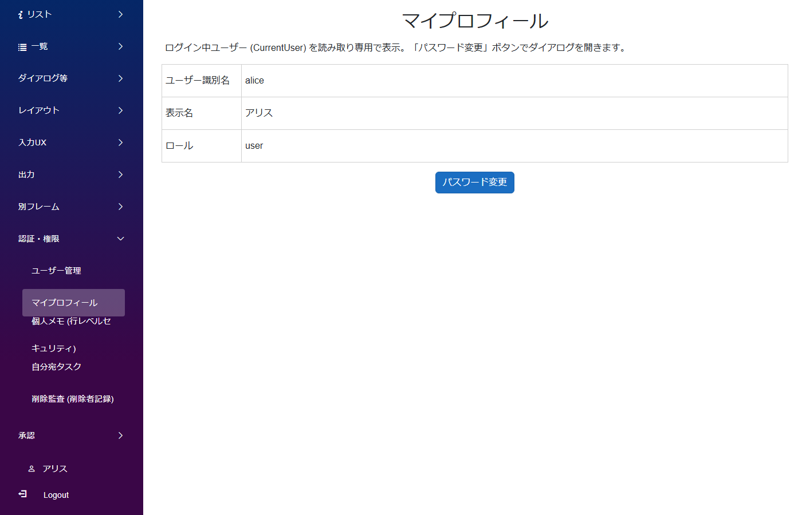
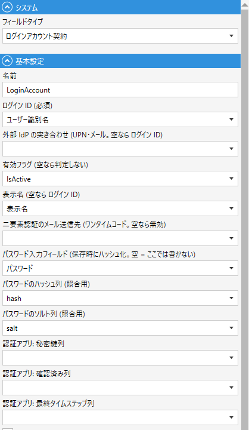

# ユーザーモジュールと認証連動

業務アプリ全体の前提となる「ログインユーザーをアプリ内のレコードとして持つ」「現在のログインユーザーを画面・スクリプトから参照する」「パスワードを変更する」といった基本パターン。

## アプリの作り



- ユーザーがログインすると、サイドバーに「マイプロフィール」リンクが表示される
- マイプロフィールを開くとログイン中ユーザーの情報 (表示名・メール等) が読み取り専用で表示される
- 「パスワード変更」ボタンでダイアログが開き、その場でパスワードを変更できる
- 管理画面の「ユーザー管理」ではすべてのユーザーを CRUD できる (管理者のみ)

## 支えるデータ構造

```
app_users  (プレーンなユーザーテーブル。ASP.NET Identity ではない)
├── id          PK
├── user_name   TEXT (ログイン ID)
├── name        TEXT (表示名)
├── hash        TEXT (ログインアカウント契約がサーバー側で書き込む)
├── salt        TEXT (同上)
├── role        TEXT
└── is_active   BOOLEAN
```

`AppUser` はテンプレートの Cookie 認証が使う**プレーンな `app_users` テーブル**に紐づく (ASP.NET Identity ではない)。認証の実装は [Extras](https://github.com/Codeer-Software/Codeer.LowCode.Blazor.Extras/blob/main/docs/Authentication.md) (MIT) が提供する。CLB の `app.clprj` の `CurrentUserModuleDesignName: "AppUser"` で「現在のログインユーザー = AppUser のレコード」と紐づけ、スクリプトから `CurrentUser.表示名.Value` のようにアクセスできるようになる。

## モジュールとテーブルの対応

| モジュール | テーブル | 主な役割 |
|---|---|---|
| `AppUser` | `app_users` | ユーザーマスタ。管理画面で CRUD |
| `MyProfile` | (なし、表示専用) | ログイン中ユーザーの自分用情報表示 + パスワード変更ボタン |
| `ChangePasswordDialog` | `app_users` (同じテーブル) | 自分のパスワードだけ更新できるダイアログ用モジュール |

## CLB ではこう作る

- **AppUser モジュール**: 通常の CRUD モジュールとして `app_users` テーブルに紐づける。パスワードは PasswordField (平文入力欄。DB 列なし) に入力し、`LoginAccountContractField` (ログインアカウント契約) が保存時にハッシュ / ソルトを書く
- **ログインアカウント契約 (`LoginAccountContractField`、Extras)** を AppUser の Fields に 1 つ置く。ログイン ID / 表示名 / 有効フラグ / パスワード入力欄と、ハッシュ・ソルトの列を宣言する。UI を持たない宣言だけのフィールドで、レイアウトには出さない (テンプレートの AppUser は配置済み)

  
- **app.clprj** の `CurrentUserModuleDesignName: "AppUser"` を指定 → スクリプトの `CurrentUser` から AppUser インスタンスにアクセスできるようになる
- **MyProfile** は表示専用モジュール (`DbTable: ""`)。`CurrentUser.表示名.Value` 等を Label/Text に流し込んで表示
- **パスワード変更**は ChangePasswordDialog (同じ `app_users` テーブルを参照する別モジュール) を `ShowDialog` で開く

## 標準パターン集の対応 (認証・権限)

- サイドバー **`認証・権限/マイプロフィール`** → `MyProfile`
- サイドバー **`認証・権限/ユーザー管理`**、および **`管理画面へ` → `ユーザー管理`** → `AppUser` (管理画面側は管理者のみアクセス)

## 落とし穴

- `AppUser` に `UserReadCondition` / `UserWriteCondition` を**つけてはいけない** (CurrentUser のソースになるため、制限すると マイプロフィール / パスワード変更 / LinkField 表示が全部壊れる)。管理者だけアクセスさせたい場合は PageFrame レベル (`AdminHome.UserReadCondition`) で絞る → [管理画面の分離パターン](auth_admin_frame.md)
- パスワードは平文保存しない。AppUser では契約の PasswordField が保存時にハッシュ化する。契約の無い別モジュール (パスワード変更ダイアログ) では `PasswordHashField` (Extras パッケージ) を使う

## 関連ドキュメント

- [認証・権限・承認のパターン 一覧](auth_patterns.md)
- [認証 / 認可の概要](../authorization/authorization.md)
