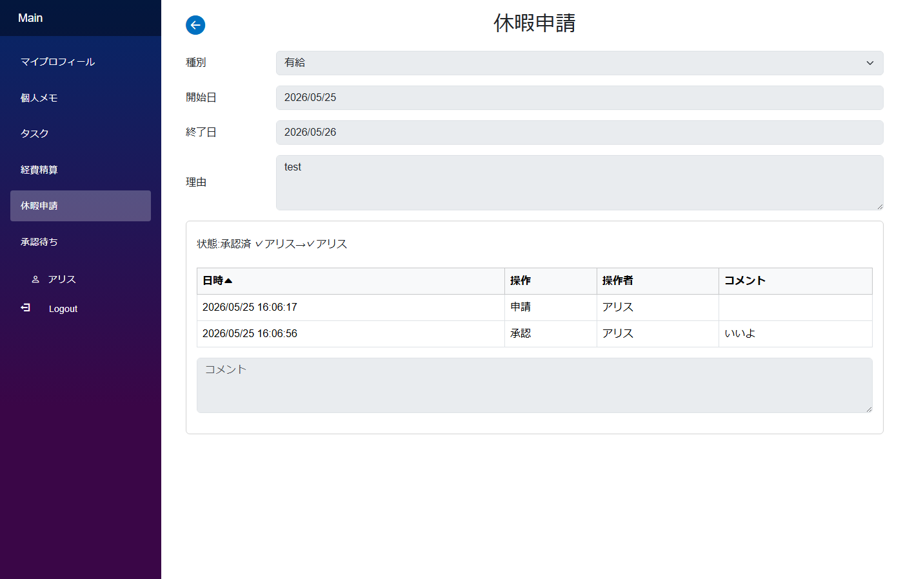
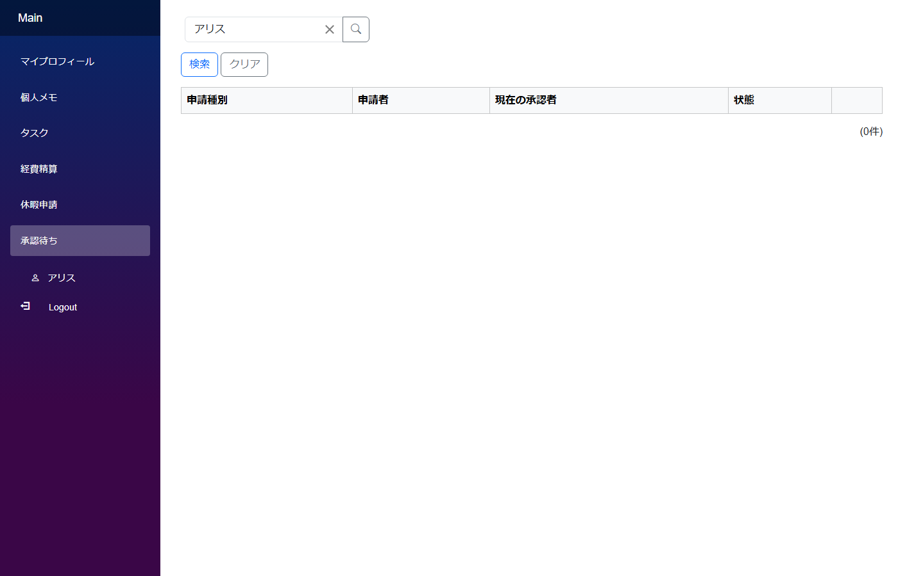

# 承認フローのワークフロー

「**申請を書く → 上長や経理が承認する → 申請者に結果が返る**」という、業務アプリで非常によく登場するワークフロー。`PatternShowcaseAuth` では**承認フローテンプレートを管理者が定義 → 申請時にテンプレに沿って承認者が割り当てられる**という構成で実装しています。

## アプリの作り



- 一般ユーザー (alice) が「休暇申請」または「経費精算」で申請を作成して保存
- 申請モジュールの中に承認フロー (`ApprovalFlow`) が内包され、テンプレートに沿った承認順序・承認者リストが自動生成される
- 承認者 (bob 等) のサイドバー「承認待ち」に該当申請が表示される
- 承認者は申請を開いて「承認」「却下」を押す。Order 単位で承認/却下が進む
- 全 Order 承認完了 → 申請ステータス Approved。途中で却下 → Rejected
- 申請者は却下 / キャンセル後に「再申請」で再開可能



## 支えるデータ構造

承認フローのデータ構造はやや複雑で、**多段ネスト** + **双方向 ID 持ち合い** の組み合わせで実現されている:

```
leave_request / expense_request           approval_flow
├── id                                    ├── id  PK ←──────────┐
├── ...申請内容                    ┌────→  ├── status            │
└── approval_flow_id  FK ─────────┘       ├── current_approver  │
                                          ├── parent_module_name │
                                          └── parent_id          FK → 申請モジュール (双方向)

approval_flow_order            approval_flow_member
├── id          PK ←─────────┐ ├── id                  PK
├── approval_flow_id  FK     │ ├── approval_flow_order_id FK
├── order_no                 ├─├── approval_flow_id    FK
└── status                   ├ ├── approver_user       FK → AppUser
                             ├ ├── is_required
                             └ ├── status (Waiting/Approved/Rejected/Skipped)
                               └── ...

approval_flow_template / template_order / template_member  (管理者が事前定義)
```

## モジュールとテーブルの対応

| モジュール | テーブル | 役割 |
|---|---|---|
| `LeaveRequest` / `ExpenseRequest` | `leave_request` / `expense_request` | 申請本体。`ApprovalFlow` を `ModuleField` で内包 |
| `ApprovalFlow` | `approval_flow` | 申請に紐づく承認フロー本体。状態 + 現在の承認者 + 親モジュール名/ID (双方向) |
| `ApprovalFlowOrder` | `approval_flow_order` | 承認順序の1段 (例: 1段目=直属上司、2段目=部長) |
| `ApprovalFlowMember` | `approval_flow_member` | 各 Order の承認者リスト (並列承認・必須/任意のフラグ) |
| `ApprovalHistory` | `approval_history` | 操作ログ (申請/承認/却下/キャンセル/再申請) |
| `ApprovalFlowTemplate` | `approval_flow_template` | 管理者が定義する承認フローテンプレート |
| `ApprovalFlowTemplateOrder` / `ApprovalFlowTemplateMember` | (同じく Template 用) | テンプレートの順序・メンバー定義 |

## CLB ではこう作る

### 1. 管理者がテンプレートを定義

`ApprovalFlowTemplate` に「FullLeave (休暇詳細: 上司 → 部長)」「FullExpense (経費詳細: 上司2名並列必須 → 経理 or 部長並列任意)」のようなテンプレを作る。各 Order に承認者と「必須/任意」フラグを設定。

### 2. 申請時の自動展開

`LeaveRequest.mod.cs` の `OnAfterInitialization` で:
```csharp
if (IsNewData)
{
    ApprovalFlow.ChildModule.Initialize("LeaveRequest", this.Id.Value, SelectTemplateName());
}
```
を呼ぶと、申請の Submit 時にテンプレに沿った Order / Member が一括生成される。

### 3. 申請 ↔ 承認フローの双方向 ID

申請モジュールには `ApprovalFlow` への FK 列 (`approval_flow_id`)、承認フローには申請への参照 (`parent_module_name` + `parent_id`) があり、**両側から相手を参照できる**。新規 Submit 時は CLB の `TemporaryIdResolver` が双方向サイクルを自動解決 ([双方向 ID 持ち合いパターン](bidirectional.md) と同じ仕組み)。

### 4. 承認待ち一覧

サイドバー「承認待ち」は `ApprovalFlow` モジュール自体の一覧 + `CurrentApprover` (`LinkField` → AppUser) で「現在の承認者 = 自分」を初期検索値にする ([検索初期値パターン](search_patterns.md#検索条件の初期化))。「開く」ボタンで申請モジュール (LeaveRequest / ExpenseRequest) に遷移。

## 認証パターン集の対応

- サイドバー **`休暇申請`** → `LeaveRequest`
- サイドバー **`経費精算`** → `ExpenseRequest`
- サイドバー **`承認待ち`** → `ApprovalFlow`
- サイドバー **`管理画面へ` → `承認フローテンプレート`** → `ApprovalFlowTemplate`

## 落とし穴

- 申請モジュール内の `ApprovalFlow.ChildModule.Members[*].Status.Value` などの子孫モジュール参照は遅延ロードで空のことがある。`ModuleSearcher` で DB から再取得する → [スクリプトガイドライン](../../ClaudeCode/Designer/ClaudeCodeForDesigner/Docs/ScriptGuidelines.md) の「ChildModule の LinkField/SelectField」セクション
- テンプレ駆動なので Order の並び順は `UseIndexSort` で自動採番。スクリプト側で `OrderNo` を直接代入しない
- 承認フローの初期化は親モジュール側 (`LeaveRequest.OnAfterInitialization`) で呼ぶ。子モジュール (`ApprovalFlow`) の初期化スクリプトに書いてはいけない (タイミングがズレる)

## 関連ドキュメント

- [認証パターン集 一覧](auth_patterns.md)
- [双方向 ID 持ち合い (1:1)](bidirectional.md) ─ 申請 ↔ 承認フローの基盤パターン
- [多段ネスト](multi_nested.md) ─ Flow → Order → Member の 3 段構造
- [検索条件の初期化](search_patterns.md#検索条件の初期化)
