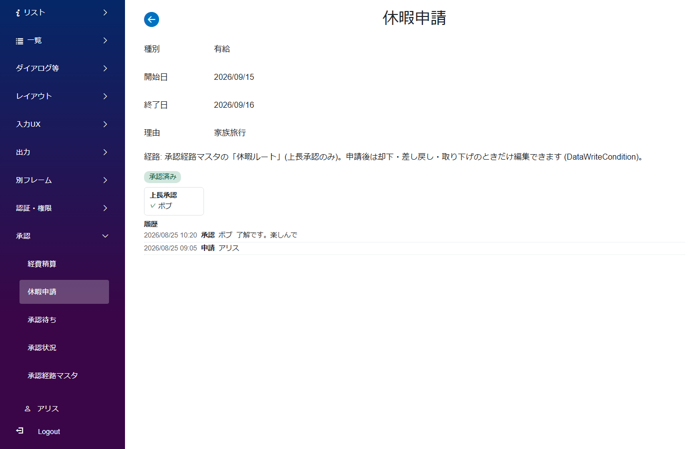
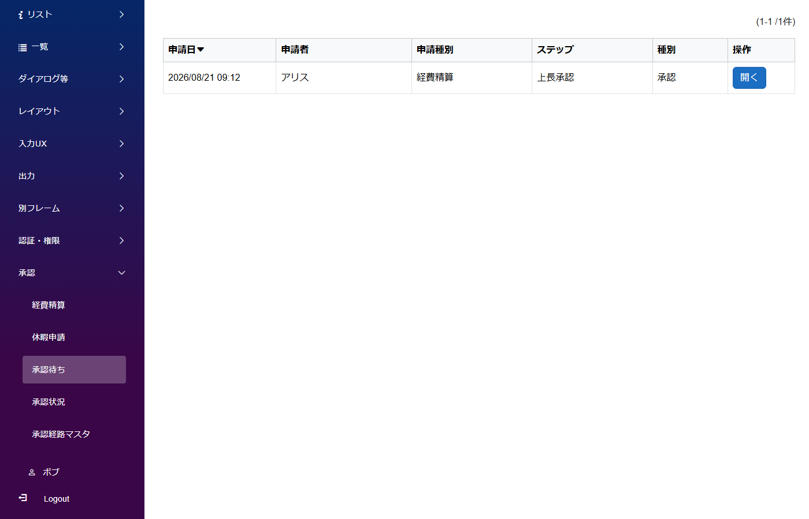

# 承認フローのワークフロー

「**申請を書く → 上長や経理が承認する → 申請者に結果が返る**」という、業務アプリで非常によく登場するワークフロー。
Codeer.LowCode.Blazor では、拡張ライブラリ Codeer.LowCode.Blazor.Extras の **`ApprovalFlowField`** で作ります。申請書モジュールにフィールドを 1 つ置くと、申請・承認・却下・差し戻し・取り下げ・再申請・回覧確認と、ステッパー形式の進捗表示・コメント・履歴表示が付きます。承認用のテーブルや状態遷移のスクリプトを自分で書く必要はありません。状態の変更はすべてサーバーが検証するので、画面の操作だけで権限のない承認が通ることはありません。

## アプリの作り



- 一般ユーザー (alice) が「経費精算」または「休暇申請」を作成して保存し、「申請」ボタンを押す
- 誰が承認するか (経路) は申請時にスクリプトが決める。サンプルでは承認経路マスタの「経費ルート」(上長承認 = bob → 経理確認 = carol) /「高額経費ルート」(上長 → 部長 = dave → 経理。経費精算は 10 万円以上のときに選ばれる) /「休暇ルート」(上長承認 = bob) を読んでいる
- 承認者 (bob) のサイドバー「承認待ち」に、自分の番になっている申請が申請種別を横断して並ぶ。「開く」で申請書へ遷移し、「承認」「却下」「差し戻し」を押す
- 全ステップが承認されると完了。却下されると却下、差し戻されると申請者が内容を直して「再申請」できる (履歴は世代ごとに残る)
- 「承認状況」で申請全体の状態・申請者・現在の担当者を一覧できる
- 承認経路マスタ (経路 → ステップ → ステップの承認者) は管理画面 (AdminFrame) から編集する



## 支えるモジュール

承認のデータは通常のモジュール 3 つ (フロー / メンバー / 履歴) に保存されます。申請書は FK 列 1 本 (`approval_id`) でフロー行を指し、状態や申請者は `Approval.Status.Value` のようにリンク越しに読めます。

| モジュール | テーブル | 役割 |
|---|---|---|
| `ExpenseRequest` / `LeaveRequest` | `expense_request` / `leave_request` | 申請書。`ApprovalFlowField` (`Approval`、DB 列 `approval_id`) を 1 つ持つ |
| `ApprovalFlow` | `approval_flows` | フロー本体 (状態 / 対象モジュール名・Id / 申請者 / 試行番号 / 現在ステップ)。画面は持たない |
| `ApprovalFlowMember` | `approval_flow_members` | ステップごとの承認者 (必須/任意・完了条件・状態)。画面は持たない |
| `ApprovalHistory` | `approval_histories` | 操作履歴。画面は持たない |
| `MyApprovalList` / `ApprovalStatusList` | (QueryField) | 承認待ち / 承認状況の一覧。ログイン中ユーザーの Id で自分の待ち行に絞る |
| `ApprovalRoute` / `ApprovalRouteStep` / `ApprovalRouteStepMember` | `approval_routes` / `approval_route_steps` / `approval_route_step_members` | 経路マスタ。ただのモジュールで、`ApprovalRoute.mod.cs` の `Load(経路名)` が経路を組み立てる |
| enum `ApprovalTargetModule` | ─ | 一覧の「申請種別」列でモジュール名を表示名に読み替える (メンバー名 = 申請書モジュール名) |

## CLB ではこう作る

### 1. 承認モジュール群を生成する (手で作らない)

デザイナのメニュー **Tools > 承認フローのセットアップ** を実行します。フロー / メンバー / 履歴の 3 モジュール、承認待ち・承認状況の一覧、経路マスタ 3 モジュール、enum、PageFrame のリンク、テーブル作成用の DDL が生成されます。DDL を DB に流してテーブルを作ってください。
承認モジュール群は 1 セットを全申請書で共有します。申請書が増えても再実行は不要です。

### 2. 申請書側 (4 手順)

1. 申請書モジュールに `ApprovalFlowField` を置く。フローモジュール名に `ApprovalFlow`、DB 列に `approval_id` (テーブルに列を追加)、「経路組み立て」に次の関数名を設定
2. スクリプトに経路を組み立てる関数を書く。`null` を返すと申請は中止され、保存もされません (入力チェックや業務ルールによる申請不可はここで判定)

   ```csharp
   // ExpenseRequest.mod.cs (標準パターン集)
   ApprovalRouteData OnBuildRoute()
   {
       if (Amount.Value == null || Amount.Value <= 0)
       {
           Logger.Error("金額は 1 円以上を入力してください");
           return null;
       }

       // 金額で経路マスタの経路を選ぶ。10 万円以上は部長承認が挟まる「高額経費ルート」
       var routeName = Amount.Value >= 100000 ? "高額経費ルート" : "経費ルート";
       return new ApprovalRoute().Load(routeName);
   }
   ```

   経路マスタを使わず、`new ApprovalRouteData().AddMembers(new[]{ 課長.Value, 部長.Value })` のように承認者の Id を直接並べて返すこともできます。

3. 編集ロック。申請書の **データによる認可 (書き込み)** に「`Approval.Status` が 未申請 (null) / 差し戻し (Returned) / 取り下げ (Withdrawn) / 却下 (Rejected) のいずれか」の Or 条件を設定します。詳細レイアウトの **DataOnlyFields** に `Approval.Status` / `Approval.Applicant` / `Approval.Members` を登録しておくと、条件で使う値が画面に出さなくても読み込まれます
4. enum `ApprovalTargetModule` にメンバーを追加 (名前 = 申請書モジュール名 / 表示 = 申請書の名前)

一覧に状態列を出すときは、一覧レイアウトに `Approval.Status` を追加します (フロー側の状態表示がそのまま出ます)。

### 3. 権限

- 承認モジュール 3 つの「書き込み可能ユーザー条件」は誰も満たさない条件になっています (セットアップの既定)。承認データはサーバーだけが書きます
- app.clprj の **Current User Module** が設定されていること (申請者・承認者の判定に使う)
- 承認者だけが記入できる欄 (査定額など) は `PermissionField` に「現在の承認待ち (自分がいま承認する番)」の条件を書きます

## 標準パターン集の対応

- サイドバー **`承認/経費精算`** → `ExpenseRequest` (経路: 経費ルート / 10 万円以上は高額経費ルート)
- サイドバー **`承認/休暇申請`** → `LeaveRequest` (経路: 休暇ルート)
- サイドバー **`承認/承認待ち`** → `MyApprovalList`、**`承認/承認状況`** → `ApprovalStatusList`
- サイドバー **`承認/承認経路マスタ`** (管理画面 `AdminFrame` にも同じリンク) → `ApprovalRoute` (経路 → ステップ → ステップの承認者)

## 落とし穴

- 経路の承認者に申請者自身が含まれると申請できません (サンプルの `ApprovalRoute.Load` がエラーにします)。デモでは alice で申請し、bob / carol / dave で承認します
- 承認ボタンなどの操作後は承認フィールドだけが再読込されます。編集ロックの画面への反映は開き直しで行われます (サーバー側の制限は即時)
- `ApprovalFlow` 等は画面を持たないエンジン用のモジュールです。独自の一覧を作りたいときは `MyApprovalList` のように QueryField の検索用モジュールを足します

## 関連ドキュメント

- [認証・権限・承認のパターン 一覧](auth_patterns.md)
- [承認フロー (Codeer.LowCode.Blazor.Extras)](https://github.com/Codeer-Software/Codeer.LowCode.Blazor.Extras/blob/main/docs/ApprovalFlow.md) ─ 経路の組み立て・状態・権限・通知メールなど `ApprovalFlowField` の詳細
- [ユーザーモジュールと認証連動](auth_user_module.md) ─ 承認者・申請者の判定に使う CurrentUser
