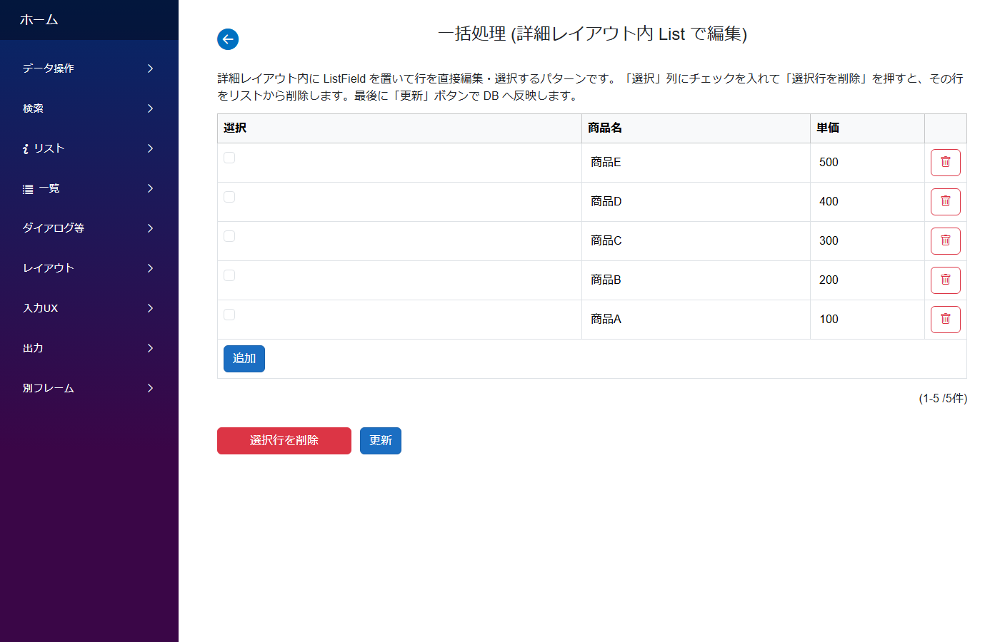

# 一括処理 (チェックして選択行に一括操作)

**いつ使う**: 商品一覧で「不要なものをまとめて削除」「複数行を一気に値段更新」など、**チェックボックスで選択した複数行に対して一括操作**したいとき。

## アプリの作り



- 一覧の各行に **チェックボックス** が表示される
- 任意の行にチェックを入れて「選択削除」ボタンを押すと、選択行だけが一括削除される
- 親モジュールの保存ボタンで DB に反映

## 支えるデータ構造

```
bulk_product_items
├── id          PK
├── name        TEXT
└── price       NUMBER
```

DB 自体は普通の 1 テーブル。チェック用フィールドは **DB 列を持たない (= UI 専用)** で実現する。

## モジュールとテーブルの対応

| モジュール | テーブル | 役割 | 主な参照 |
|---|---|---|---|
| `BulkProduct` | (なし、表示専用) | 親の一括処理画面 | `Items` (`ListField` → `BulkProductItem`) + 一括処理ボタン |
| `BulkProductItem` | `BulkProductItems` | 子 (実データ) | `IsSelected` (Boolean、DbColumn 空) でチェック状態を保持 |

## CLB ではこう作る

- **親 (`BulkProduct`)** は表示専用モジュール (`DbTable: ""`、`DataSourceName: ""`、`Id` フィールド無し、`CanUpdate: true`)
- 子 (`BulkProductItem`) に `IsSelected` (BooleanField、DbColumn 空) を用意してチェック状態を保持
- 子の ListLayout に `IsSelected` を `IsViewOnly: false` で配置すると、行内チェックボックスになる
- 一括処理ボタンの `OnClick` スクリプトで、`foreach (var row in Items.Rows) if (row.IsSelected.Value == true) Items.DeleteRow(row);` のように選択行を処理
- 親の SubmitButton で DB に反映

## 標準パターン集の対応

サイドバー **`データ操作/一括処理`** → `BulkProduct` + `BulkProductItem`

## 落とし穴

- 表示専用モジュールでも、子に入力可能フィールド (チェックボックス) を持つなら **`CanUpdate: true`** にしないと画面全体が読み取り専用になる
- 行選択ハイライト (`CanSelect: true`) は別物。チェックボックスは BooleanField で実現する

## 関連ドキュメント

- [アプリ作成パターン一覧](patterns.md) ─ 全パターンのインデックス
- [モジュール定義の全体構造](../module/module.md)
- [Field リファレンス](../fields/) ─ BooleanField / ListField の詳細
