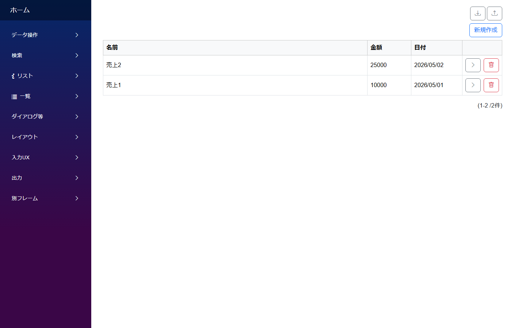

# 取込書出 (CSV / Excel の一括入出力)

**いつ使う**: 既存データを CSV/Excel でダウンロードして、編集して、まとめてアップロードで反映する。大量データの初期投入や、業務担当が表計算ソフトで編集したい場合の定番。

## アプリの作り



- 一覧画面上部に **ダウンロード / アップロード** ボタンが表示される
- ダウンロードボタンで一覧の内容を Excel ファイルとして取得
- Excel を編集してアップロードすると、内容が DB に反映される (新規追加 / 既存更新)

## 支えるデータ構造

```
import_exports
├── id           PK
├── name         TEXT
├── amount       NUMBER
└── record_date  DATE
```

通常の CRUD テーブル。アップロード/ダウンロードは CLB の標準機能で自動処理される。

## モジュールとテーブルの対応

| モジュール | テーブル | 主な設定 |
|---|---|---|
| `ImportExport` | `ImportExports` | PageFrame の Link 側で `CanBulkDataUpdate: true` (アップロード) + `CanBulkDataDownload: true` (ダウンロード) を有効化 |

## CLB ではこう作る

- 通常の CRUD モジュールとして定義
- **PageFrame の Link** の `ListPageDesign` で `CanBulkDataUpdate` / `CanBulkDataDownload` を `true` にすると、一覧ページにアイコンボタンが出る
- Excel フォーマットはモジュールの ListLayout に基づいて自動生成される

## 標準パターン集の対応

サイドバー **`データ操作/取込書出`** → `ImportExport`

## 落とし穴

- `CanBulkDataUpdate` / `CanBulkDataDownload` は **PageFrame の Link 側で設定する**。モジュール側の同名プロパティだけでは一覧画面のアイコンが出ない
- CLB のビルトイン機能は Excel 形式。CSV は標準対応ではない

## 関連ドキュメント

- [アプリ作成パターン一覧](patterns.md) ─ 全パターンのインデックス
- [モジュール定義の全体構造](../module/module.md)
- [PageFrame の設定](../designer/page_frame.md)
