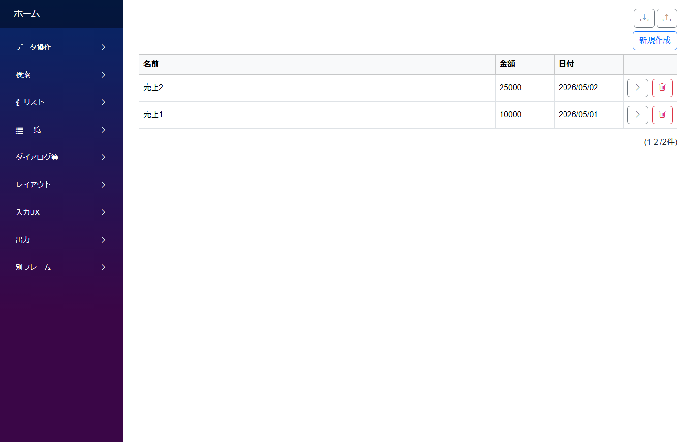

# 取込書出 (CSV / Excel の一括入出力)

**いつ使う**: 既存データを CSV/Excel でダウンロードして、編集して、まとめてアップロードで反映する。大量データの初期投入や、業務担当が表計算ソフトで編集したい場合の定番。他システムと決まった形式 (CSV・固定長) でデータをやり取りする場合にも使う。

## アプリの作り



- 一覧画面上部に **ダウンロード / アップロード** ボタンが表示される
- ダウンロードボタンで一覧の内容を Excel ファイルとして取得
- Excel を編集してアップロードすると、内容が DB に反映される (新規追加 / 既存更新)
- モジュールに形式の定義を置くと、同じボタンで CSV・固定長のファイルを入出力できる (後述)

## 支えるデータ構造

```
import_exports
├── id           PK
├── name         TEXT
├── amount       NUMBER
└── record_date  DATE
```

通常の CRUD テーブル。アップロード/ダウンロードは CLB の標準機能で自動処理される。

## モジュールとテーブルの対応

| モジュール | テーブル | 主な設定 |
|---|---|---|
| `ImportExport` | `ImportExports` | PageFrame の Link 側で `CanBulkDataUpdate: true` (アップロード) + `CanBulkDataDownload: true` (ダウンロード) を有効化 |

## CLB ではこう作る

- 通常の CRUD モジュールとして定義
- **PageFrame の Link** の `ListPageDesign` で `CanBulkDataUpdate` / `CanBulkDataDownload` を `true` にすると、一覧ページにアイコンボタンが出る
- Excel フォーマットはモジュールの ListLayout に基づいて自動生成される
- アップロードでは取込前にファイル全体を検証し、対応しない列や型変換できないセルがあれば行番号付きで報告して **1 行も取り込まない**
- Id 列に値のある行は既存データの更新、空の行は新規追加になる (Id を手入力するモジュールでは、その Id のデータがあれば更新、無ければ新規追加)

## CSV・固定長・相手仕様の列に対応する (Extras)

拡張ライブラリ [Codeer.LowCode.Blazor.Extras](https://github.com/Codeer-Software/Codeer.LowCode.Blazor.Extras) の設定用フィールドをモジュールに定義すると、一括ダウンロード / 一括更新のファイル形式と列構成を切り替えられます。
どれもモジュールの Fields に定義するだけで効き、レイアウトへの配置は不要です。アプリテンプレートには最初から組み込まれています。

| フィールド | 役割 |
|---|---|
| [CsvFileFormatField](https://github.com/Codeer-Software/Codeer.LowCode.Blazor.Extras/blob/main/docs/BulkFileTransfer.md#csvfileformatfield-csvファイル形式) | ファイル形式を CSV に切り替える。エンコーディング (BOM 付き UTF-8 / UTF-8 / Shift_JIS)・区切り文字 (カンマ / タブ / セミコロン)・拡張子 (既定 `csv`) を指定。区切り文字を「なし」にすると **固定長** になる |
| [FileColumnMappingField](https://github.com/Codeer-Software/Codeer.LowCode.Blazor.Extras/blob/main/docs/BulkFileTransfer.md#filecolumnmappingfield-ファイル列マッピング) | 列の並び・外部列名 (ヘッダ)・固定値・ヘッダ有無を相手仕様に合わせる。固定長のときは列ごとの桁数・寄せ・埋め文字もここで指定 |
| [FileValueConversionField](https://github.com/Codeer-Software/Codeer.LowCode.Blazor.Extras/blob/main/docs/BulkFileTransfer.md#filevalueconversionfield-ファイル値変換) | 1 つのフィールドの値を、ファイル上の表し方と DB の値の間で引き当てる (取引先コード ⇔ 自社コード、Link の Id ⇔ 名前 など)。変換表は通常の業務モジュール |
| [BulkFileTransferButtonField](https://github.com/Codeer-Software/Codeer.LowCode.Blazor.Extras/blob/main/docs/BulkFileTransfer.md#bulkfiletransferbuttonfield-一括ファイル転送ボタン) | 詳細画面に置ける一括ダウンロード / 一括更新ボタン。検索フィールドの条件、またはリストフィールドの表示中の条件で入出力する (例: 受注詳細の明細だけを入出力) |

組み合わせと結果:

| 定義するフィールド | 一括ダウンロード / 一括更新 |
|---|---|
| なし | Excel (内部名のヘッダ) |
| CsvFileFormatField のみ | CSV (内部名のヘッダ) |
| FileColumnMappingField のみ | Excel (相手仕様の列) |
| 両方 | CSV (相手仕様の列) |
| 両方 + CsvFileFormatField の区切り文字を「なし」 | 固定長 (相手仕様の列) |

FileValueConversionField はどの組み合わせでも併用できます。日付・数値の書式は各フィールドの `Format` に従います。

### アップロードで受け付けるファイル

| モジュールの定義 | 受け付ける拡張子 |
|---|---|
| CsvFileFormatField なし | `.xlsx` / `.xlsm` (旧形式の `.xls` / `.xlsb` は読めない) |
| CsvFileFormatField あり | CsvFileFormatField で指定した拡張子だけ (既定 `.csv`。`txt` / `dat` などに変更可) |

## スクリプトで加工しながら取り込む / 書き出す

ボタン一発の取込で足りない場合 (コード変換・検証・マスタ引き当て・不要行の除外などを挟みたい場合) は、Extras のスクリプトオブジェクトを使います。

- 取込: `BulkFileReader<モジュール>` でファイルを選ばせて解析 → 行をスクリプトで加工 → `BulkFileTransferService.Submit(...)` で一括保存
- 出力: `BulkFileTransferService.Download(...)` で、ModuleSearcher・検索フィールド・リストフィールドの条件、または加工した行のリストをファイルにする
- ファイルの形式・列構成は、上の設定用フィールドの定義がそのまま使われる
- 取込ボタンは DB に結びつかない画面専用のモジュールに置く

使い方は [組み込みサービスとテンプレート由来サービス](../script/script_services.md#bulkfilereader--bulkfiletransferservice--ファイルの一括取込出力) と Extras の [BulkFileReader](https://github.com/Codeer-Software/Codeer.LowCode.Blazor.Extras/blob/main/docs/BulkFileTransfer.md#bulkfilereader-取込) / [BulkFileTransferService](https://github.com/Codeer-Software/Codeer.LowCode.Blazor.Extras/blob/main/docs/BulkFileTransfer.md#bulkfiletransferservice-出力一括保存) を参照してください。

## 大量行の新規追加を速くする (一括 INSERT)

ファイル取込とスクリプトの一括保存では、**新規追加だけ**のデータが一定行数以上あると、1 行ずつではなく複数行をまとめた INSERT で挿入されます。
アプリテンプレートではサーバーの `Services/CustomizedModuleDataIO.cs` で 100 行以上のときに有効にしています (`BulkAddThreshold = 100`。0 以下で無効)。

次の場合は従来どおり 1 行ずつ保存されます。

- 更新・削除の行が混ざっている、または複数のモジュールにまたがる
- 作成時に実行する ExecuteSql フィールドや Json フィールドがあるモジュール
- 編集履歴を記録しているモジュール
- 画面の保存ボタンなど、通常の保存

サーバー側で `CustomizedModuleDataIO` の `AddAsync` をオーバーライドして行ごとの処理を足している場合は、一括 INSERT の経路 (`BulkAddAsync`) にも同じ処理を足してください。

## 標準パターン集の対応

サイドバー **`データ操作/取込書出`** → `ImportExport`

## 落とし穴

- `CanBulkDataUpdate` / `CanBulkDataDownload` は **PageFrame の Link 側で設定する**。モジュール側の同名プロパティだけでは一覧画面のアイコンが出ない
- 標準の形式は Excel。CSV・固定長にするにはモジュールに CsvFileFormatField (固定長は FileColumnMappingField も) を定義する
- CsvFileFormatField を定義したモジュールは、指定した拡張子のファイルしかアップロードできない (Excel ファイルは選べなくなる)
- 固定長で列幅に収まらない値は切り詰めずにエラーになる

## 関連ドキュメント

- [アプリ作成パターン一覧](patterns.md) ─ 全パターンのインデックス
- [モジュール定義の全体構造](../module/module.md)
- [PageFrame の設定](../designer/page_frame.md)
- [組み込みサービスとテンプレート由来サービス](../script/script_services.md) ─ BulkFileReader / BulkFileTransferService
- [Codeer.LowCode.Blazor.Extras](https://github.com/Codeer-Software/Codeer.LowCode.Blazor.Extras)
