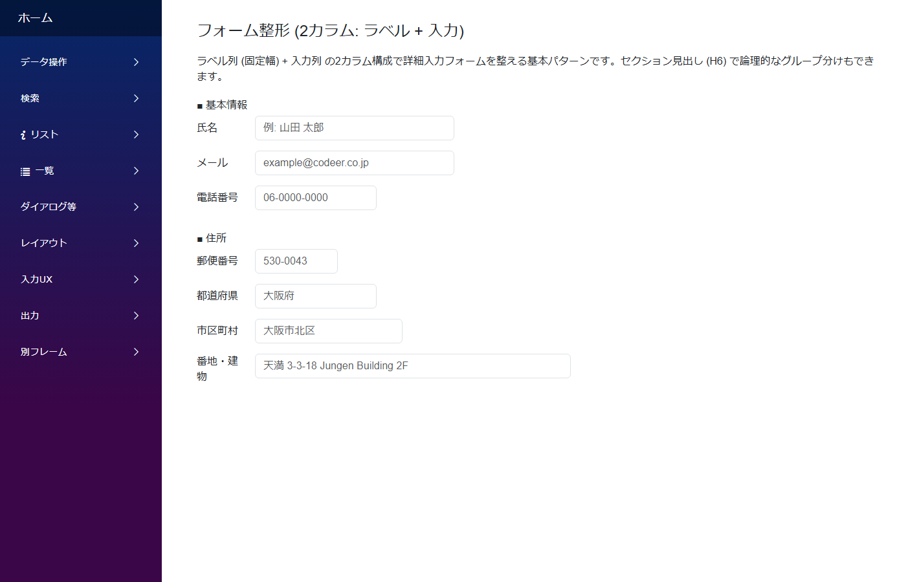
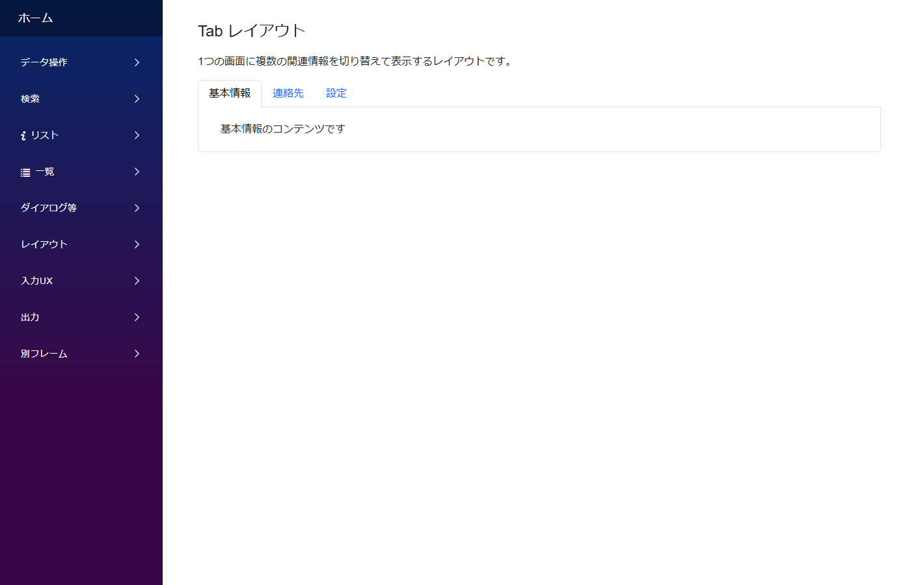
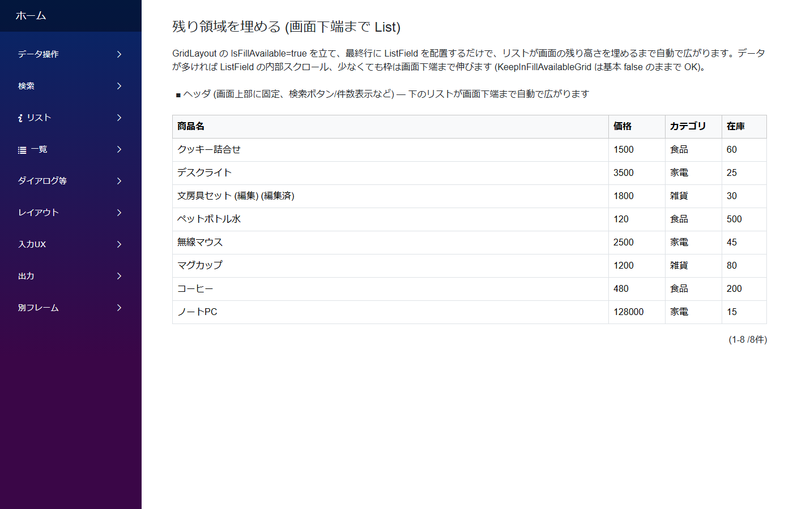
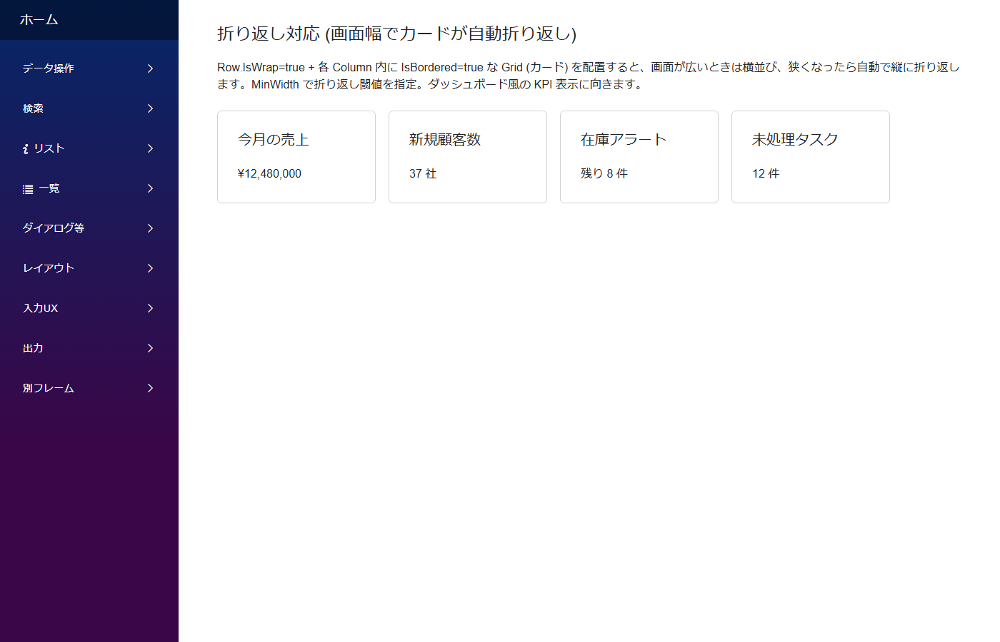
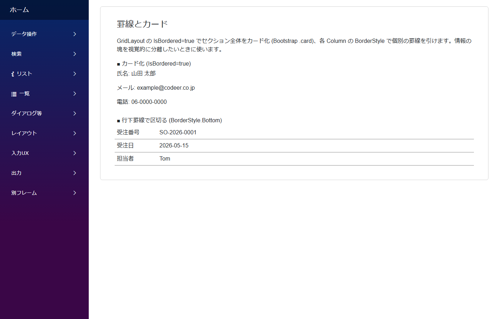
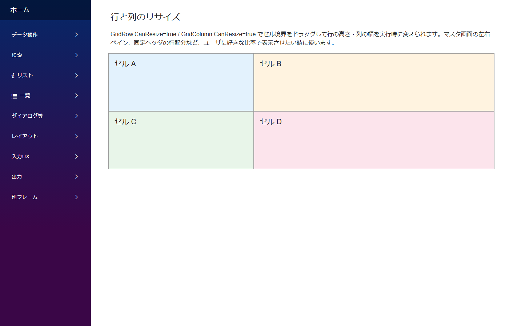
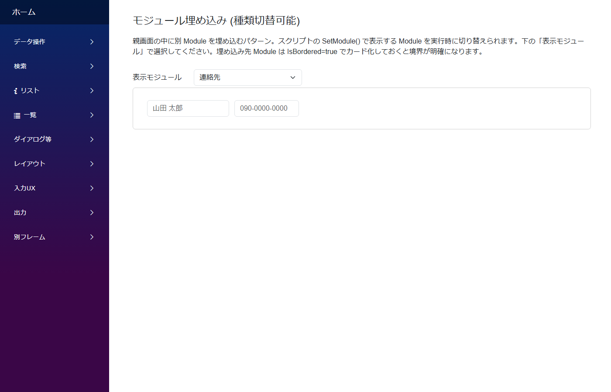
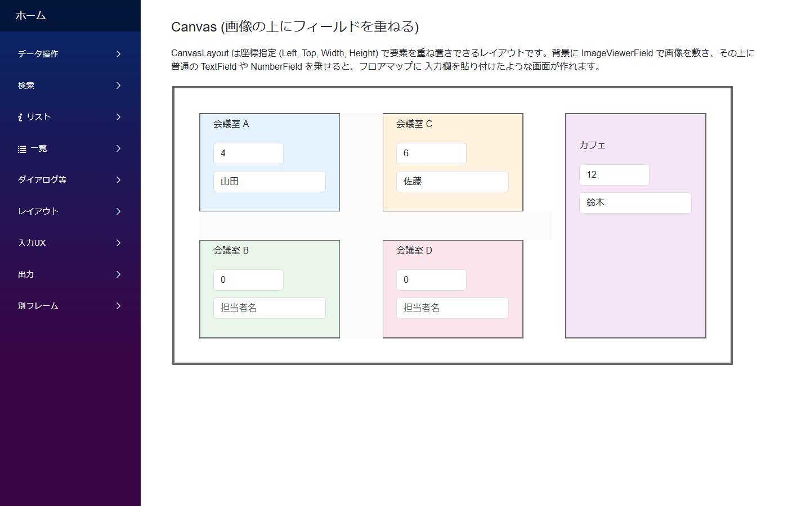
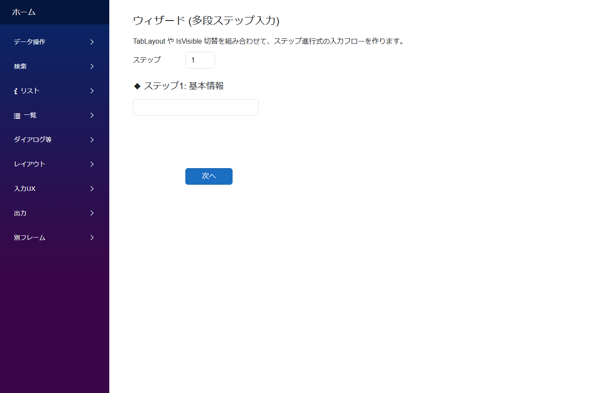

# 画面レイアウトのパターン

`GridLayout` / `TabLayout` / `CanvasLayout` の組み合わせで、フォーム整形・スクロール領域・タブ分割・自由配置などを実現する各種パターン。

---

## フォーム整形 (ラベル列 + 入力列)

**ラベル列 (固定幅 80〜140px) + 入力列 (可変)** の 2 カラム構成で詳細入力フォームを整える基本パターン。ラベル列に `VerticalAlignment: Middle` を必ず付けて、入力欄の高さが変わってもラベルが中央に揃うようにする。

**標準パターン集の対応**: サイドバー **`レイアウト/フォーム整形 → `FormLayoutSample``**

---
## タブ分割

1 つの詳細画面に複数の関連情報をタブで切り替えて表示する `TabLayoutDesign`。設定タブ・概要タブ・履歴タブのように関心領域を分けたいときに。

**標準パターン集の対応**: サイドバー **`レイアウト/タブで分割 → `TabLayoutSample``**

---
## 残り領域を埋める (FillAvailable)

`GridLayout.IsFillAvailable: true` を立て、最終行に `ListField` を配置すると、リストが画面の残り高さを埋めるまで自動で広がる。データが多ければ ListField の内部スクロール、少なければ空白でも安定。

**標準パターン集の対応**: サイドバー **`レイアウト/残り領域を埋める → `FillAvailableSample``**

---
## 折り返し対応 (レスポンシブ)

`GridRow.IsWrap: true` + 各 Column 内に `IsBordered: true` な Grid (カード) を配置すると、画面が広いときは**横並び**、狭くなったら**自動で縦に折り返し**。`MinWidth` で折り返し閾値を指定。ダッシュボード型 UI に使う。

**標準パターン集の対応**: サイドバー **`レイアウト/折り返し対応 → `ResponsiveSample``**

---
## 罫線とカード

`GridLayout.IsBordered: true` でセクション全体を **Bootstrap カード化**、各 Column の `BorderStyle` で個別の罫線を引ける。情報の塊を視覚的に分離したいときに使う。

**標準パターン集の対応**: サイドバー **`レイアウト/罫線とカード → `BorderSample``**

---
## リサイズ (ユーザーが幅変更)

`GridRow.CanResize: true` / `GridColumn.CanResize: true` でセル境界をドラッグして行高・列幅を実行時に変えられる。マスタ画面の左右ペイン分割や、固定ヘッダの行配分など、ユーザに表示比率を委ねたいときに。

**標準パターン集の対応**: サイドバー **`レイアウト/リサイズ → `ResizeSample``**

---
## モジュール埋め込み (動的差替え)

親画面の中に別 Module を埋め込む `ModuleField`。スクリプトの `SetModule()` で **表示する Module を実行時に切り替えられる** (DbColumn 空の ModuleField でのみ可)。ダッシュボード・タブの中身・条件付き表示に有効。

**標準パターン集の対応**: サイドバー **`レイアウト/モジュール埋め込み → `NestedModuleSample``**

---
## 自由配置 (Canvas)

`CanvasLayout` は **座標指定 (Left, Top, Width, Height) で要素を重ね置きできる**レイアウト。背景に `ImageViewerField` で画像を敷き、その上に普通の Text/Number を絶対配置すると、図面上の入力フォームのような画面が作れる。

**標準パターン集の対応**: サイドバー **`レイアウト/自由配置 → `CanvasLayoutSample``**

---
## ウィザード (ステップ入力)

`TabLayout` や `IsVisible` の切替を組み合わせて、ステップ進行式の入力フローを作る。前へ/次へボタンで状態を進める。アンケート・申込・初期設定など段階的入力に。

**標準パターン集の対応**: サイドバー **`レイアウト/ウィザード → `WizardSample``**

---

## 関連ドキュメント

- [アプリ作成パターン一覧](patterns.md) ─ 全パターンのインデックス
- [モジュール定義の全体構造](../module/module.md)
- [Field リファレンス](../fields/)
