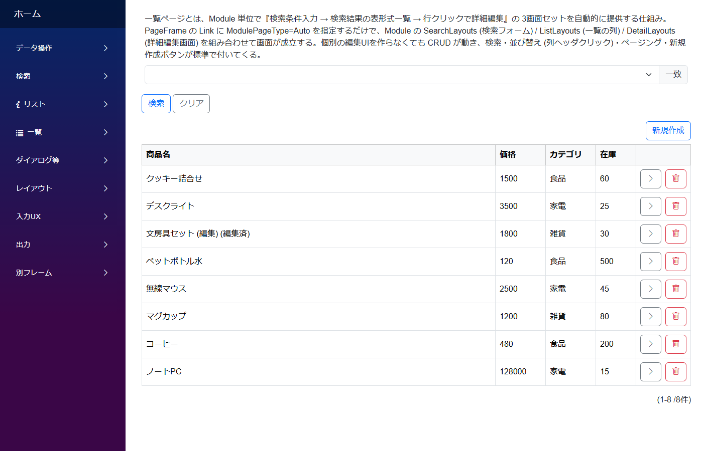
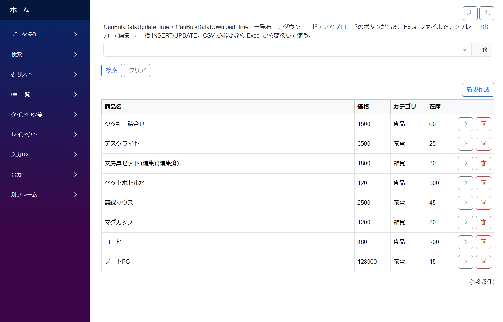
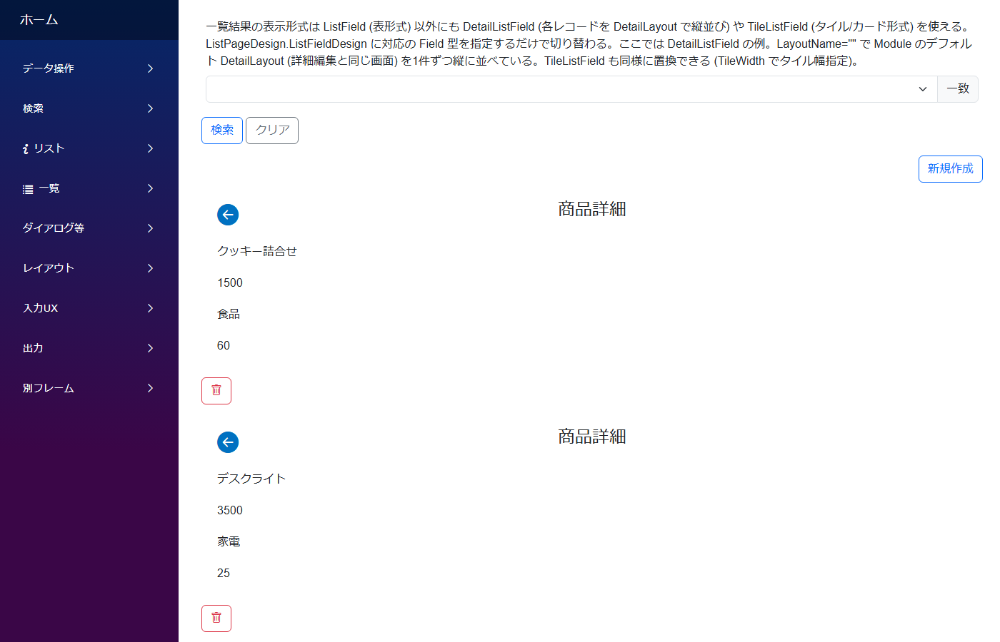
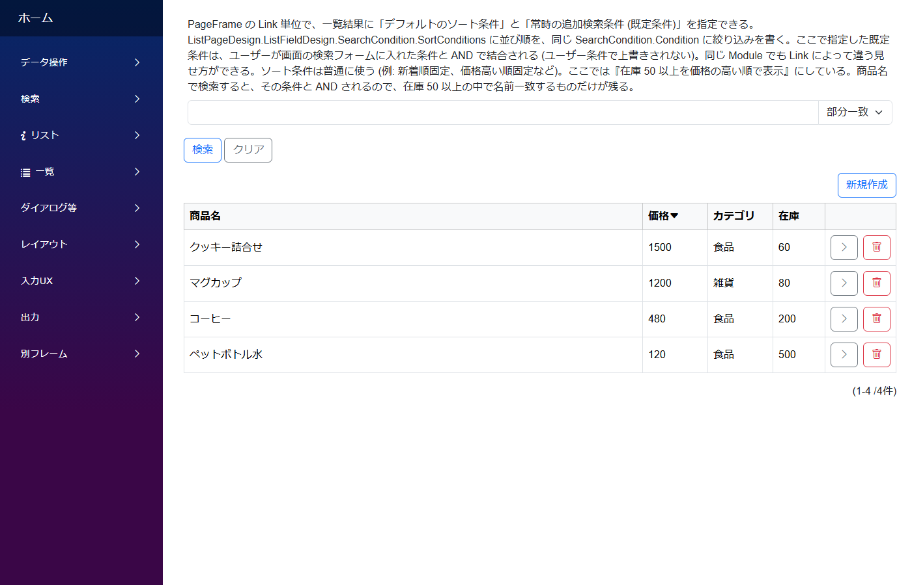
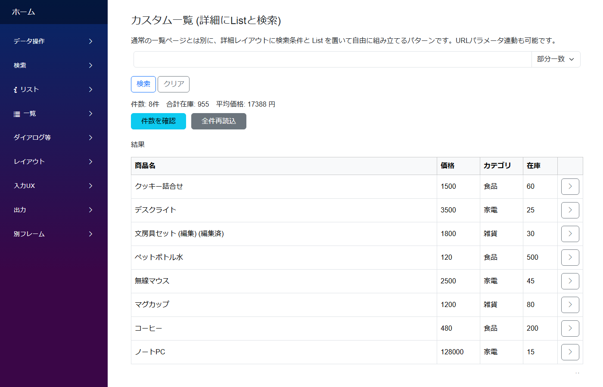
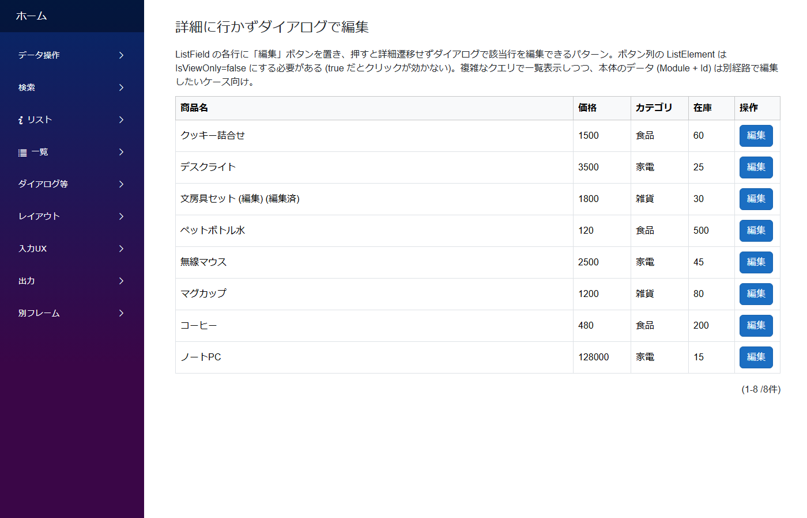
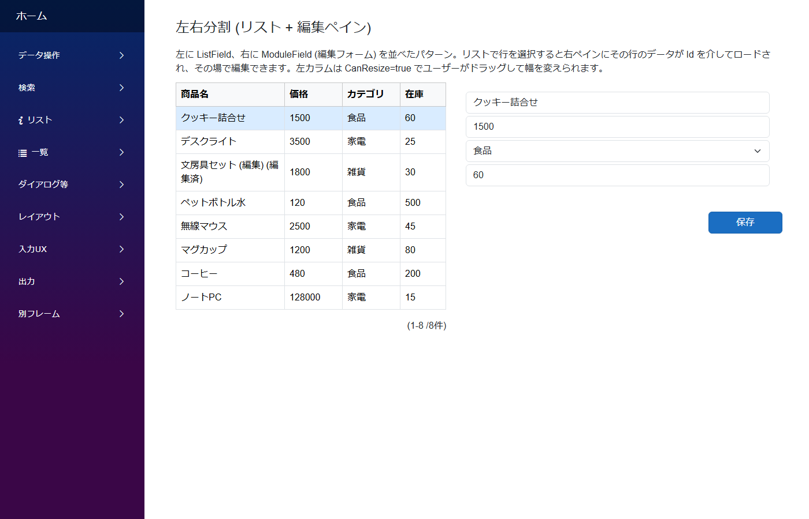

# 一覧ページのパターン

`PageFrame` の Link で `ModulePageType=Auto` (or `ListToDetail`) を指定すると、**検索条件入力 → 表形式一覧 → 行クリックで詳細編集** の 3 画面セットが自動生成されます。同じモジュールでも Link 側の設定で動作を変えられます。

---

## 基本

最もシンプルな一覧画面。検索 + 結果表 + 行クリックで詳細遷移。`PageFrame.Link.ListPageDesign` のデフォルト動作。

**標準パターン集の対応**: サイドバー **`一覧/基本 → `ListPageDemo` (URL: `list-basic-v2`)`**

---
## 一括処理 (Excel 入出力)

Link 側で `CanBulkDataUpdate: true` + `CanBulkDataDownload: true` を立てると、一覧上部に **Excel ダウンロード / アップロードのアイコンボタン**が出現。大量データの初期投入や一括更新に。

**標準パターン集の対応**: サイドバー **`一覧/一括処理 → `ListPageDemo` (URL: `list-bulk`)`**

---
## Detail 表示

Link 側で `ListFieldDesign.LayoutName` を指定して 1 行を **詳細レイアウト形式**で表示。`DetailListField` 風の見せ方を一覧ページで実現できる。

**標準パターン集の対応**: サイドバー **`一覧/Detail表示 → `ListPageDemo` (URL: `list-detail`)`**

---
## 既定条件 (デフォルト絞り込み + 並び替え)

Link 側の `ListFieldDesign.SearchCondition` に固定の絞り込み条件 (`MatchCondition`) や並び替え (`SortConditions`) を入れておくと、同じモジュールでもサイドバーリンクごとに **異なるフィルタ済み一覧**を提供できる。

**標準パターン集の対応**: サイドバー **`一覧/既定条件 → `ListPageDemo` (URL: `list-filtersort`)`**

---
## カスタム一覧 (自前で組む)

標準の一覧ページじゃ表現しきれない自由なレイアウト (検索 + サマリ + 一覧 + ボタンを 1 画面に組み合わせる等) は、**表示専用モジュール**を作って詳細レイアウトに `SearchField` + `ListField` を自前配置する。

**標準パターン集の対応**: サイドバー **`一覧/カスタム一覧 → `CustomList``**

---
## ダイアログ編集

ListField の各行に「編集」ボタンを置いて、押すと**詳細遷移せずダイアログで該当行を編集**できるパターン。ボタン列の ListElement は `IsViewOnly: false` にする必要がある (`true` だとクリックが効かない)。

**標準パターン集の対応**: サイドバー **`一覧/ダイアログ編集 → `EditFromListSample``**

---
## 左右分割 (リスト + 編集ペイン)

左に `ListField`、右に `ModuleField` (編集フォーム) を並べたパターン。リストで行を選択すると右ペインにその行のデータが Id 経由でロードされ、その場で編集できる。左カラムは `CanResize: true` で幅可変。

**標準パターン集の対応**: サイドバー **`一覧/左右分割 → `SplitViewSample``**

---

## 関連ドキュメント

- [アプリ作成パターン入口](patterns.md) ─ 全パターンのインデックス
- [モジュール定義の全体構造](../module/module.md)
- [Field リファレンス](../fields/)
