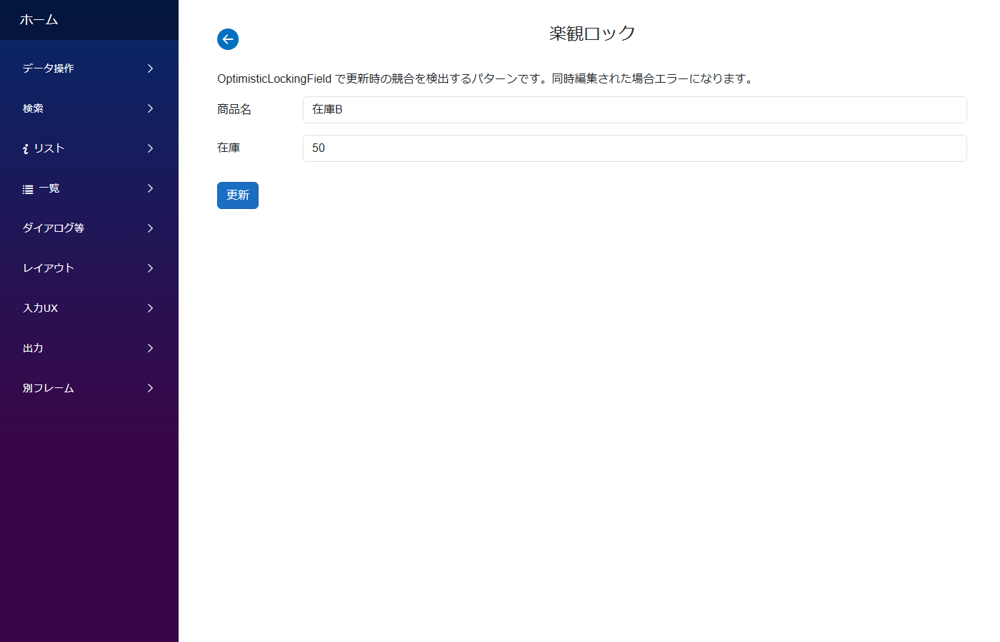

# 楽観ロック (同時編集の検出と防止)

**いつ使う**: 複数ユーザーが同じレコードを同時編集する可能性がある業務系アプリで、**「先に更新した人の変更が無くならないように」** 守りたいとき。

## アプリの作り



- 通常の編集画面でユーザーが意識する操作はない
- ただし**別の人が先に保存していた場合**、保存ボタンを押すと「他のユーザーが先に更新しました」というエラーが出る
- ユーザーは画面をリロードして最新値を取得し直してから編集を再開

## 支えるデータ構造

```
locked_items
├── id           PK
├── name         TEXT
├── stock        INTEGER
└── Version      INTEGER  ← OptimisticLocking 用バージョン列
```

`Version` (or `xmin` 等) 列を増減でバージョン管理。CLB の保存処理が `UPDATE ... WHERE Version = ?` で楽観ロック制御する。

## モジュールとテーブルの対応

| モジュール | テーブル | 主なフィールド |
|---|---|---|
| `LockedItem` | `LockedItems` | `Stock` 等の通常フィールド + `OptimisticLocking` (予約名、DbColumn は `Version` 等) |

## CLB ではこう作る

- フィールドに `OptimisticLockingFieldDesign` を追加して **`Name` を予約名 `"OptimisticLocking"`** にする (UI 表示しないので Fields だけ定義し、Layout には入れない)
- `DbColumn` は実際の DB 列名 (例: `Version`)
- PostgreSQL なら `xmin` 列でデフォルト動作。SQL Server/MySQL/SQLite はアプリ側のバージョン管理 (`IncrementVersion: true`) を有効化
- 保存時に CLB が自動で `UPDATE ... WHERE OptimisticLocking = ? SET OptimisticLocking = OptimisticLocking + 1` 相当を実行
- バージョン不一致なら例外で保存を防止

## 標準パターン集の対応

サイドバー **`データ操作/楽観ロック`** → `LockedItem`

## 落とし穴

- フィールド名は予約名の **`OptimisticLocking`** の綴り。任意名だと CLB の自動動作が効かない
- PostgreSQL の `xmin` は DB 側で勝手に更新される。SQL Server/MySQL/SQLite は `IncrementVersion: true` を明示しないとアプリ側バージョン管理が動かない (デフォルト false は PostgreSQL 前提)

## 関連ドキュメント

- [アプリ作成パターン入口](patterns.md) ─ 全パターンのインデックス
- [モジュール定義の全体構造](../module/module.md)
- [Field リファレンス](../fields/) ─ OptimisticLockingField の詳細
