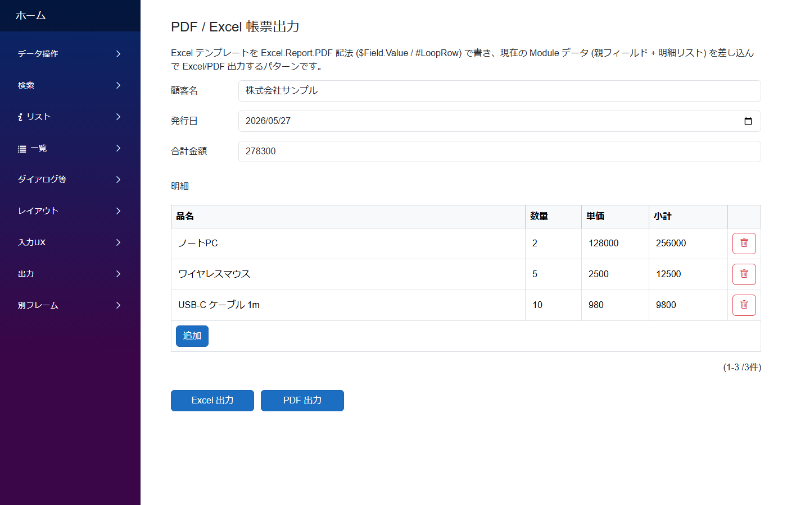

# 出力のパターン

レコード内容を Excel / PDF として書き出す帳票系のパターン。

---

## Excel / PDF 帳票

Excel テンプレートを `$Field.Value` / `#LoopRow` のような **Excel.Report.PDF 記法**で書き、現在の Module データ (親フィールド + 明細リスト) を差し込んで Excel/PDF として出力するパターン。請求書・見積書・成績表など定型帳票に。

**標準パターン集の対応**: サイドバー **`出力/帳票 → `ReportSample``**

---

## 関連ドキュメント

- [アプリ作成パターン入口](patterns.md) ─ 全パターンのインデックス
- [モジュール定義の全体構造](../module/module.md)
- [Field リファレンス](../fields/)
