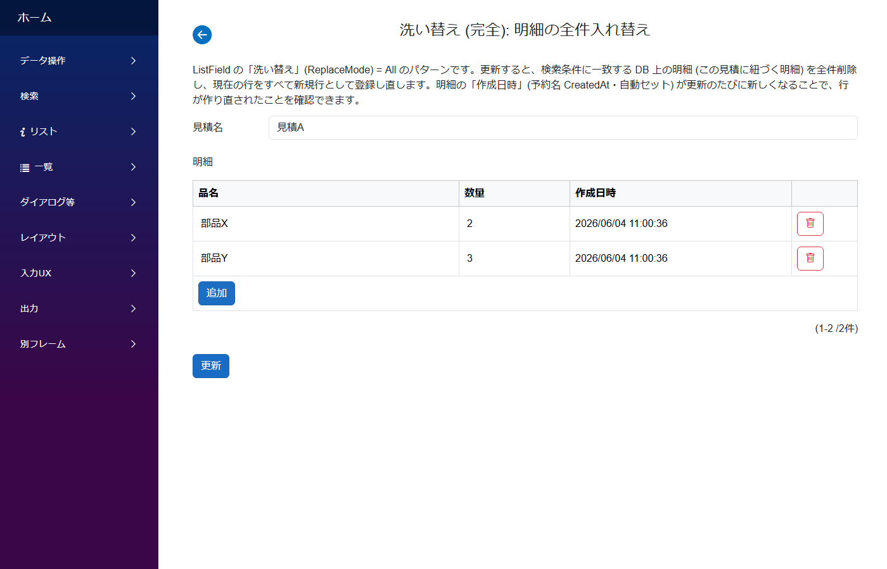
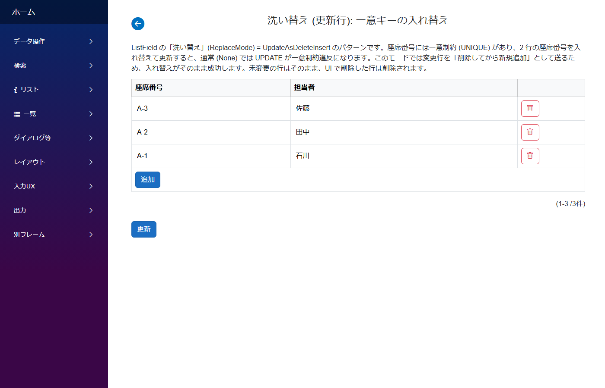

# 洗い替え (ListField の保存方式を入れ替えにする)

**いつ使う**: 明細やマスタの保存を「差分の追加/更新/削除」ではなく**入れ替え**として扱いたいとき。`ListField` の **洗い替え (`ReplaceMode`)** プロパティで保存時の挙動を切り替えます。

| ReplaceMode | 挙動 | 典型ケース |
|---|---|---|
| `None` (既定) | 通常の追加/更新/削除 | 普通の明細編集 |
| `All` | 条件に一致する DB 上のデータを**全件削除**し、現在の行を**すべて新規追加**し直す | 取込データの総入れ替え、構成明細の確定保存 |
| `UpdateAsDeleteInsert` | **変更行だけ**を「削除してから新規追加」に置き換える | 一意制約のある列 (座席番号・表示順など) の**値の入れ替え** |

---

## パターン1: 完全洗い替え (`ReplaceMode: All`)

### アプリの作り



- 見積 (親) の詳細画面に明細 (子) の `ListField` を置いた、よくあるヘッダ詳細構成
- 更新ボタンを押すと、**この見積に紐づく明細を DB から全件削除し、画面の行をすべて新規行として登録し直す**
- 明細の「作成日時」(予約名 `CreatedAt`・自動セット) が保存のたびに新しくなるので、行が作り直されたことを確認できる

### 支えるデータ構造

```
ReplaceAllSamples            ReplaceAllItems
├── Id        PK             ├── Id        PK (保存のたびに振り直される)
└── Name      TEXT           ├── ParentId  FK → ReplaceAllSamples.Id
                             ├── ItemName  TEXT
                             ├── Qty       INTEGER
                             └── CreatedAt DATETIME (予約名で自動セット)
```

### モジュールとテーブルの対応

| モジュール | テーブル | 役割 |
|---|---|---|
| `ReplaceAllSample` | `ReplaceAllSamples` | 親 (見積)。明細 `ListField` の `ReplaceMode: "All"` |
| `ReplaceAllItem` | `ReplaceAllItems` | 子 (明細)。`CreatedAt` で作り直しを可視化 |

### CLB ではこう作る

- 親の明細 `ListField` に **`ReplaceMode: "All"`** を設定。それ以外は通常のヘッダ詳細 (1:N) と同じ
- 削除対象は `ListField` の `SearchCondition` (= 親 Id で絞る条件) に一致する範囲。**他の親の明細には影響しない**
- 親が新規 (未保存) のときは DB に対応データが無いため、削除はスキップされて追加だけ実行される

### 標準パターン集の対応

サイドバー **`データ操作/洗い替え (完全)`** → `ReplaceAllSample` + `ReplaceAllItem`

### 落とし穴

- 子の **Id は保存のたびに振り直される**。子の Id を別テーブルから参照している (FK で握っている) 構造では使わないこと
- 検索条件が空 (親で絞っていない等) の場合、全件削除になってしまうのを防ぐため**サーバー側で拒否**される。`ReplaceMode: All` は親 Id 等で絞った `ListField` で使う

---

## パターン2: 更新行を削除+追加に (`ReplaceMode: UpdateAsDeleteInsert`)

### アプリの作り



- 座席番号 (一意制約あり) と担当者の一覧をインライン編集する画面
- 2 行の座席番号を入れ替えて更新すると、通常 (`None`) は UPDATE が**一意制約違反**になるが、このモードでは成功する
- 変更行を「削除してから新規追加」として送るため、削除が先に実行されて衝突しない

### 支えるデータ構造

```
Seats
├── Id          PK
├── SeatNo      TEXT UNIQUE   ← 一意制約
└── PersonName  TEXT
```

### モジュールとテーブルの対応

| モジュール | テーブル | 役割 |
|---|---|---|
| `SeatReplaceSample` | (なし、表示専用) | 親画面。`Seats` (`ListField`) の `ReplaceMode: "UpdateAsDeleteInsert"` |
| `Seat` | `Seats` | 子 (実データ)。`SeatNo` に UNIQUE 制約 |

### CLB ではこう作る

- `ListField` に **`ReplaceMode: "UpdateAsDeleteInsert"`** を設定
- 影響を受けるのは**変更した行だけ**。未変更行はそのまま、新規行は通常どおり追加、UI で削除した行は削除される
- 変更行の Id は振り直されるが、未変更行の Id は維持される

### 標準パターン集の対応

サイドバー **`データ操作/洗い替え (更新行)`** → `SeatReplaceSample` + `Seat`

### 落とし穴

- `All` と同じく、**変更行の Id は振り直される**。Id を外部から参照している行を頻繁に書き換える用途には向かない
- 予約名のシステムフィールド (`CreatedAt` / `Creator` 等) は新規追加扱いで再セットされる

---

## 関連ドキュメント

- [アプリ作成パターン一覧](patterns.md) ─ 全パターンのインデックス
- [ヘッダ詳細 (1:N)](header_detail.md) ─ 洗い替えしない通常の明細保存
- [ListField リファレンス](../fields/List.md)
