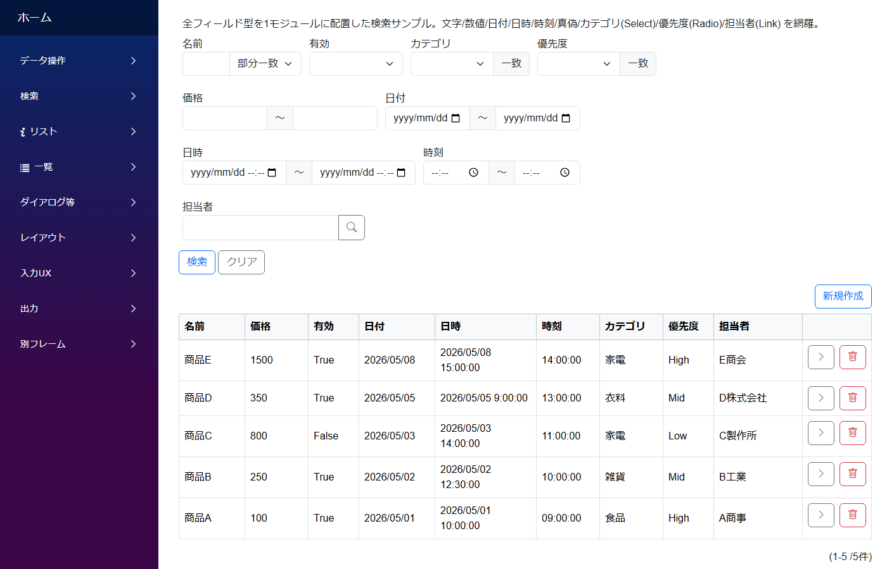
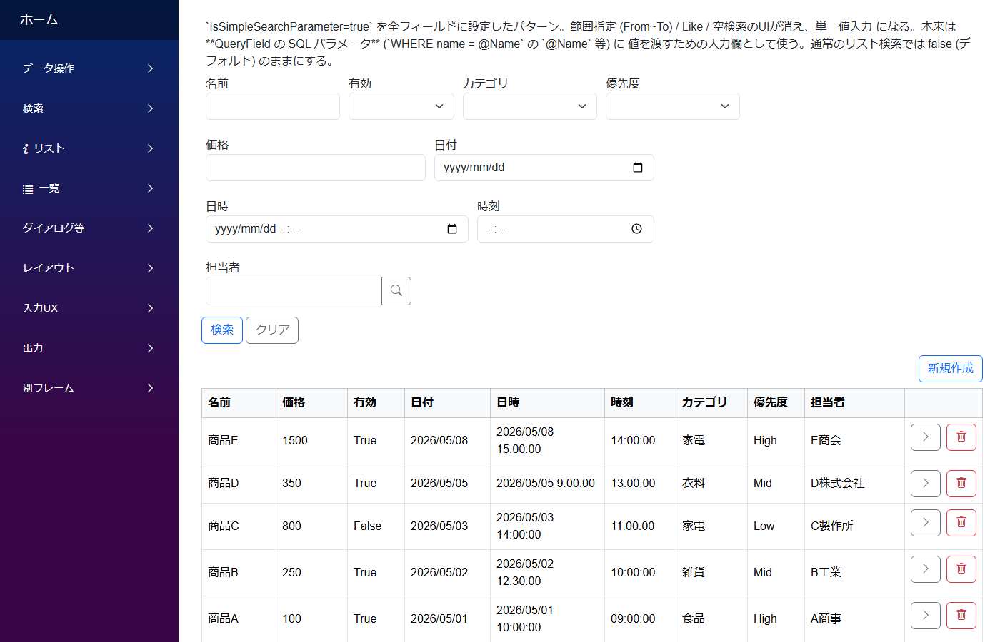
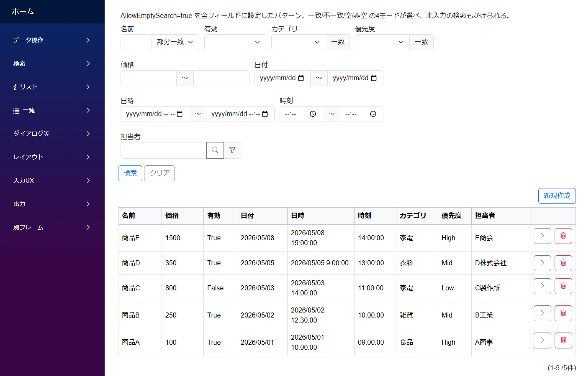
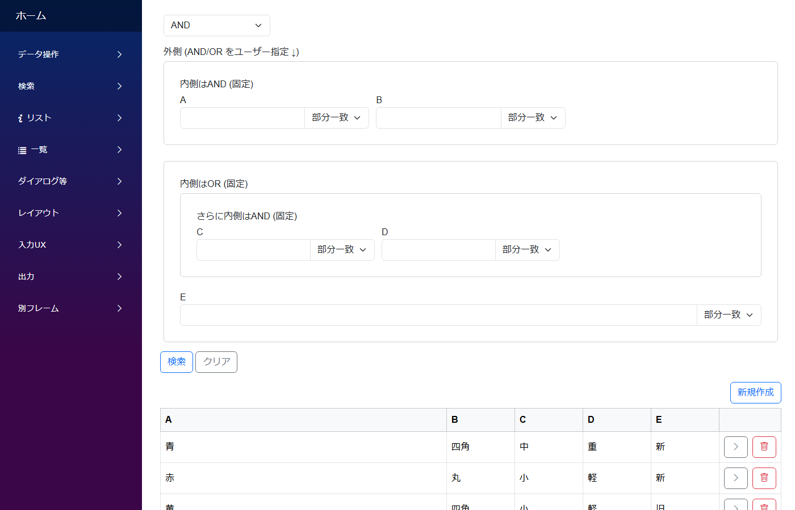
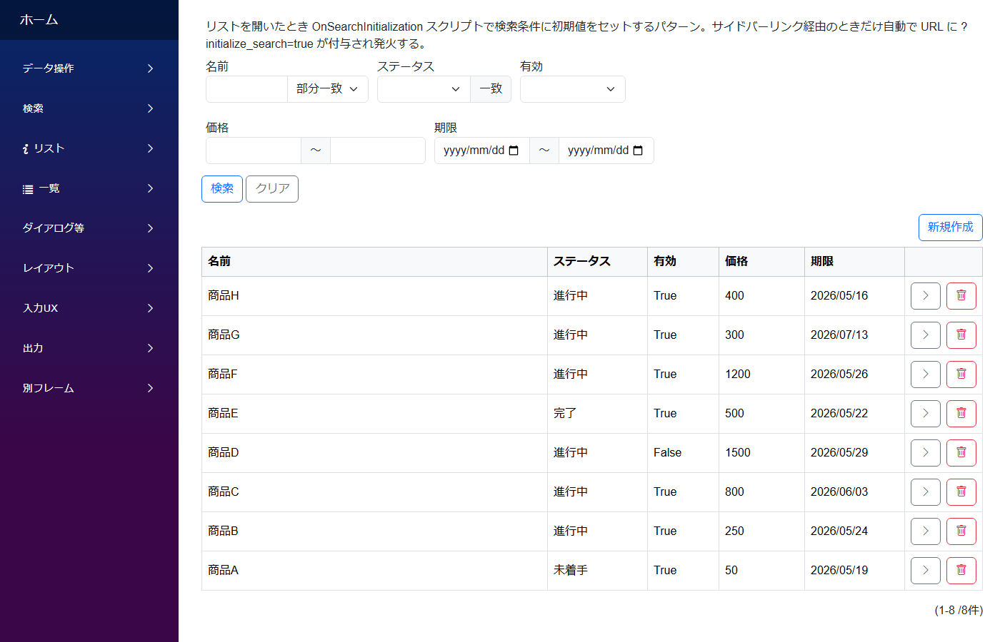

# 検索のパターン

リスト画面に検索条件を付けて結果を絞り込む各種パターン。基本的に 1 つの SearchLayout (検索レイアウト) と検索結果リストの組み合わせで実現します。

---

## 全フィールド検索

Text / Number / Date / DateTime / Time / Select / Radio / Boolean / Link / Id を 1 つの SearchLayout に並べた基本サンプル。Number/Date 系は標準で **From〜To 範囲入力 UI** に、Boolean は **3 状態 (true/false/未指定)** に自動切替されます。

**標準パターン集の対応**: サイドバー **`検索/全フィールド → `AllFieldsSearch``**

---
## 簡易検索パラメータ

フィールドの `IsSimpleSearchParameter: true` を付けると、SearchLayout に置かなくても URL パラメータや一覧画面の簡易検索 UI で絞り込めます。「サイドバーから直接特定の条件で開きたい」ケースに便利。

**標準パターン集の対応**: サイドバー **`検索/簡易検索パラメータ → `SimpleSearch``**

---
## 空検索 (常時全件表示)

SearchLayout を空にして、開いた瞬間に全件表示するパターン。マスタ表のように検索よりも一覧表示が目的の画面で使います。`AllowEmptySearch: true` で「条件未入力でも検索ボタンを押せる」設定にできます。

**標準パターン集の対応**: サイドバー **`検索/空検索 → `EmptySearch``**

---
## AND・OR 切替検索

SearchLayout の `SearchOperator` を `UserSpecified` にすると、画面で **AND/OR を切り替えるラジオボタン**が出現。さらに 3 階層までネストして複雑な論理式 (例: `(A AND B) OR (C AND D)`) を組み立てられます。

**標準パターン集の対応**: サイドバー **`検索/AND・OR → `AndOrSearch``**

---
## 検索条件の初期化

サイドバーリンクから一覧を開いたとき、検索条件に初期値が入っている状態にしたい場合。`OnSearchInitialization` スクリプトで `SearchValue` / `SearchMin` / `SearchMax` をセットします。サイドバーリンク経由で URL に `?initialize_search=true` が自動付与されたときだけ発火する仕様。

**標準パターン集の対応**: サイドバー **`検索/初期化 → `SearchInit``**

---

## 関連ドキュメント

- [アプリ作成パターン一覧](patterns.md) ─ 全パターンのインデックス
- [モジュール定義の全体構造](../module/module.md)
- [Field リファレンス](../fields/)
