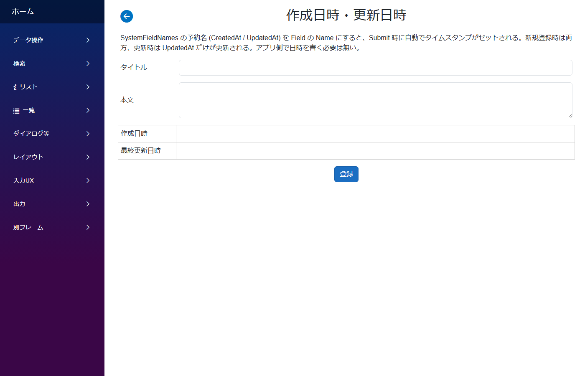

# 作成日時・更新日時の自動セット (システムフィールド)

**いつ使う**: 「いつ作られた / 最後に更新されたか」「誰が作った / 更新したか」を全レコード自動で記録したい。

## アプリの作り



- 通常の編集画面でユーザーが意識する必要なし (CLB が裏で自動セット)
- 詳細画面に「作成: 2026-01-15 田中」「更新: 2026-01-20 山田」のような表示を出すことが多い

## 支えるデータ構造

```
sample_items
├── id          PK
├── name
├── created_at  TIMESTAMP   ← CreatedAt
├── updated_at  TIMESTAMP   ← UpdatedAt
├── creator     INT (FK → users)  ← Creator
└── updater     INT (FK → users)  ← Updater
```

## モジュールとテーブルの対応

| モジュール | テーブル | 主なフィールド (予約名) |
|---|---|---|
| `SystemFieldsSample` | `sample_items` | `CreatedAt` / `UpdatedAt` (DateTime) / `Creator` / `Updater` (LinkField → ユーザー) |

これらは CLB の **予約名** (綴り厳密一致) で動作する。

## CLB ではこう作る

予約名でフィールドを定義するだけ。CLB が Submit 時に自動セットする (スクリプト不要):

| フィールド名 (予約名) | 型 | 動作 |
|---|---|---|
| `CreatedAt` | DateTime | レコード作成時に自動セット |
| `UpdatedAt` | DateTime | レコード更新時に自動セット |
| `Creator` | Link → ユーザー | 作成者を自動セット |
| `Updater` | Link → ユーザー | 更新者を自動セット |

## 標準パターン集の対応

サイドバー **`データ操作/作成日時・更新日時`** → `SystemFieldsSample`

## 落とし穴

- フィールド名は予約名の **綴りそのまま**。`CreatedDate` 等の任意名だと自動セットされない
- スクリプトで `Creator.Value = CurrentUser.Id.Value` のように代入する必要はない (CLB が自動で入れる)

## 関連ドキュメント

- [アプリ作成パターン入口](patterns.md) ─ 全パターンのインデックス
- [モジュール定義の全体構造](../module/module.md)
- [Field リファレンス](../fields/) ─ LinkField / ListField / DetailListField / ModuleField 等の詳細
