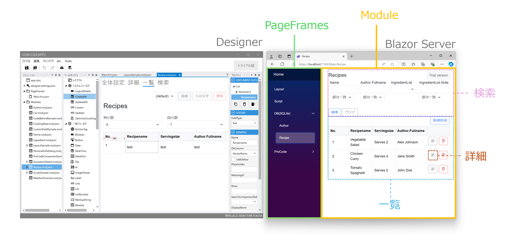
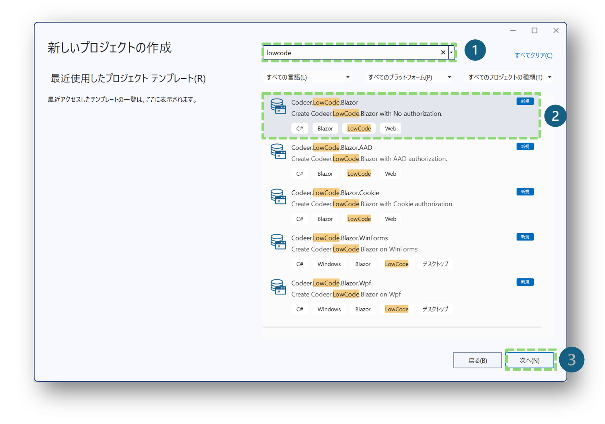
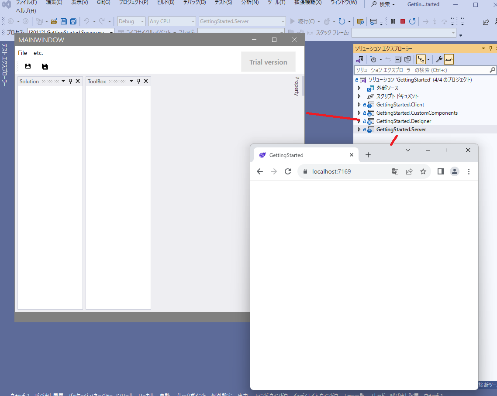
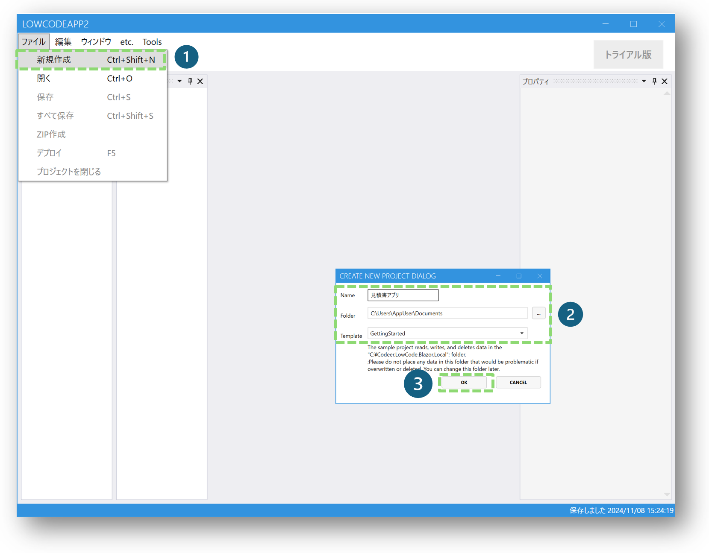
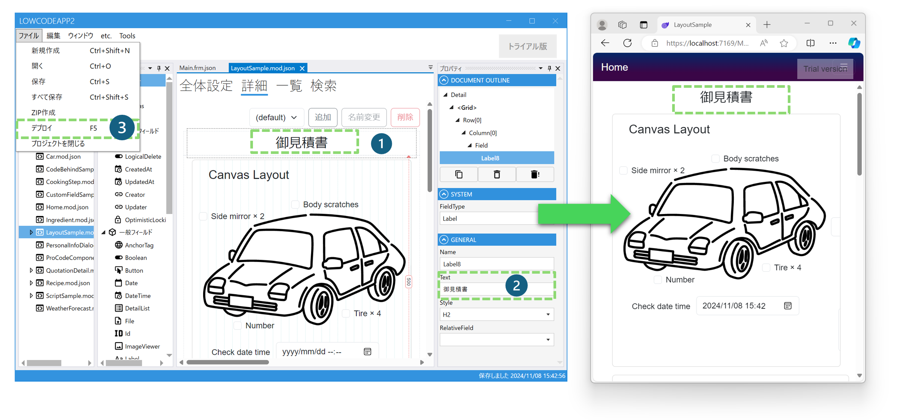

# クイックスタート

**所要時間: 約 10 分**

Visual Studio のテンプレートから、サンプル入りのプロジェクトを作成して Web ブラウザで動かすまでを案内します。
ここではまだコードは書きません。まず「**どんなものが動くのか**」を手元で確認することがゴールです。

完成後はこんな画面が動きます:

> 動画で見たい方: [Getting Started（YouTube）](https://youtu.be/MchuOxWYR1o?si=7I9FfQB55dP9ctY-)

---

## 前提

- Windows 環境（デザイナは WPF アプリのため）
- Visual Studio 2022 以降
- .NET 8.0 SDK

---

## Step 1. Visual Studio テンプレートをインストール

Visual Studio Marketplace から拡張機能をインストールします。

- [Codeer.LowCode.Blazor.Templates](https://marketplace.visualstudio.com/items?itemName=Codeer.LowCodeBlazor)

インストール後は Visual Studio を再起動してください。

---

## Step 2. プロジェクトを作成

Visual Studio の「新しいプロジェクトの作成」から `Codeer.LowCode.Blazor` を検索します。
Blazor / WPF / WinForms の 3 種類のテンプレートが表示されます。**初めての場合は Blazor がおすすめ**です。

作成されるソリューションには以下のプロジェクトが含まれます:

| プロジェクト | 役割 |
|---|---|
| `{名前}.Server` | Blazor アプリのサーバー部分 |
| `{名前}.Server.Shared` | デザイナとサーバーで共有 |
| `{名前}.Client` | Blazor アプリのクライアント部分（WebAssembly） |
| `{名前}.Client.Shared` | デザイナとクライアントで共有 |
| `{名前}.Designer` | デザイナ（WPF アプリ） |

---

## Step 3. ビルドしてデザイナと Web アプリを起動

ソリューションをビルドし、**Designer プロジェクト**と **Server プロジェクト**を起動します。

> **重要**: デザイナは必ず **Release 構成** で発行（Publish）して、Windows Explorer から起動してください。Debug 構成で起動すると正常に動作しない場合があります。

---

## Step 4. デザイナで新規プロジェクトを作成

デザイナ起動後、「ファイル」→「新規プロジェクト」を選びます。
**サンプルを含むプロジェクト**が作成され、画面がひととおり定義された状態になります。

---

## Step 5. Web アプリにデプロイ

デザイナのツールバーのボタンを押すと、デザイナの設定が Web アプリへ送信されます。
起動中の Web アプリがホットリロードされて、作成した画面がそのまま表示されます。

---

## Step 6. デザイナで変更してみる

デザイナで設定を少しだけ変えて、ボタンを押してみてください。**Web アプリに即座に反映**されます。
このサイクルが Codeer.LowCode.Blazor の基本的な開発スタイルです。

---

## つまずいたら

### Q. デザイナが起動しない / 落ちる

Debug 構成でビルドしている可能性があります。Designer プロジェクトを右クリック →「発行」から **Release 構成**で出力した exe を起動してください。

### Q. Web アプリに変更が反映されない

- Web アプリ（`{名前}.Server`）が起動中か確認
- デザイナ右下にデプロイの成否が表示されるので確認
- デザイナ設定で Web アプリの URL が合っているか確認（「ファイル」→「デザイナ設定」）

### Q. DB との接続はいつ必要？

クイックスタートのサンプルは SQLite を同梱しているので、追加設定なしで動きます。独自の DB に接続する場合は次のチュートリアルへ進んでください。

---

## 次に読む

動かせたら、次は**自分で画面を作ってみる**ステップです。

- [はじめてのモジュール作成](../tutorials/first_module.md) — 30 分で DB と連携した CRUD 画面を作る
- [コア概念](../introduction/concepts.md) — 用語をもう一度整理したい場合
