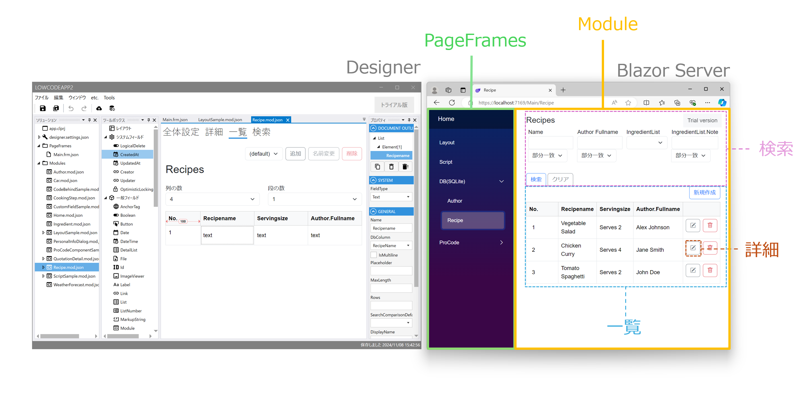
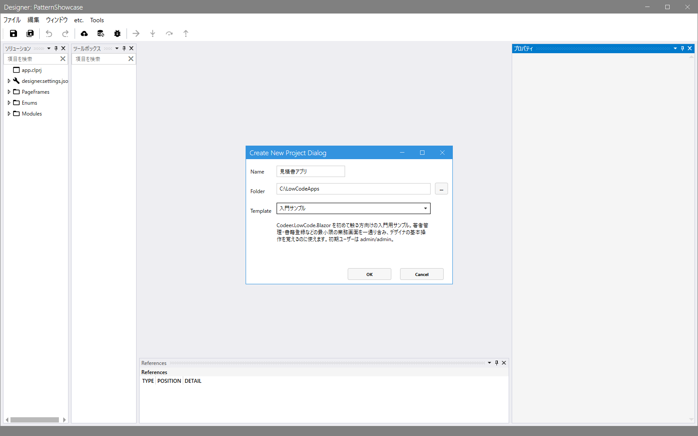
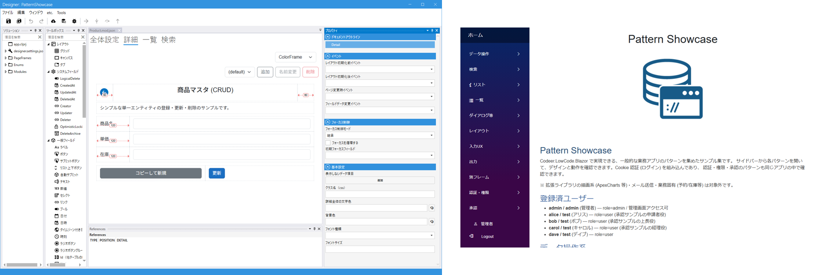

# クイックスタート

**所要時間: 約 10 分**

Visual Studio のテンプレートから、サンプル入りのプロジェクトを作成して Web ブラウザで動かすまでを案内します。
ここではまだコードは書きません。まず「**どんなものが動くのか**」を手元で確認することがゴールです。

完成後はこんな画面が動きます:

> 動画で見たい方: [Getting Started（YouTube）](https://youtu.be/MchuOxWYR1o?si=7I9FfQB55dP9ctY-)

---

## Claude Code に環境構築を任せる

[Claude Code](https://claude.com/claude-code) を使っているなら、以下の手順を全部任せることもできます。空のフォルダで Claude Code を起動し、こう伝えます。

> このURLを見て指示に従って https://github.com/Codeer-Software/Codeer.LowCode.Blazor.Starter

.NET SDK の確認、ソリューションの書き出しとビルド、空のデザインプロジェクトの作成、サーバーとデザイナの起動まで進みます。聞かれるのは不足ソフトを winget でインストールしてよいかだけです。Visual Studio は必須ではなく（VS Code 用の設定を同梱）、ライセンス登録なしでトライアルとして動きます。詳細は [Starter リポジトリの README](https://github.com/Codeer-Software/Codeer.LowCode.Blazor.Starter) を参照してください。

そのあと画面（デザイン）を作る流れは [Claude Code でデザインプロジェクトを編集](../ai/claude_code_designer.md) と同じです。以下は Visual Studio で手動で始める手順です。

---

## 前提

- Windows 環境（デザイナは WPF アプリのため）
- Visual Studio 2022 以降
- .NET 8.0 SDK
- **Microsoft Edge WebView2 ランタイム**（デザイナ内のプレビュー描画に必要）
  - Windows 11 は標準搭載。Windows 10 でも Microsoft Edge と一緒にインストールされていることが多いです。
  - デザイナでモジュールを開いてもプレビューが真っ白／コンポーネントが描画されない場合は未インストールの可能性があります。
  - 入っていない場合は [Microsoft Edge WebView2 ダウンロードページ](https://developer.microsoft.com/microsoft-edge/webview2/) から「Evergreen Standalone Installer」をインストールしてください。

---

## Step 1. Visual Studio テンプレートをインストール

Visual Studio Marketplace から拡張機能をインストールします。

- [Codeer.LowCode.Blazor.Templates](https://marketplace.visualstudio.com/items?itemName=Codeer.LowCodeBlazor)

インストール後は Visual Studio を再起動してください。

---

## Step 2. プロジェクトを作成

Visual Studio の「新しいプロジェクトの作成」から `Codeer.LowCode.Blazor` を検索します。
テンプレートは 2 種類あります。**まずは `Codeer.LowCode.Blazor` を選んでください。**

| テンプレート | 内容 |
|---|---|
| `Codeer.LowCode.Blazor` | Blazor WebAssembly クライアント + ASP.NET Core サーバー + デザイナ。ログイン機能（Cookie 認証。ユーザーテーブルでパスワードを照合。Entra ID などの外部ログインや二要素認証は設定で追加）を最初から含む |
| `Codeer.LowCode.Blazor.Maui` | .NET MAUI（Android / iOS）クライアントのみ。上のテンプレートで作ったサーバーに接続するスマートフォンアプリ |

ログイン機能はすべてのソリューションに含まれます。デザイナのテンプレートもすべてログインを前提に作られているので、Visual Studio 側で選び分ける必要はありません。
ログイン画面が不要な構成にする方法は [Starter リポジトリ](https://github.com/Codeer-Software/Codeer.LowCode.Blazor.Starter) の `CLAUDE.md`「認証を外す」にあります。

作成されるソリューションには以下のプロジェクトが含まれます:

| プロジェクト | 役割 |
|---|---|
| `{名前}.Server` | Blazor アプリのサーバー部分。ログイン処理もここ |
| `{名前}.Client` | Blazor アプリのクライアント部分（WebAssembly） |
| `{名前}.Client.Shared` | デザイナとクライアントで共有 |
| `{名前}.Designer` | デザイナ（WPF アプリ） |
| `{名前}.LicenseRegisterCli` | ライセンス登録用のコマンドラインツール |

---

## Step 3. ビルドしてデザイナと Web アプリを起動

ソリューションをビルドし、**Designer プロジェクト**と **Server プロジェクト**を起動します。

> **重要**: デザイナは必ず **Release 構成** で発行（Publish）して、Windows Explorer から起動してください。Debug 構成で起動すると正常に動作しない場合があります。

---

## Step 4. デザイナで新規プロジェクトを作成

デザイナ起動後、「ファイル」→「新規プロジェクト」を選び、テンプレートを選択します。
初めてなら **「入門サンプル」** がおすすめです。画面がひととおり定義された状態で作成されます。

| テンプレート | 内容 |
|---|---|
| 空のプロジェクト | ホーム画面とユーザーマスタ（`AppUser`）だけ。自分のアプリを 1 から作るときに |
| 入門サンプル | 著者・書籍などの小さな業務画面一式。デザイナの基本操作を覚える用 |
| 標準パターン集 | 検索・一覧・ダイアログ・レイアウト・認証・承認など 60 種以上の実装パターン集。詳細は [アプリ作成パターン](../patterns/patterns.md) |
| 在庫管理 / 営業支援 (SFA) / プロジェクト管理 | そのまま業務で使える完成形のアプリ。詳細は [業務テンプレート](../templates/templates.md) |

どのテンプレートにもユーザーマスタ（`AppUser`）と初期ユーザー **admin / admin** が含まれています。サンプルデータ入りの SQLite データベースも同時に配置されるので、DB の準備は不要です。

---

## Step 5. Web アプリにデプロイ

デザイナのツールバーのボタンを押すと、デザイナの設定が Web アプリへ送信されます。
起動中の Web アプリがホットリロードされて、作成した画面がそのまま表示されます。
ブラウザにはまずログイン画面が出るので、**admin / admin** でログインしてください。

---

## Step 6. デザイナで変更してみる

デザイナで設定を少しだけ変えて、ボタンを押してみてください。**Web アプリに即座に反映**されます。
このサイクルが Codeer.LowCode.Blazor の基本的な開発スタイルです。

---

## つまずいたら

### Q. デザイナが起動しない / 落ちる

Debug 構成でビルドしている可能性があります。Designer プロジェクトを右クリック →「発行」から **Release 構成**で出力した exe を起動してください。

### Q. Web アプリに変更が反映されない

- Web アプリ（`{名前}.Server`）が起動中か確認
- デザイナ右下にデプロイの成否が表示されるので確認
- デザイナ設定で Web アプリの URL が合っているか確認（「ファイル」→「デザイナ設定」）

### Q. ログイン画面で入れない

どのテンプレートも初期ユーザーは **admin / admin** です。標準パターン集には alice / bob / carol / dave（パスワード: test）も登録されています。

### Q. DB との接続はいつ必要？

クイックスタートのサンプルは SQLite を同梱しているので、追加設定なしで動きます。独自の DB に接続する場合は次のチュートリアルへ進んでください。

---

## 次に読む

動かせたら、次は**自分で画面を作ってみる**ステップです。

- [はじめてのモジュール作成](../tutorials/first_module.md) — 30 分で DB と連携した CRUD 画面を作る
- [コア概念](../introduction/concepts.md) — 用語をもう一度整理したい場合
