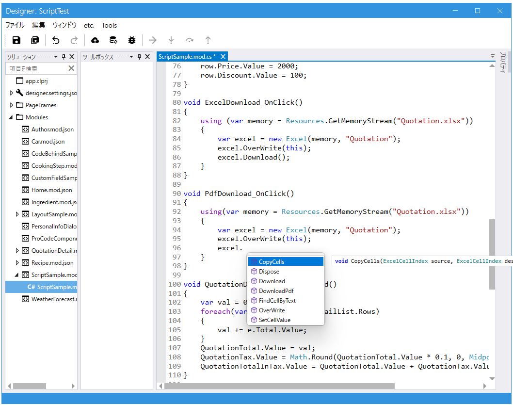

# スクリプト

Codeer.LowCode.Blazor のスクリプトは、**C# とほぼ同じ構文で書ける軽量スクリプト**です。
デザイナで Field やイベントを選んで、画面の挙動をカスタマイズします。



---

## どこに書くか

| 書く場所 | 例 |
|---|---|
| **Field のイベント** | `OnClick`（Button）、`OnDataChanged`（TextField 等）、`OnSelectedIndexChanged`（List） |
| **レイアウトのイベント** | `OnBeforeInitialization`、`OnAfterInitialization` |
| **Module の Scripts** | 自由に書けるトップレベル領域。関数・モジュール変数を定義する |
| **Field のスクリプト式** | `IsVisible`、`IsEnabled` などの式に短い式を書く |

スクリプトはデザイナのプロパティパネルから入って、専用エディタで編集します。

---

## イベントハンドラの命名規則

イベントから作られる関数の名前は **`{FieldName}_{EventName}`** が標準です。
この名前にしておくと、エディタで Field 名の補完が効きます。

```csharp
// SaveButton (Button) の OnClick
void SaveButton_OnClick()
{
    Toaster.Success("保存しました");
}

// EmailField (Text) の OnDataChanged
void EmailField_OnDataChanged()
{
    if (!EmailField.Value.Contains("@"))
    {
        EmailField.SetError("@ が含まれていません");
    }
}
```

---

## 同期と非同期

戻り値が `Task` / `Task<T>` のメソッドは **`await` を付けて呼び出します**。

```csharp
async Task SaveButton_OnClick()
{
    if (!await ValidateInput()) return;
    if (await Submit())
    {
        Toaster.Success("保存しました");
    }
}
```

メソッド名に `Async` が付いていなくても、戻り値が `Task` なら対象です。
ハンドラ自体も非同期処理を含むなら `async Task` にします。

> 内部的には `Submit` / `ShowDialog` / `MessageBox.Show` / `ValidateInput` など多くの API が非同期です。

---

## モジュールメンバーの参照

同じモジュール内では、Field・Layout・モジュール変数・モジュール関数は**名前のまま参照**できます。

```csharp
// 同じモジュール内
var name = NameField.Value;        // Field 参照
ListLayout.SetAdditionalCondition(s); // Layout 参照
var sum = CalcSum(10, 20);         // モジュール関数

// this も使える（明示したい場面で）
this.NameField.Value = "山田";
```

別モジュールは `new` で取得します。

```csharp
var customer = new Customer();
var info = customer.GetInfo();
```

---

## 学ぶ順番

1. **使い方を覚える** → [チュートリアル: スクリプトの基本](../tutorials/tutorial_script.md)（30分）
2. **モジュール連携** → [チュートリアル: モジュール連携](../tutorials/tutorial_modules.md)（40分）
3. **構文・型・名前解決の詳細** → [スクリプト構文リファレンス](script_syntax.md)
4. **使えるサービスの一覧** → [組み込みサービスとテンプレート由来サービス](script_services.md)
5. **他モジュールの検索** → [ModuleSearcher / BatchSearcher](script_module_searcher.md)
6. **独自の型・サービスを足す** → [スクリプトの拡張](script_extend.md)
7. **デバッグ** → [スクリプトデバッガ](script_debugger.md)

---

## Field 個別の API

各 Field 固有のプロパティ・メソッドはそれぞれの Field ドキュメントを参照してください。

- [Field 共通プロパティ](../fields/common_properties.md) — すべての Field で使えるもの
- [Field 一覧](../fields/field.md) — 個別ドキュメントの索引
- [Module からスクリプトで使えるもの](../module/module.md#スクリプトから-module-を操作する)

---

## 関連項目

- [プロコード](../overview/procode.md) — C# / Blazor で本格的に拡張する
- [破壊的変更（1.2.57）](../breaking_changes/1.2.57.md) — スクリプト仕様の変更履歴
