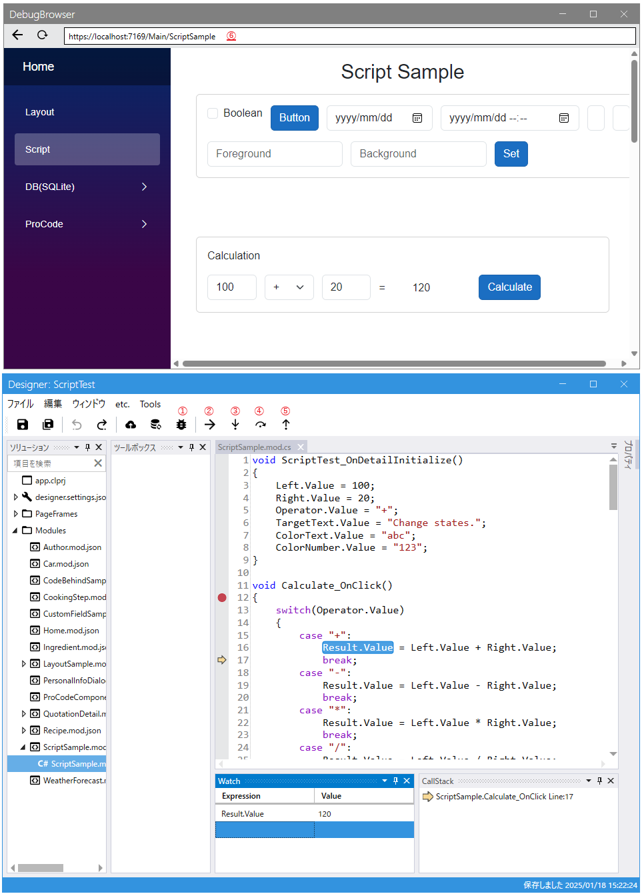

# スクリプトデバッガ



スクリプトをステップ実行できます。Web アプリ側で `CanScriptDebug` を `true` にする必要があります。

## 設定

`IAppInfoService` の `CanScriptDebug` で `true` を返すと利用可能になります。
`Codeer.LowCode.Blazor.Templates` Ver1.1.22.1 以降のテンプレートでは
`appsettings.Development.json` で指定できます。

```cs
// LowCodeApp.Client.Shared/Services/AppInfoService.cs (アプリテンプレート)
public bool CanScriptDebug => _config?.CanScriptDebug == true;
```

`_config` はサーバーから取得した設定で、Server プロジェクトの `appsettings.Development.json` の `CanScriptDebug` がそのまま使われます。

```json
{
  "DesignFileDirectory": "C:\\Codeer.LowCode.Blazor.Local\\Designs",
  "UseHotReload": true,
  "CanScriptDebug": true, // スクリプトデバッグの設定
  "FileSystemStorages": [
    {
      "Name": "Local",
      "Directory": "C:\\Codeer.LowCode.Blazor.Local\\Storages"
    }
  ]
}
```

## 操作

①でデバッグ用のブラウザを起動できます。⑥にデバッグ対象の URL を入力してください。
あとの操作は VisualStudio 等と同じです。

| 操作 | ショートカットキー | ボタン |
|----------|----------|----------|
| デバッガ起動 | F5 | ① |
| 実行 | F5 | ② |
| ステップイン | F11 | ③ |
| ステップオーバー | F10 | ④ |
| ステップアウト | Shift+F11 | ⑤ |

---

## 関連項目

- [スクリプト概要](script.md)
- [スクリプト構文リファレンス](script_syntax.md)
