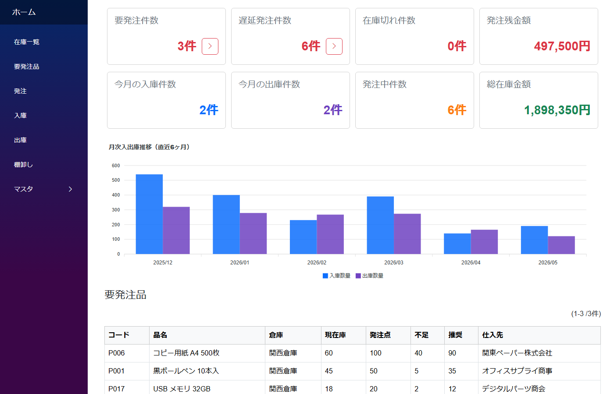
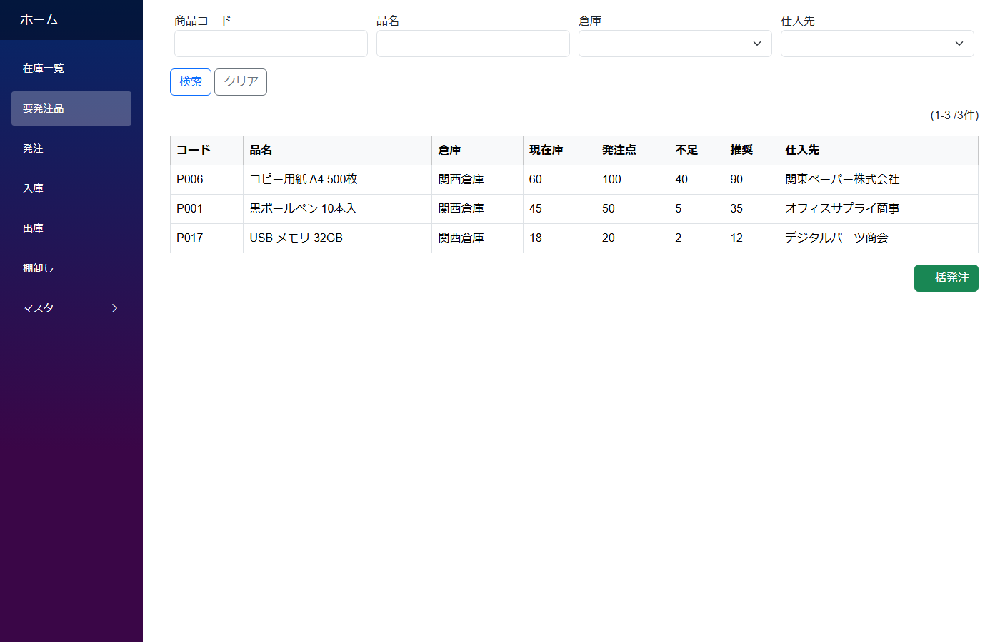

# 在庫管理テンプレート

中小規模の小売・卸売・製造業が、商品の入出庫・棚卸し・現在庫を一元管理し、適正在庫を維持するための雛形アプリ。Excel・紙台帳から脱却して、複数人同時編集・自動集計・発注点アラート付きのデジタル管理へ移行するためのたたき台です。

内部名: `InventoryManagementTemplate`



---

## 画面構成

| メニュー | 用途 |
|---|---|
| ホーム | KPI 8 枚（要発注 / 遅延発注 / 発注中 / 発注残金額 / 在庫切れ / 今月入出庫 / 総在庫金額）+ 月次入出庫推移グラフ |
| 在庫一覧 | 商品 × 倉庫の現在庫数を一覧表示。検索・絞り込みの起点 |
| 要発注品 | 現在庫が発注点を下回った商品の一覧。「一括発注」ボタンで仕入先 × 倉庫別の発注書を自動生成 |
| 発注 | 発注書の作成・確定・追跡。仮登録 → 発注中 → 一部入庫 → 完了 のステータス管理。発注書から入庫を起こすボタン付き |
| 入庫 / 出庫 / 棚卸し | 各伝票の CRUD。ヘッダ + 明細リストの統一レイアウト |
| マスタ（商品 / 仕入先 / 倉庫） | 各マスタの管理 |

### 要発注品リストの例



現在庫が発注点を下回った商品が「不足」「推奨」付きで並ぶ。右下の「一括発注」ボタンを押すと、仕入先 × 倉庫別の仮登録発注書が一括作成されます。

---

## データモデル

マスタ 3 / トランザクションヘッダ 4 / トランザクション明細 4 / 在庫スナップショット 1 の計 12 テーブル。

```
商品 (product)              ← 商品コード / 品名 / カテゴリ / 単位 / 単価 / 発注点 / 安全在庫 / 仕入先
仕入先 (supplier)           ← 会社名 / 担当者 / 連絡先
倉庫 (warehouse)            ← 倉庫名 / 住所

発注 (purchase_order)       ┐
　└ 発注明細 (...)          ┘ 仮登録 → 発注中 → 一部入庫 → 完了 のステータス遷移

入庫 (receiving)            ┐
　└ 入庫明細 (...)          ┘ 登録時に在庫テーブルへ加算

出庫 (shipping)             ┐
　└ 出庫明細 (...)          ┘ 登録時に在庫テーブルから減算

棚卸し (stocktaking)        ┐
　└ 棚卸し明細 (...)        ┘ 登録時に在庫テーブルを実在庫数で上書き（楽観ロック付き）

在庫 (inventory)            ← 商品 × 倉庫 単位で 1 行。現在庫数 + バージョン
```

### 設計上のポイント

- **現在庫は専用の在庫テーブルで保持** — 入出庫・棚卸し登録時に同じトランザクションで自動更新。現在庫の参照は集計クエリではなく直接参照で済み、画面表示・発注点判定・在庫金額計算がすべて高速
- **入出庫は相対更新（+/−）** — 同時実行しても順序に依存せず最終在庫が一致するので楽観ロック不要
- **棚卸しは絶対更新（上書き）** — 楽観的ロック（バージョンチェック）で他ユーザーの入出庫を打ち消さないように保護
- **伝票は一度登録したら修正・削除不可** — 訂正は逆伝票（反対の入出庫）で対応。事実の記録としての監査性を確保

---

## 使い始める流れ

### 導入時（最初の一度だけ）

1. マスタ整備: 倉庫・仕入先・商品を登録（商品には発注点と安全在庫を設定）
2. 初期在庫: 既存在庫を棚卸し伝票として一括登録

### 日次

- 商品が入荷したら **入庫を登録**（発注書から「入庫登録」ボタンで起こすと商品・数量・倉庫が自動セット）
- 商品が出ていくときに **出庫を登録**
- 発注書の進捗は **発注一覧** で確認

### 週次〜月次

- **要発注品** ページで発注点を下回った商品をチェック → 「一括発注」で仕入先別の仮登録発注書を一括作成 → 発注確定
- ホームの **KPI と月次推移グラフ** で在庫金額・入出庫・発注残金額・遅延発注などの動きを把握

### 四半期〜年次

- **棚卸し** を実施して帳簿在庫と実在庫のズレを補正（倉庫単位で実施可能、営業時間外推奨）

---

## カスタマイズのポイント

- 項目追加はデザイナ GUI から（コーディング不要）
- 商品カテゴリは TextField で運用（マスタ化したい場合はモジュール追加で対応）
- 単位（個 / 箱 / kg 等）も TextField なので自由に入力
- 発注書のステータス遷移ロジックを自社運用に合わせて追加・削除する場合はモジュールスクリプト（`.mod.cs`）を編集

---

## 想定業種

物理的な商品在庫を扱う業種であれば適用可能。特に相性が良いのは：

| 業種 | 使用ケース |
|---|---|
| 小売業 | 店舗・倉庫間の在庫管理、発注タイミングの把握 |
| 卸売業 | 多品種の入出庫管理、得意先別出荷管理 |
| 製造業（資材・部品） | 原材料・部品の入出庫、安全在庫の維持 |
| EC 事業者 | 商品在庫の一元管理、複数倉庫間の在庫把握 |
| 建設・工事業 | 資材・工具の在庫管理、現場ごとの払い出し記録 |

規模感としては **商品点数 100〜2,000 点、倉庫 1〜5 拠点、月間伝票 200〜2,000 件** に最適。

---

## 関連ドキュメント

- [業務テンプレート一覧](templates.md)
- [アプリ作成パターン一覧](../patterns/patterns.md)
- [ヘッダ詳細 (1:N) パターン](../patterns/header_detail.md) — 伝票＋明細の作り方
- [楽観ロック](../patterns/optimistic_lock.md) — 棚卸し更新の保護方式
- [マスタ参照（多対1）](../patterns/lookup.md) — 商品 → 仕入先などの参照
