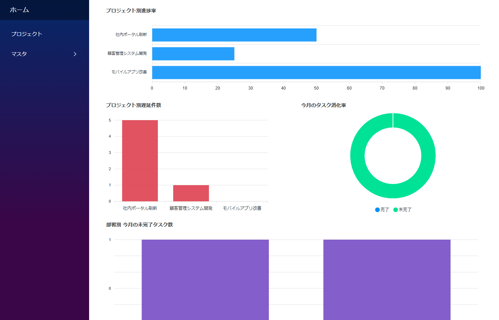
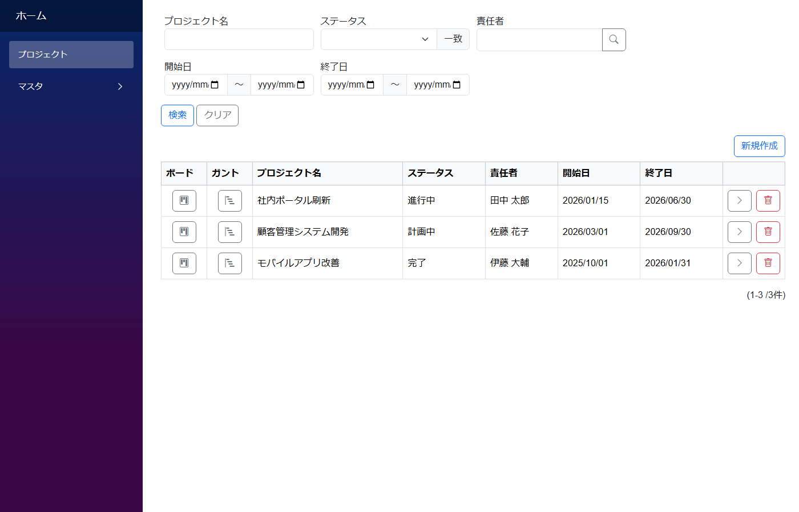
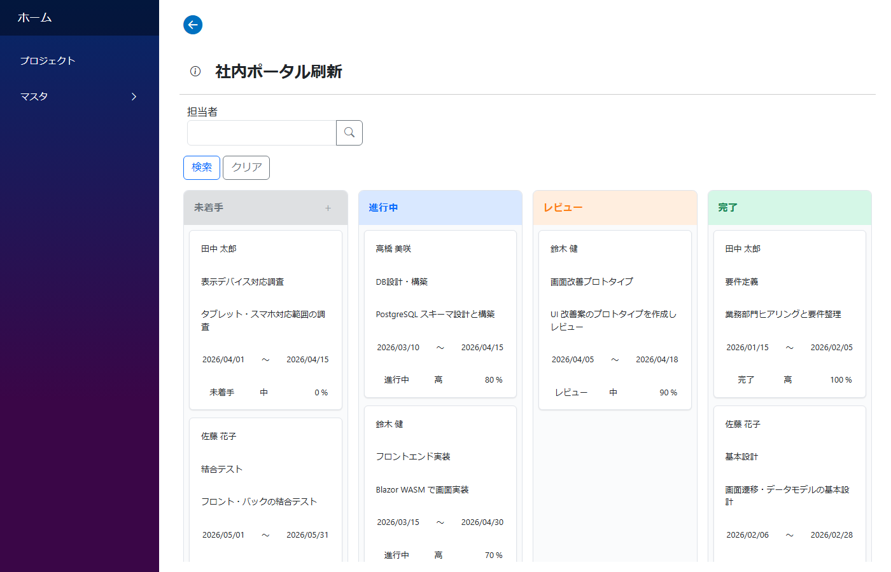
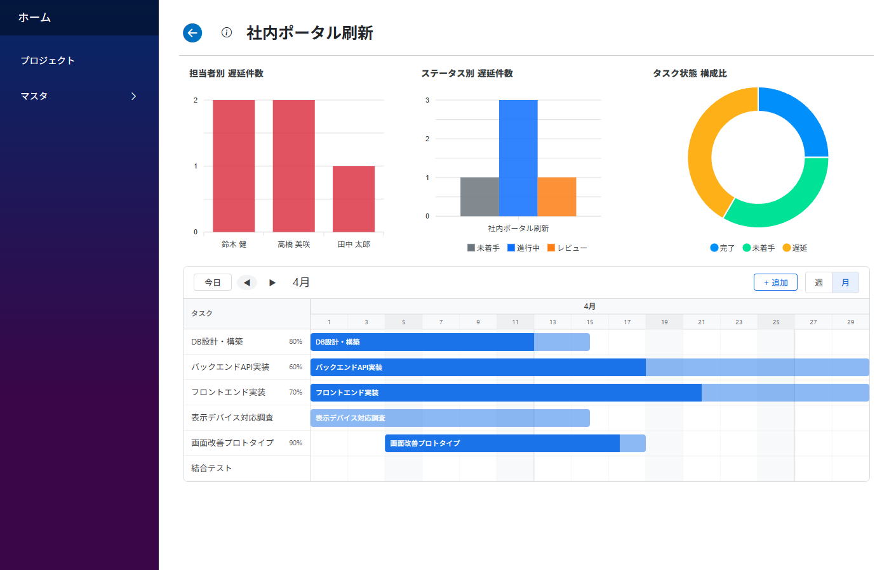

# プロジェクト管理テンプレート

中小規模のプロジェクトチームが、タスクの計画・進捗・負荷状況をひと目で把握できるようにするための雛形アプリ。一覧 / ガントチャート / タスクボード / ダッシュボード を一つのアプリにまとめたたたき台です。

内部名: `ProjectManagementTemplate`



---

## 画面構成

| メニュー | 用途 |
|---|---|
| ホーム | 進捗率・遅延件数・今月の消化率・部署別負荷を ApexCharts で可視化 |
| プロジェクト | プロジェクトの CRUD。詳細画面にメンバー・タスクを内包表示 |
| マスタ（メンバー / 部署） | 担当者情報・組織の部署マスタ |

ガント / タスクボード は **プロジェクト一覧の各行のボタン** から、対象プロジェクトに絞った状態で開きます（URL: `プロジェクトガント/{Id}`, `プロジェクトボード/{Id}`）。実装上は独立モジュールではなく、プロジェクトモジュールの **別 DetailLayout** として作られています。

### プロジェクト一覧（ボード／ガントへの導線）



### タスクボード



### ガントチャート



上部の 3 チャート（担当者別遅延件数 / ステータス別遅延件数 / タスク状態構成比）はガント画面でも常時表示され、期間バーのドラッグやカード編集と同じ自動保存サイクルで再読み込みされます。

---

## データモデル

組織側とプロジェクト側の 2 系統で 5 テーブル構成。

```
プロジェクト                ← プロジェクト名 / 期間 / ステータス / 責任者
　├ タスク                  ← タスク名 / 担当者 / 期間 / 進捗率 / ステータス / 優先度
　└ プロジェクトメンバー    ← 参加メンバー / 役割 / 参加日

メンバー                    ← 氏名 / メール / 役職 / 所属部署
部署                        ← 部署名
```

プロジェクトメンバーは「メンバー × プロジェクト」の多対多を解決する中間テーブル。

### 設計上のポイント

- **自動保存** — プロジェクト詳細・タスクボード・ガントの各画面では `AutoSubmitField` を組み込んでおり、フィールド編集後 300ms で自動保存（Submit ボタン操作不要）。タスクボードのドラッグ＆ドロップ、ガント上の期間ドラッグ、カード編集なども含めて自動保存され、保存完了後にダッシュボードのチャートも再読み込みされる
- **ガント・タスクボードは別レイアウト** — プロジェクトモジュールに 3 つの DetailLayout（標準 / ボード行 / ガント行）を持たせ、`OtherPageModuleDesigns` で URL とレイアウトを対応付け。1 つのテーブルで 3 種類のビューを切り替える構造

---

## 使い始める流れ

### 導入時

1. マスタでメンバー・部署を登録
2. プロジェクト画面で新規作成 → 参加メンバーとタスクを追加

### 日々の運用

- **進捗更新**: タスクボードでカードをドラッグしてステータスを変更。進捗率は自動連動
- **遅延・負荷の把握**: ホームのダッシュボードで遅延件数・今月の消化率・部署別負荷をチェック
- **スケジュール調整**: タスクガントで全体の期間バランスを確認

---

## カスタマイズのポイント

- 項目追加はデザイナ GUI から（コーディング不要）
- ステータス色・タスクボード列の定義は各モジュールの JSON に記述。会社の運用ルールに合わせて編集可能
- ApexCharts の種類（棒／円／折れ線）も差し替え容易

---

## 想定業種

タスクに「担当者」「期限」「進捗」がある業務なら業種を問わず適用可能。

| 業種 | 使用ケース |
|---|---|
| ソフトウェア開発・SIer | 開発案件の工程・タスク管理、リリーススケジュール可視化 |
| Web 制作・広告代理店 | 制作進行、クライアント別案件管理、納期管理 |
| コンサルティング | 複数顧客の案件並行管理、工数見える化 |
| 建設・不動産 | 工事案件のフェーズ管理、職人・業者の割当状況 |
| 製造業（設計・試作） | 設計タスク・試作工程のスケジュール管理 |
| 総務・情報システム部門 | 社内プロジェクト（DX 推進、システム入替等）の進行管理 |
| 研究・教育機関 | 研究プロジェクトのタスク割当、論文執筆スケジュール |
| 士業（会計・法務） | 顧問先ごとの案件・期限管理 |

規模感としては **5〜50 名程度のチーム、同時 10〜30 プロジェクト程度** に最適。

---

## 拡張ライブラリ

- **ApexCharts** — ダッシュボードのチャート（`Codeer.LowCode.Bindings.ApexCharts`）
- **Codeer.LowCode.Blazor.Extras** — ガントチャート・タスクボードフィールド

---

## 関連ドキュメント

- [業務テンプレート入口](templates.md)
- [アプリ作成パターン入口](../patterns/patterns.md)
- [多対多パターン](../patterns/many_to_many.md) — メンバー × プロジェクトの中間テーブル
- [ヘッダ詳細 (1:N) パターン](../patterns/header_detail.md) — プロジェクト＋タスクの作り方
- [自動保存パターン](../patterns/auto_save.md) — `AutoSubmitField` の使い方
