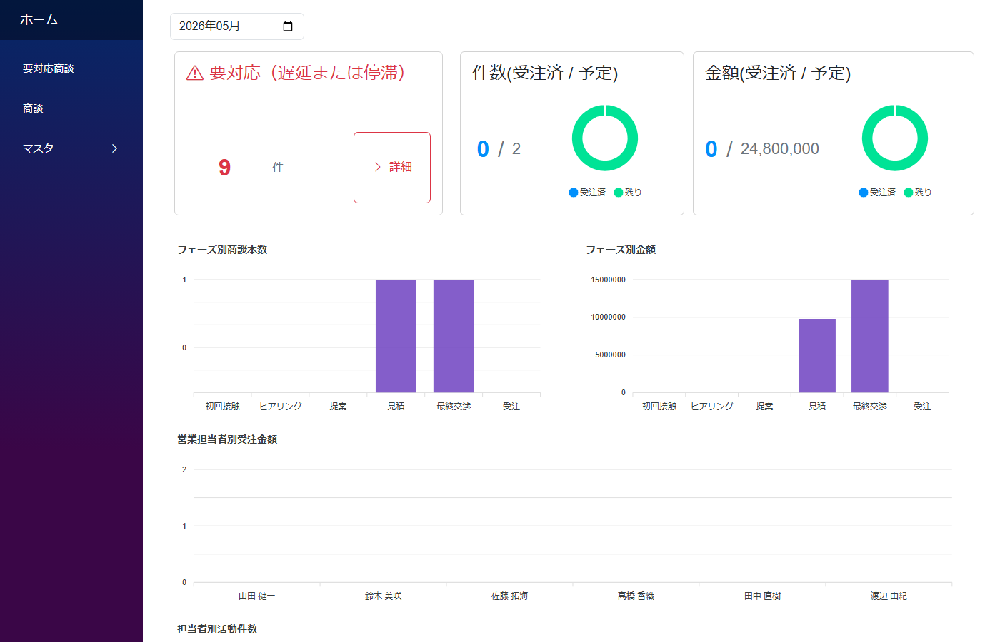
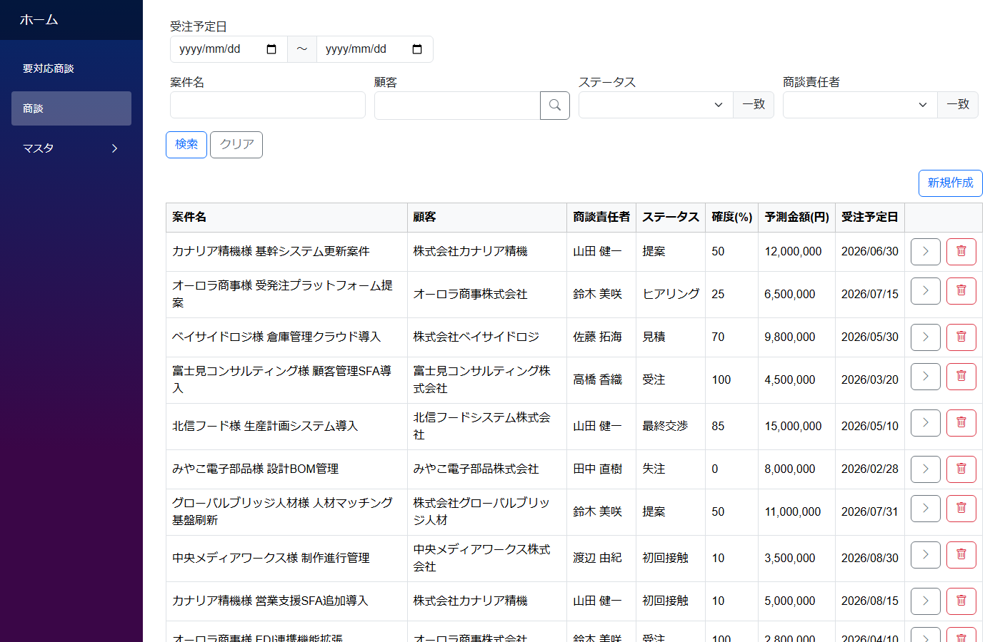

# 営業支援 (SFA) テンプレート

中小規模の営業組織が、商談の進捗と活動履歴を共有しつつ、パイプライン全体の健康度をひと目で把握できるようにするための雛形アプリ。Excel・SaaS から脱却する SFA（Sales Force Automation）のたたき台です。

内部名: `SFATemplate`



---

## 画面構成

| メニュー | 用途 |
|---|---|
| ホーム | 対象年月セレクタ + 要対応サマリー + KPI カード + フェーズ別パイプライン + 担当者別受注/活動グラフ |
| 要対応商談 | 基準日時点で「遅延（受注予定日超過）」または「停滞（30日以上活動なし）」の商談を抽出表示 |
| 商談 | 商談の CRUD。詳細画面に活動履歴を内包表示 + 活動履歴追加ダイアログ |
| マスタ（業種 / 顧客 / 営業担当者） | 業種マスタ、顧客（会社）+ 顧客担当者、自社の営業メンバー |

ホーム上部の **対象年月セレクタ** で月を切り替えると、配下の集計（KPI・パイプライン・受注金額・活動件数）が一斉に追従します。

### 商談一覧



---

## データモデル

商談を中心に、活動履歴で営業活動を時系列に記録する 6 テーブル構成。

```
商談 (deal)                 ← 案件名 / ステータス（フェーズ）/ 確度 / 予測金額 / 受注予定日 / 顧客 / 商談責任者
　└ 活動履歴 (activity)     ← 種別（訪問/電話/メール/Web会議）/ 活動日時 / 担当者 / やり取り相手（顧客担当者）/ 内容メモ

顧客 (customer)             ← 会社名 / 業種 / 住所 / 連絡先
　└ 顧客担当者 (contact)    ← 氏名 / 部署 / 役職 / 連絡先

業種 (industry)             ← 業種名
営業担当者 (salesperson)    ← 氏名 / 部署 / メール
```

### 設計上のポイント

- **活動履歴は商談に紐付く子モジュール** — 1 活動 = 1 相手（複数人とのやり取りは活動を分けるか、メモ欄に併記）
- **やり取り相手は商談の顧客で自動絞り込み** — 活動履歴の「やり取り相手」候補は、商談に紐付く顧客の担当者だけが出る（`商談Id.顧客Id.Value` のドット参照でフィルタ）
- **集計は Home、明細は各画面の役割分担** — 進行中商談・直近活動の単独リストはダッシュボードに置かず、商談一覧と詳細の活動履歴で代替する設計

---

## 使い始める流れ

### 導入時

1. マスタ準備: 営業担当者・業種を登録（業種は運用中も追加可能）
2. 顧客登録: 会社情報を登録 → 詳細画面で顧客担当者を追加

### 日々の運用

- **商談登録**: 顧客と商談責任者を選んで新規作成 → 保存後、詳細画面で活動履歴を追加
- **活動記録**: 商談詳細画面の「活動履歴追加」ボタンからダイアログを開いて、訪問・電話・メール等のログを記入 → 商談の登録ボタンで一括保存
- **要対応商談の確認**: メニュー「要対応商談」で、基準日時点で遅延・停滞の商談を一覧化
- **状況把握**: ホームのダッシュボードで対象年月を選択 → 要対応件数・KPI・パイプライン・営業担当者別受注を月単位で確認

---

## カスタマイズのポイント

- 項目追加はデザイナ GUI から（コーディング不要）
- フェーズ定義・色は商談モジュールの JSON に記述。自社の商談プロセスに合わせて編集可能
- ApexCharts の種類（棒／円／折れ線）も差し替え容易

---

## 想定業種

法人営業（BtoB）を行う組織であれば業種を問わず適用可能。

| 業種 | 使用ケース |
|---|---|
| BtoB SaaS / IT サービス | リード〜契約までの商談進行、フェーズ別パイプライン管理 |
| 製造業（営業部門） | 法人顧客への提案・見積〜受注の進捗管理 |
| 商社・卸 | 多取引先・多商品案件の並行進行管理 |
| コンサルティング | 提案フェーズの長い案件の状況可視化 |
| 人材紹介・派遣 | 法人クライアントごとの案件・進捗管理 |
| 不動産（法人向け） | 物件提案〜契約までの商談・連絡履歴の集約 |
| 広告・代理店 | クライアント別の提案案件、競合状況管理 |

規模感としては **営業 5〜30 名程度、同時 30〜100 商談程度** に最適。

---

## 関連ドキュメント

- [業務テンプレート一覧](templates.md)
- [アプリ作成パターン一覧](../patterns/patterns.md)
- [ヘッダ詳細 (1:N) パターン](../patterns/header_detail.md) — 顧客＋顧客担当者、商談＋活動履歴の作り方
- [マスタ参照（多対1）](../patterns/lookup.md) — 顧客 → 業種、商談 → 営業担当者などの参照
- [連動入力パターン](../patterns/input_patterns.md) — 商談の顧客に応じて顧客担当者の選択肢を絞り込む方式
