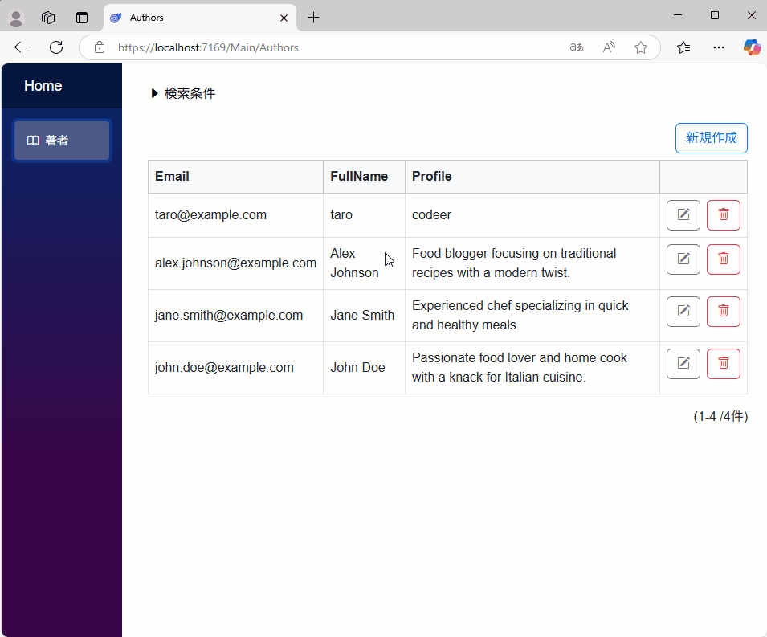
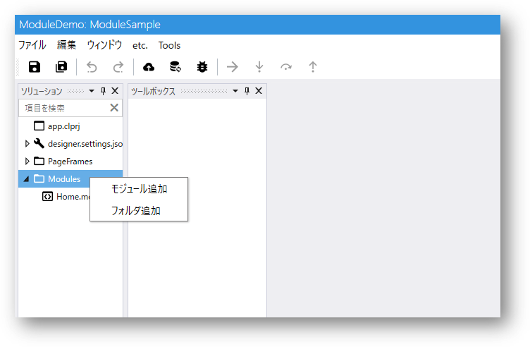
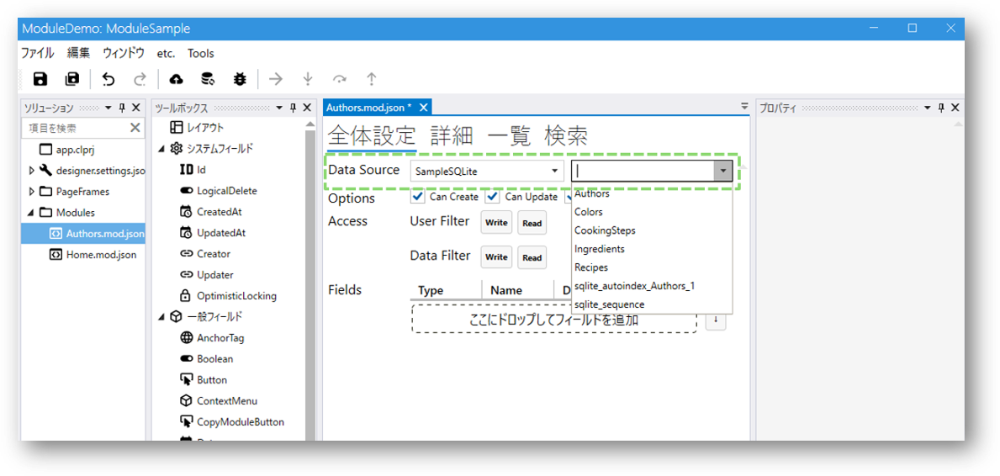
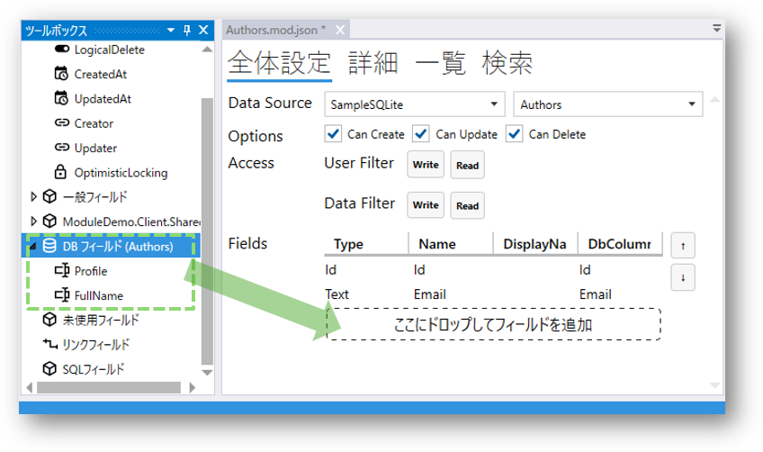
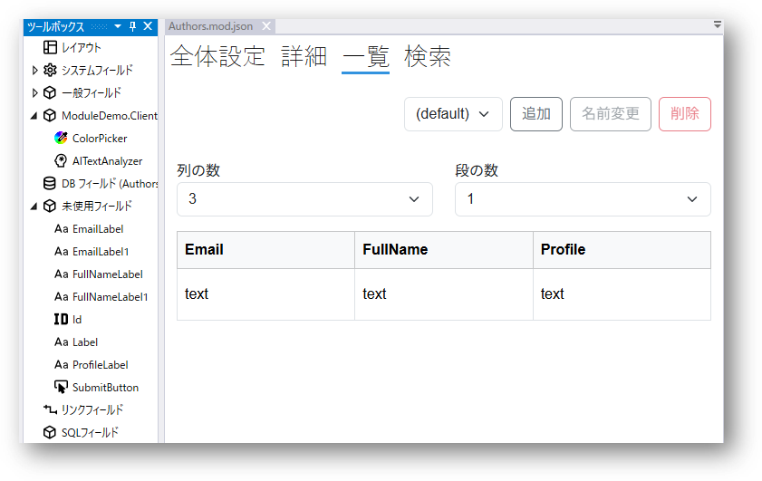
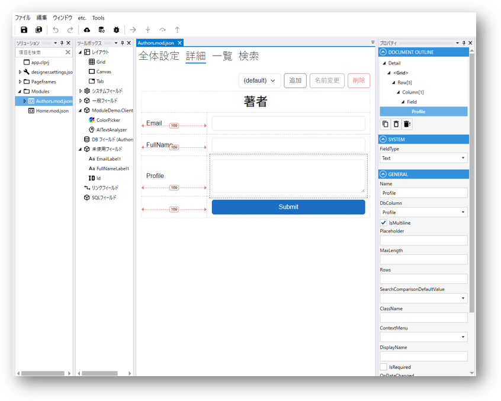
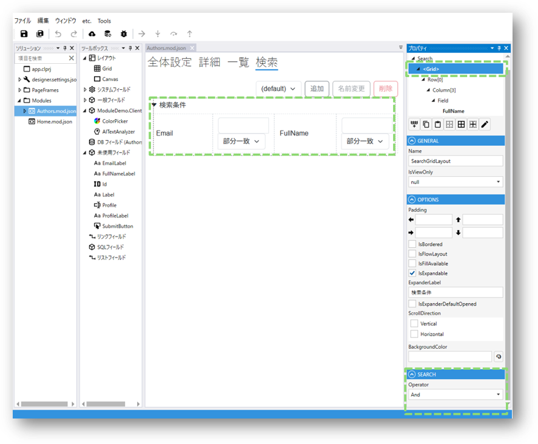
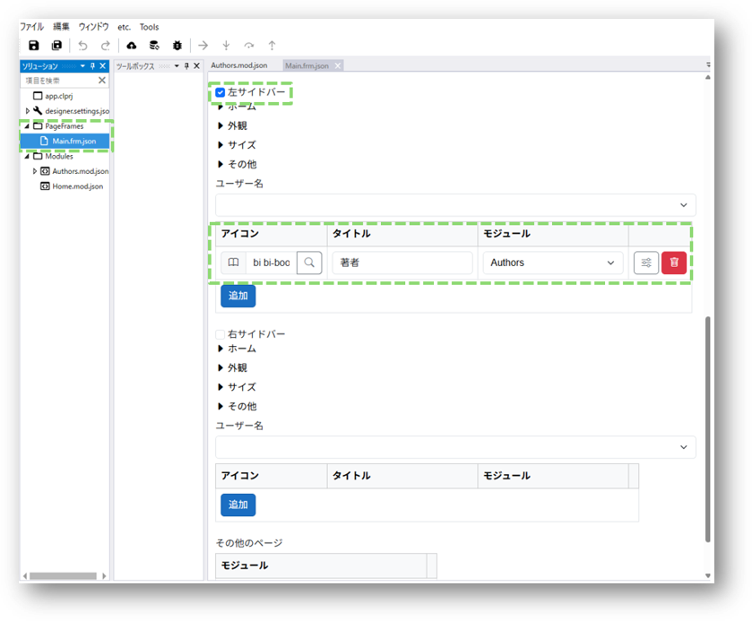

# はじめてのモジュール作成

**所要時間: 約 30 分**

[クイックスタート](quickstart.md)でサンプルを動かしたら、次は**自分で画面を作ってみる**ステップです。
DB テーブル 1 つに対応する、一覧・詳細・検索の 3 画面を作ります。

> 動画で見たい方: [Module の基本的な作成方法と DB への接続（YouTube）](https://youtu.be/q7U9tQPOYXI?si=QreIPnTPalT2e1k5)

---

## このチュートリアルで作るもの

1 つのテーブルに対して、以下が動く画面を作ります:

- **一覧画面** — テーブルのデータを一覧表示
- **詳細画面** — 追加・編集・削除のための入力フォーム
- **検索画面** — 一覧の上に表示される検索条件

完成形:

---

## 前提

- [クイックスタート](quickstart.md) を完了していること
- Data Source が設定されていること（サンプルプロジェクトには SQLite が同梱済み）

独自の DB を使う場合は、先に [designer.settings](../designer/designer_settings.md) で Data Source を登録してください。

---

## Step 1. モジュールを追加する

デザイナの `Module` フォルダを右クリックし、「モジュール追加」を選びます。
モジュール名を入力（例: `Customer`）して追加します。

---

## Step 2. Data Source を指定する

作成したモジュールをダブルクリックで開き、**全体設定**画面で Data Source を指定します。
対応するテーブル（または View）を選択します。

> テーブル一覧が出ない時は、ツールバーのボタンで Data Source 情報を更新してください。

---

## Step 3. DB フィールドをモジュールに追加する

Data Source を設定すると、**ツールボックス**に「DB フィールド」リストが表示されます。
このリストから、モジュールで使いたいカラムをドラッグ＆ドロップで `Fields` に追加します。

### Id について（重要）

**データの追加・更新・削除には、System Field の `Id` フィールドが必須**です。

- Id は名前を `Id` から変更できない
- **Id には 2 種類ある**:
  - **System Field の Id** — データ操作のキー（必須）
  - **一般 Field の Id 型** — 表示用など

DB カラムが `Id` という名前でない場合は、先に System Field の Id をツールボックスから追加し、その Id フィールドのプロパティで **対応する DB カラム**を指定してください。

Id の種類（DB 自動生成 / ユーザー入力 / 複合キー）は Id フィールドのプロパティで設定します。

→ 詳しく: [Id Field](../fields/Id.md) / [Field 全般](../fields/field.md)

---

## Step 4. 一覧画面を設定する

「一覧」タブに切り替え、**段**と**列**の数を決めます。
「未使用フィールド」から表示したいフィールドを一覧レイアウトへドラッグ＆ドロップします。

---

## Step 5. 詳細画面を設定する

「詳細」タブに切り替え、[レイアウト](../module/layout.md)を設定してフィールドを配置します。
詳細画面は**追加・編集ダイアログ**としても使われます。

レイアウトの詳しい使い方: [レイアウト](../module/layout.md) / [動画ガイド](../movies.md)

---

## Step 6. 検索画面を設定する

「検索」タブで検索条件を追加します。
一覧画面の上に検索ボックスが出るようになります。

複数条件を設定した場合、`And` / `Or` の組み合わせを事前に指定することも、ユーザーに選ばせることもできます。

---

## Step 7. PageFrame に登録する

作成したモジュールを、アプリの外枠である [PageFrame](../designer/page_frame.md) に登録します。
登録するとサイドバーにリンクが表示され、画面遷移できるようになります。

---

## Step 8. デプロイして動作確認

デザイナのツールバーのボタンで Web アプリに反映します。

一覧表示・検索・追加・編集・削除が、この時点ですべて動くはずです。
スクリプトは 1 行も書いていません。

---

## 次のステップ

ここまでで「DB と連動した基本画面」が作れました。次はよくあるパターンを学びます:

- [モジュール作成時の注意点](../Help/PointToNote_CreateModule.md) — Id の扱いなどで詰まる箇所の対策
- [レイアウト](../module/layout.md) — GridLayout / CanvasLayout / FlowLayout を使いこなす
- [スクリプト](../script/script.md) — ボタンクリックで処理を書く
- [Tips: 読み取り専用にする](../Examples/Tips_IsViewOnly.md)
- [Tips: Submit 時に処理を追加](../Examples/Tips_AddProcessingSubmit.md)

もっと高度な作成方法:

- [Excel から画面と DB を作る](../designer/import_module_from_excel.md)
- [既存 DB からモジュールを一括作成](../designer/import_modules_from_db.md)
- [AI でモジュールを作成](../ai/ai_modules.md)
