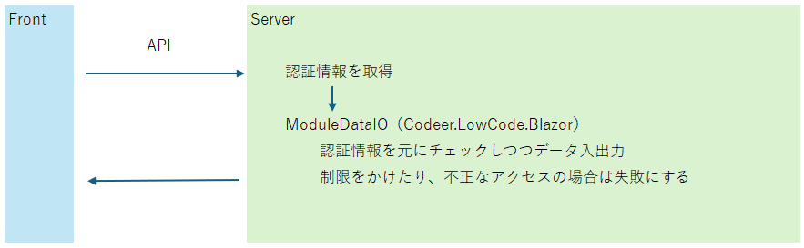
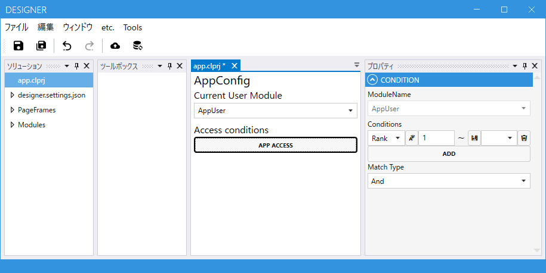
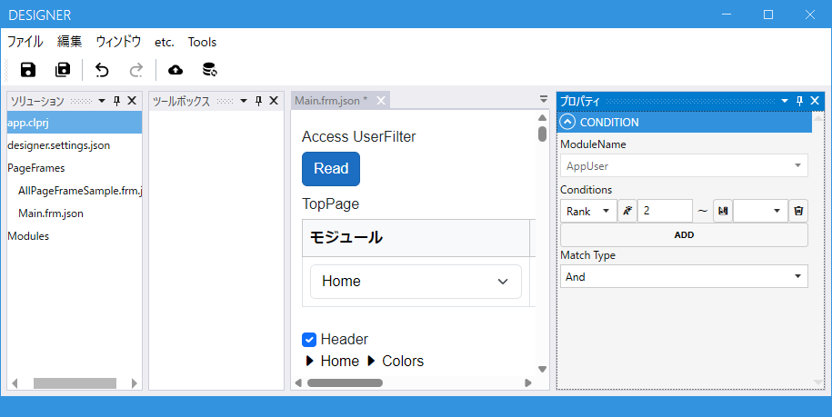
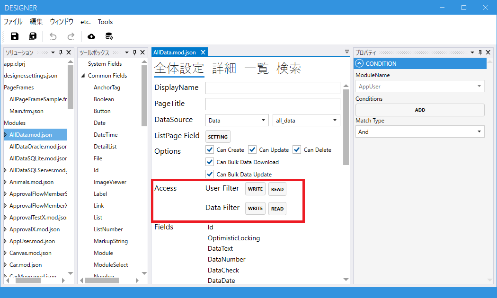
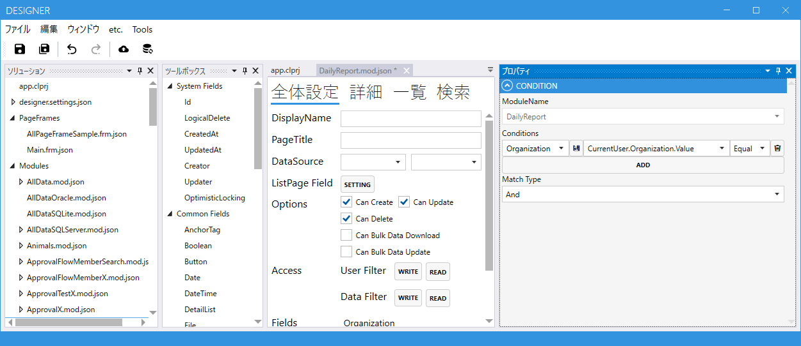

# チュートリアル: 認証を有効にする

**所要時間: 約 30 分**

業務アプリに必須の認証・認可を段階的に組み込みます。

- 認証 = **誰か**を特定する仕組み（ログイン）
- 認可 = **何ができるか**を制御する仕組み（アクセス権）

Codeer.LowCode.Blazor では、**認証はユーザーコード側**で実装し、**認可はデザイナで設定**します。認証は Cookie 認証や Azure Entra ID 認証のテンプレートが用意されています。



---

## 前提

- [はじめてのモジュール作成](first_module.md) を完了している
- プロジェクトを Cookie 認証または Azure Entra ID 認証のテンプレートで作成している
  （Visual Studio の新規作成時に選択）

---

## ステップの全体像

| ステップ | やること | 対象 |
|---|---|---|
| 1 | CurrentUserModule を作成 | ユーザー情報を保持するモジュール |
| 2 | app.clprj で CurrentUserModule を指定 | アプリ全体 |
| 3 | PageFrame に表示条件を設定 | 画面グループ単位 |
| 4 | Module にアクセス条件を設定 | モジュール単位 |
| 5 | データ単位のアクセス条件を設定 | 行単位 |

---

## Step 1. CurrentUserModule を用意する

**CurrentUserModule** は、ログイン中のユーザーの情報を持つ特別なモジュールです。
通常は `AppUser` のようなテーブルに対応させます。

### 最低限必要な Field

| Field | 役割 |
|---|---|
| **Id**（System Field） | ユーザーの一意キー |
| **UserName**（Text など） | 認証で使う ID |
| **Rank** など任意のカラム | 権限レベルの判定に使う |

Cookie 認証のテンプレートでは、`UserName` を ASP.NET Identity の `User.Identity.Name` と突き合わせて、該当ユーザーの行を特定します（ユーザーコード側の `ControllerExtensions` に実装済み）。

---

## Step 2. app.clprj で CurrentUserModule を指定する

デザイナで `app.clprj` を開き、**CurrentUserModule** に Step 1 で作ったモジュールを指定します。



### アプリ全体のアクセス制限

CurrentUserModule のさらに**条件**を設定することで、**アプリ全体のアクセス可能ユーザー**を絞れます。

例: `Rank >= 1` のユーザーだけアプリにアクセスできる

→ 条件を満たさないユーザーは、ログイン後であってもどのページ・どのデータにもアクセスできません。

---

## Step 3. PageFrame ごとのアクセス制限

[PageFrame](../designer/page_frame.md) ごとに**表示条件**を設定できます。



例: `Rank >= 2` のユーザーだけ `Main.frm` を表示できる

これは**画面グループ単位のアクセス制御**です。管理者向け画面グループと一般ユーザー画面グループを分ける、といった使い方をします。

---

## Step 4. Module ごとのアクセス制限

各 Module に以下 4 つの条件を設定できます。



| 条件 | 意味 |
|---|---|
| **UserRead** | このユーザーはデータを**読める**か |
| **UserWrite** | このユーザーはデータを**書き換えられる**か |
| **DataRead** | この**データ**を（このユーザーは）読めるか |
| **DataWrite** | この**データ**を（このユーザーは）書き換えられるか |

### UserRead / UserWrite — ユーザーによる制御

- `UserRead` が false のユーザー → このモジュールのデータにアクセスできない。サイドバーやヘッダのモジュールリストからも消える
- `UserWrite` が false のユーザー → 読めるが、追加・編集・削除ができない

例:
```
UserRead: true
UserWrite: CurrentUser.Rank >= 3
```
→ 誰でも見られるが、Rank 3 以上しか編集できない

---

## Step 5. データ単位のアクセス制限

同じモジュールでも、**行単位**で閲覧・編集可否を制御できます。



### DataRead — 行単位の読み取り制御

一覧に表示されるデータが、条件を満たす行だけに絞られます。

例（同一組織のデータのみアクセス可能）:
```
DataRead: CurrentUser.OrganizationId.Value == this.OrganizationId.Value
```

→ 他組織のデータは**存在しないかのように**扱われます。SelectField のプルダウンからも消えます。

### DataWrite — 行単位の書き込み制御

条件を満たさない行は**表示はできるが編集できない**状態になります。

例（自分が作成したデータのみ編集可能）:
```
DataWrite: CurrentUser.Id.Value == this.Creator.Value
```

---

## 認証まわりの実装（ユーザーコード）

認証そのものは ASP.NET の標準機能で、テンプレートが生成するユーザーコードに実装されています。
特別なカスタマイズが不要なら、テンプレートのまま使えます。

Cookie 認証のテンプレートには次のような実装が含まれます:

- `ModuleDataController` に `[Authorize, AutoValidateAntiforgeryToken]` が付与されている
- `ControllerExtensions.GetCurrentUserIdAsync` で `User.Identity.Name` から `AppUser.Id` を解決
- ログイン・ログアウト用の `AccountController`

→ 詳細: [認証・認可（リファレンス）](../authorization/authorization.md)

### 独自認証に差し替えたい場合

ユーザーコード側を書き換えることで、社内 SSO・JWT・OAuth2 など任意の認証方式に対応できます。Codeer.LowCode.Blazor が要求するのは「現在のユーザーの Id を返せること」だけです。

---

## デプロイして確認する

認証・認可の設定はデプロイ後にブラウザで次の順に確認します。

1. **ログアウト状態でアクセス** → ログイン画面に飛ぶ
2. **権限のないユーザーでログイン** → アプリ自体に入れない、または一部画面だけ表示される
3. **権限のあるユーザーでログイン** → すべて見える・編集できる
4. **他組織のデータが混在する状態** → 自分の組織のデータだけが出てくる

---

## つまずきやすいポイント

### Q. ログインはできるがアプリに入れない

`app.clprj` の CurrentUserModule に該当ユーザーの行があるかを確認します。`User.Identity.Name` に対応する行がないと、どこにもアクセスできません。

### Q. サイドバーのメニューが一部出ない

その Module の `UserRead` 条件を満たしていない可能性があります。条件式を見直すか、デバッグ目的で `UserRead: true` に戻して挙動を確認します。

### Q. 他組織のデータが見えてしまう

Module の `DataRead` を設定していないか、条件式が正しくないかです。`this.{カラム}.Value == CurrentUser.{カラム}.Value` の書き方を確認してください。

---

## 次に読む

- [認証・認可（リファレンス）](../authorization/authorization.md) — 詳細な設定項目
- [PageFrame](../designer/page_frame.md) — 画面構成の設定
- [app.clprj](../designer/app_clprj.md) — アプリ全体の設定
