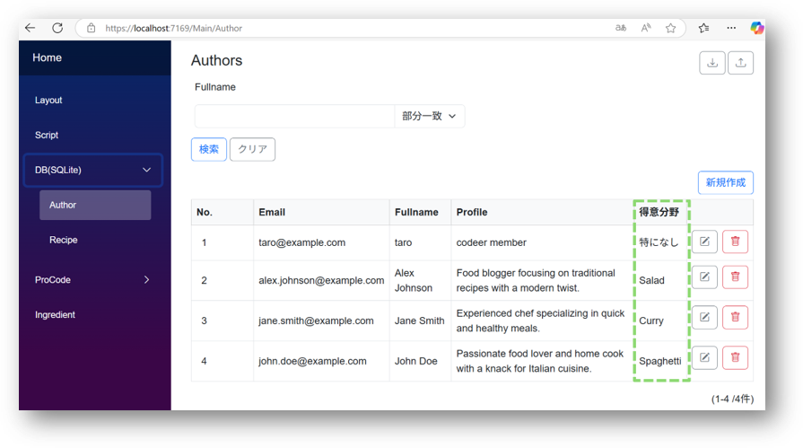
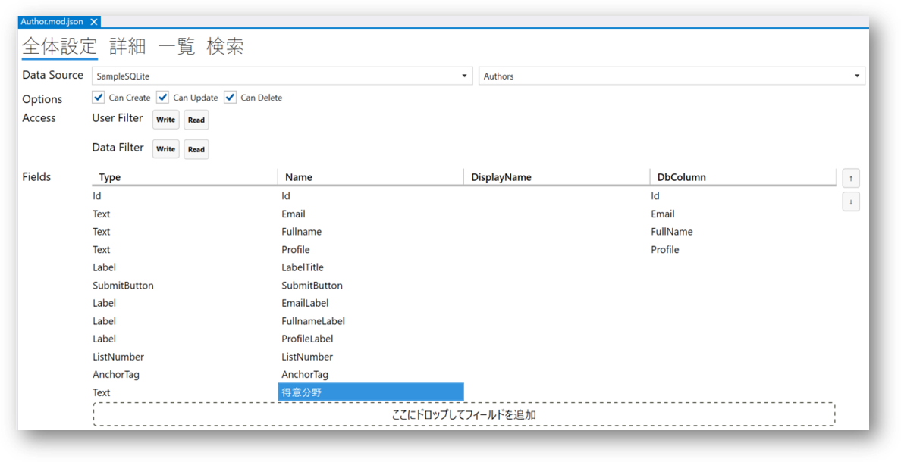
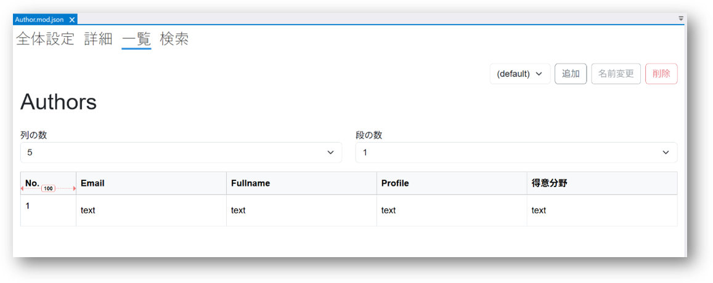
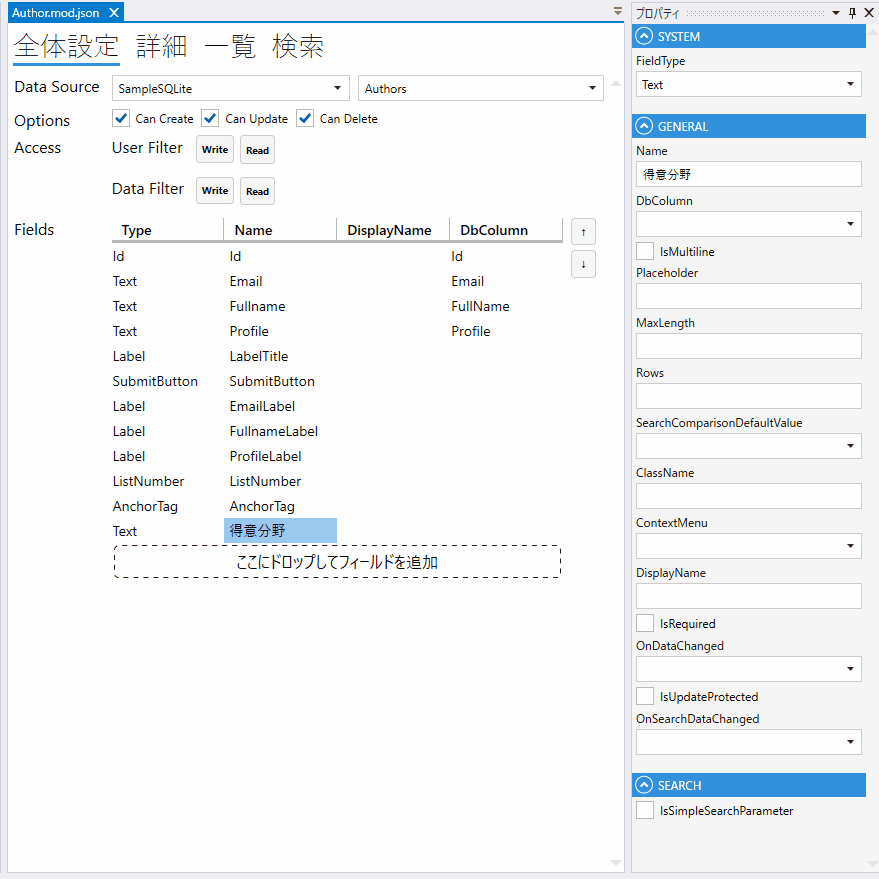
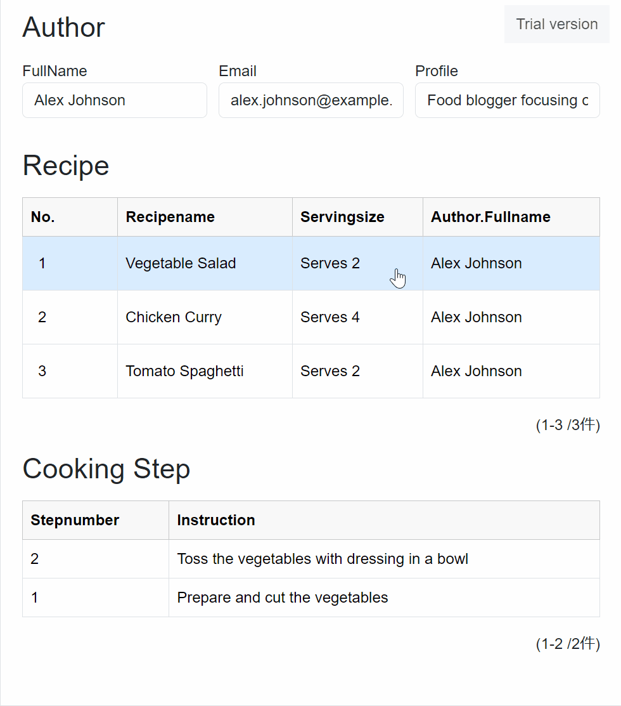
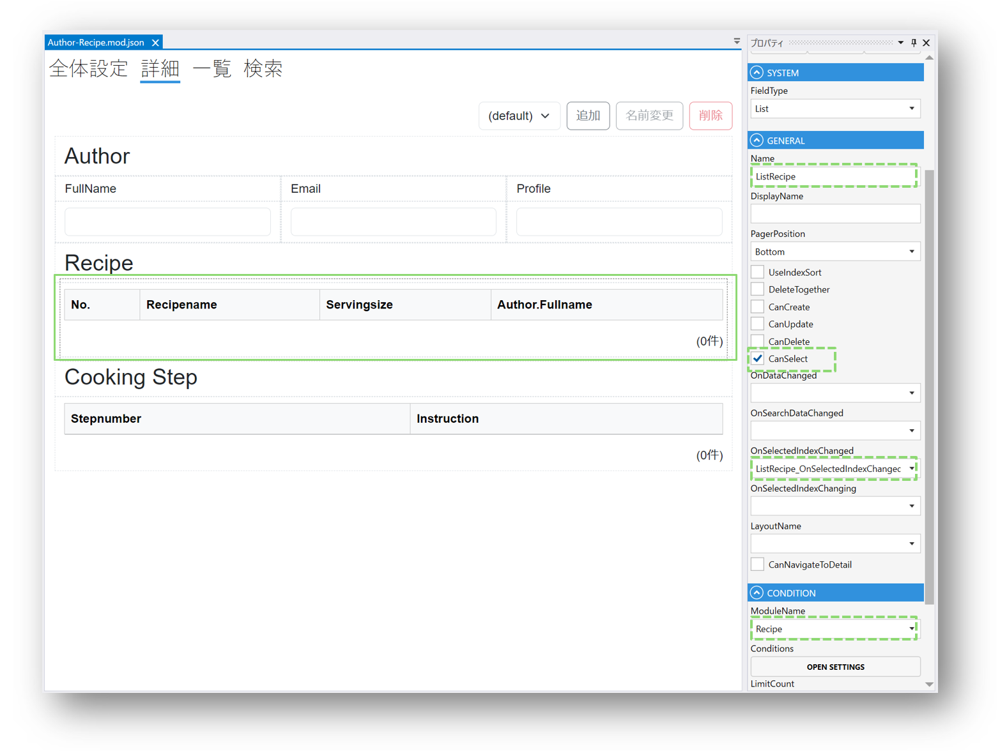
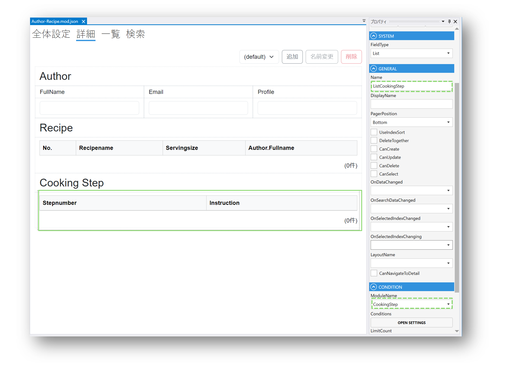
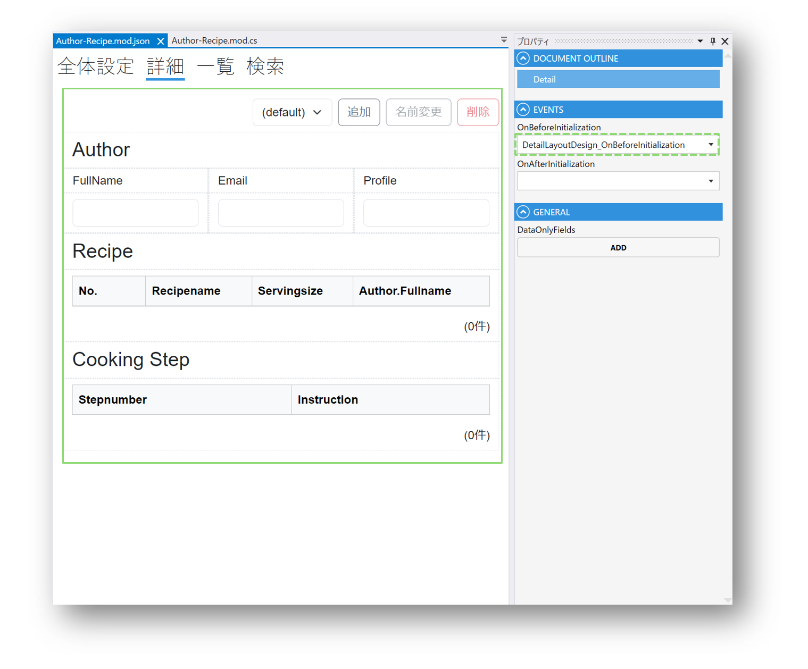

# チュートリアル: モジュール連携

**所要時間: 約 40 分**

実務で作るアプリは、たいてい複数のモジュールが絡み合います。
このチュートリアルでは以下の 3 パターンを段階的に試します。

1. **LinkField で他モジュールを参照**（ノーコード）
2. **ModuleSearcher でスクリプトから他モジュールを検索**
3. **2 つのリストを連動させる**（親のリストで選択 → 子のリストが絞り込まれる）

---

## 前提

- [はじめてのモジュール作成](../quickstart/first_module.md) を完了している
- [スクリプトの基本](tutorial_script.md) を一読している
- デザイナのテンプレートに含まれる `Author`・`Recipe`・`CookingStep` サンプルが使えること（別のモジュールでも代替可）

---

## Part 1. LinkField で他モジュールを参照する（ノーコード）

**シナリオ**: `Recipe` モジュールに `Author`（作者）への参照を持たせる。Recipe の編集画面で作者を選べるようにする。

### Step 1. Recipe モジュールを開く

### Step 2. LinkField を追加

ツールボックスから **LinkField** を Recipe モジュールの Fields にドロップします。
名前を `Author` とします。

### Step 3. 参照先モジュールを指定

LinkField のプロパティで:

- **ModuleName**: `Author`（参照したいモジュール）
- **DisplayField**: 表示に使う Author 側の Field（例: `Name`）
- **SearchLayoutName**: ダイアログで一覧する時の検索レイアウト

### Step 4. 詳細レイアウトに配置

Recipe の詳細画面に LinkField を配置すると、Author を選択するための**入力欄＋検索ダイアログボタン**が出ます。

→ より詳しい設定: [Link フィールド](../fields/Link.md)

---

## Part 2. ModuleSearcher でスクリプトから他モジュールを検索

**シナリオ**: `Author` モジュールの一覧に「得意分野」列を追加し、
その人の最新の `Recipe` のカテゴリを自動で引いてくる。



### Step 1. Author モジュールに TextField を追加

`Author` モジュールに `得意分野` という TextField を追加し、一覧画面にも配置します。




### Step 2. 一覧画面の OnAfterInitialization イベントを作成

一覧レイアウトのプロパティパネルから `OnAfterInitialization` イベントを新規作成します。



### Step 3. ModuleSearcher で検索するスクリプト

```csharp
void ListLayoutDesign_OnAfterInitialization()
{
    var category = "特になし";

    // Recipe モジュールを検索する
    var searcher = new ModuleSearcher<Recipe>();

    // Recipe.Author が現在の Author.Email と一致するものに絞る
    searcher.AddEquals(recipe => recipe.Author.Value, this.Email.Value);

    // 実行
    var recipeList = searcher.Execute();

    if (recipeList.Count > 0)
    {
        // 最初のレシピ名の 2 単語目を「得意分野」として扱う（例として）
        category = recipeList[0].Recipename.Value.Split(" ")[1];
    }

    this.得意分野.Value = category;
}
```

### Step 4. デプロイして確認

一覧を開くと、各 Author の行に「得意分野」が自動で入ります。

### ModuleSearcher のよく使うメソッド

| メソッド | 用途 |
|---|---|
| `AddEquals(x => x.Name.Value, "test")` | 完全一致 |
| `AddLike(x => x.Name.Value, "部分")` | あいまい検索 |
| `AddLessThan(x => x.Age.Value, 20)` | 未満 |
| `AddLessThanOrEqual(...)` | 以下 |
| `AddGreaterThan(...)` | より大きい |
| `AddGreaterThanOrEqual(...)` | 以上 |
| `OrderBy(x => x.Ranking.Value)` | 昇順ソート |
| `OrderByDescending(...)` | 降順ソート |
| `AddConditions(anotherSearcher)` | 別の Searcher の条件をまとめて追加 |

複数の `Add*` 条件は AND で結ばれます。OR 検索にしたい場合は `IsOrMatch = true` を設定します。

---

## Part 3. 2 つのリストを連動させる

**シナリオ**: `Recipe` リストで行を選択すると、その Recipe に紐付く `CookingStep` だけが隣のリストに出る。



### Step 1. 2 つのリストを 1 画面に配置

親画面となる詳細レイアウトに、`Recipe` と `CookingStep` の 2 つの ListField を並べて配置します。




### Step 2. 初期ロードを止める（子リスト）

画面を開いた瞬間に子リストが全件ロードされないよう、初期化の段階で `AllowLoad = false` にします。



レイアウトの `OnBeforeInitialization` イベントで:

```csharp
void DetailLayoutDesign_OnBeforeInitialization()
{
    // Recipe が選択されるまで CookingStep リストはロードしない
    ListCookingStep.AllowLoad = false;
}
```

### Step 3. Recipe の選択に応じて子リストを絞り込む

Recipe の ListField の `OnSelectedIndexChanged` イベントを作成:

```csharp
void ListRecipe_OnSelectedIndexChanged()
{
    // ロードを許可
    ListCookingStep.AllowLoad = true;

    // 選択された Recipe の Id を取得
    var selectedRecipeId = ListRecipe.Rows[ListRecipe.SelectedIndex].Id.Value;

    // CookingStep.RecipeId が一致するものだけに絞る
    var searcher = new ModuleSearcher<CookingStep>();
    searcher.AddEquals(steps => steps.Recipeid.Value, selectedRecipeId);

    // 条件を適用してリロード
    ListCookingStep.SetAdditionalCondition(searcher);
    ListCookingStep.Reload();
}
```

### Step 4. デプロイして確認

Recipe の行をクリックすると、その Recipe の CookingStep だけが右側に表示されます。

---

## ここまでで学んだ連携パターンのまとめ

| やりたいこと | 推奨パターン |
|---|---|
| 参照先モジュールを選ばせる | **LinkField**（ノーコード） |
| 参照先モジュールのデータを計算に使う | **ModuleSearcher** で検索 |
| 画面上のリストを動的に絞り込む | **SetAdditionalCondition + Reload** |
| 他画面に遷移する | `NavigationService.NavigateTo(...)` |
| 他モジュールのメソッドを呼ぶ | `new OtherModule().メソッド()`（public なスクリプト関数） |

---

## 次に読む

- [チュートリアル: 認証を有効にする](tutorial_auth.md) — ログイン・権限を入れる
- [Link フィールド（リファレンス）](../fields/Link.md)
- [ListField（リファレンス）](../fields/List.md)
- [スクリプト概要](../overview/script.md)
