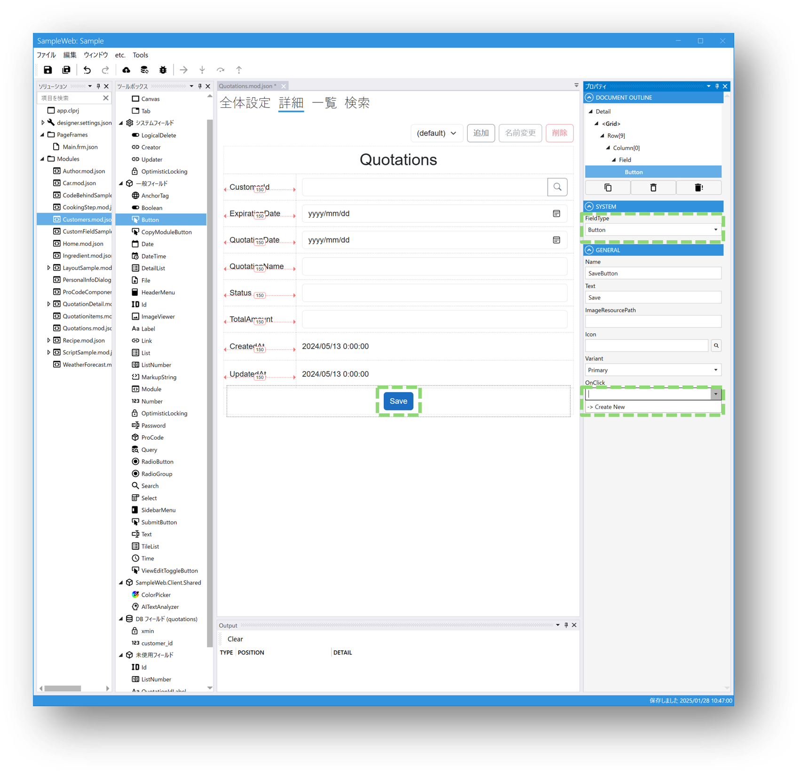
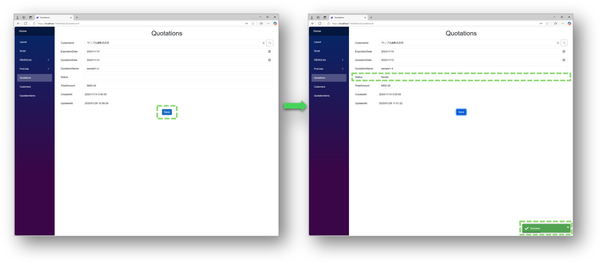

# チュートリアル: スクリプトの基本

**所要時間: 約 30 分**

[はじめてのモジュール作成](first_module.md)で、**1 行もスクリプトを書かずに** CRUD 画面が動くことを確認しました。
ここでは、画面に「一手間」を加えるためのスクリプトの書き方を学びます。

---

## このチュートリアルで覚えること

- **どこにスクリプトを書くか**（イベントハンドラの作り方）
- **Field の値を読み書きする**
- **Submit の前後に処理を挟む**
- **メッセージ表示・バリデーションエラー**
- **Toaster / MessageBox / Logger の使い分け**

---

## 前提

- [はじめてのモジュール作成](first_module.md)を完了している
- 何らかのモジュールに詳細画面があり、Submit ボタン（または Button フィールド）が配置されている

---

## Step 1. ボタンの OnClick にスクリプトを書く

1. デザイナで Button フィールドを選択します
2. 右側のプロパティパネルで **OnClick** イベントの「新規作成」を押します
3. スクリプト編集画面が開きます



まずは一番シンプルに、クリックでトースト通知を出してみます。

```csharp
void SaveButton_OnClick()
{
    Toaster.Success("ボタンが押されました");
}
```

デプロイして Web アプリでボタンを押すと、右下に通知が表示されます。

---

## Step 2. Field の値を読み書きする

Field はモジュールの中で**名前で直接参照**できます。`{フィールド名}.Value` で値を取得・設定します。

```csharp
void SaveButton_OnClick()
{
    // Status フィールドが空なら "Saved" を入れる
    if (string.IsNullOrEmpty(Status.Value))
    {
        Status.Value = "Saved";
    }

    Toaster.Success($"Status = {Status.Value}");
}
```

**ポイント**:

- Field 名は**デザイナで設定した名前**（Name プロパティ）がそのまま識別子になる
- `.Value` でプリミティブな値を読み書きできる
- C# とほぼ同じ構文、補間文字列 `$"..."` も使える

---

## Step 3. Submit と組み合わせる

ボタンで独自処理を走らせたあと、標準の Submit（登録・更新）も呼びたい場合は `Submit()` を呼びます。
戻り値で成功・失敗を判定できます。



```csharp
void SaveButton_OnClick()
{
    // 事前処理: 空なら既定値を入れる
    if (string.IsNullOrEmpty(Status.Value))
    {
        Status.Value = "Saved";
    }

    // 標準の Submit を実行
    if (await Submit())
    {
        Toaster.Success("保存しました");
    }
    else
    {
        Toaster.Error("保存に失敗しました");
    }
}
```

**ポイント**:

- `Submit()` は非同期メソッドなので **`await` をつける**
- 戻り値は `bool`（DB 保存に成功したかどうか）
- 失敗時は画面上の Field に自動でバリデーションエラーが表示される

---

## Step 4. 事前バリデーションを追加する

Submit を呼ぶ前に自分で条件をチェックしたい場合は、`ValidateInput()` や自前の判定を組み合わせます。

```csharp
void SaveButton_OnClick()
{
    // 必須チェック
    if (string.IsNullOrEmpty(Name.Value))
    {
        await MessageBox.Show("名前を入力してください");
        return;
    }

    // Module 全体の標準バリデーションも実行
    if (!await ValidateInput())
    {
        return;  // 失敗時は画面上にエラー表示されるので return だけでよい
    }

    if (await Submit())
    {
        Toaster.Success("保存しました");
    }
}
```

---

## Step 5. メッセージ系 API の使い分け

よく使うメッセージ系 API は 3 種類あります。

| API | 特徴 | いつ使う |
|---|---|---|
| `Toaster.Success(...)` / `Error(...)` / `Warn(...)` | 画面右下に一時的に表示（非ブロッキング） | 操作の結果通知、エラー報告 |
| `MessageBox.Show(...)` | モーダルダイアログ（ユーザーが OK を押すまで待つ） | 確認・警告 |
| `Logger.Log(...)` / `Error(...)` / `Warn(...)` | ブラウザの開発者ツールに出力（画面には出ない） | デバッグ |

```csharp
Toaster.Success("完了しました");      // 数秒で消えるトースト
await MessageBox.Show("よろしいですか？"); // await 必須、戻り値 string で押したボタン取得可
Logger.Log("デバッグ情報: " + Name.Value); // 開発者ツールの Console へ
```

---

## Step 6. よく使うパターン集

### 画面遷移

```csharp
NavigationService.NavigateTo("ModuleA/List");
```

### 他モジュールからデータ取得

```csharp
var searcher = new ModuleSearcher<Customer>();
searcher.AddEquals(c => c.Email.Value, this.Email.Value);
var customers = searcher.Execute();

if (customers.Count > 0)
{
    this.CustomerName.Value = customers[0].Name.Value;
}
```

→ 詳しくは [モジュール連携チュートリアル](tutorial_modules.md)

### Field の表示制御

```csharp
PasswordField.IsVisible = !IsViewOnly;
SubmitButton.IsEnabled = ValidateInput();
```

---

## スクリプトでできること / できないこと

| できる | できない |
|---|---|
| Field の読み書き・表示切替 | 画面の DOM 要素を直接触る |
| Module 単位の CRUD | クライアント側でのファイル I/O |
| WebAPI 呼び出し | DB に対する生 SQL 実行（→ [ExecuteSql フィールド](../db/execute_sql_field.md)） |
| Excel/PDF の生成 | |
| 他モジュールのデータ検索 | |

どうしてもできないことは[プロコード](../overview/procode.md)で拡張します。

---

## トラブルシューティング

### Q. `await` を付け忘れてエラー

非同期メソッド（`Submit()`, `MessageBox.Show()`, `ValidateInput()` など）は必ず `await` を付けます。
メソッド名に `Async` が付いていなくても、戻り値が `Task` ならすべて対象です。

### Q. スクリプト内で Field 名の補完が効かない

イベントハンドラの命名規則は **`{FieldName}_{EventName}`** です。例えば `SaveButton` の OnClick なら `SaveButton_OnClick` にすると、スコープ内で Field 名が参照できます。

### Q. ボタンを押しても何も起きない

- デプロイしたか（ボタン）
- ブラウザの開発者ツールで JavaScript エラーが出ていないか
- `Logger.Log("click")` を仕込んで実行経路を確認

---

## 次に読む

- [チュートリアル: モジュール連携](tutorial_modules.md) — 他モジュールのデータを参照・絞り込み
- [スクリプト概要](../script/script.md) — 入口・学ぶ順番
- [スクリプト構文リファレンス](../script/script_syntax.md) — 構文・型変換・名前解決
- [組み込みサービスとテンプレート由来サービス](../script/script_services.md) — API 一覧
- [スクリプトデバッガ](../script/script_debugger.md) — スクリプトをステップ実行
