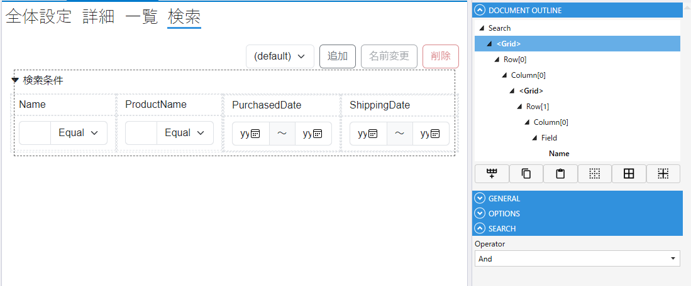
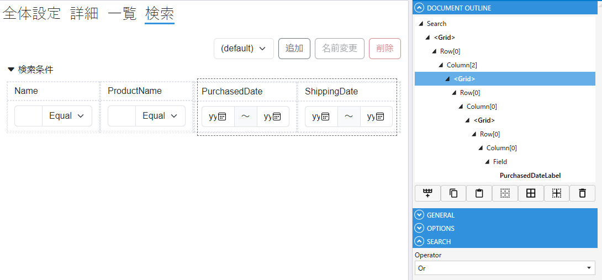
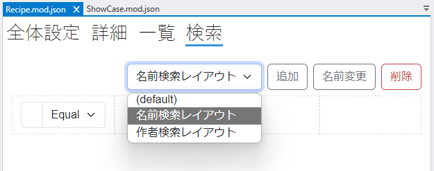

# チュートリアル: 検索を作り込む

**所要時間: 約 30 分**

[はじめてのモジュール作成](first_module.md) で基本的な検索は作れました。
このチュートリアルでは、実務でよく必要になる検索のカスタマイズを扱います。

- 複数条件の And / Or 組み合わせ
- 検索条件の初期値
- 検索実行時の独自処理
- 複数の検索レイアウト（簡易・詳細）を切り替え

---

## 前提

- [はじめてのモジュール作成](first_module.md) を完了
- 検索タブに複数の Field を配置済み

---

## Part 1. And / Or の使い分け

Grid 単位で検索条件の結合方法を切り替えられます。プロパティパネルで設定します。

| 設定 | 挙動 |
|---|---|
| **And 検索** | Grid 内のすべての条件を満たす（既定） |
| **Or 検索** | いずれかの条件を満たす |
| **ユーザー指定** | 画面上でユーザーが And / Or を選ぶ |

### 複雑な条件の組み方

Grid を**入れ子**にすると、AND / OR を組み合わせられます。

**例**: `(Name AND ProductName) AND (PurchaseDate OR ShippingDate)`

1. 外側 Grid を And にして `Name` と `ProductName` を配置
2. 外側 Grid の中に内側 Grid を追加
3. 内側 Grid を Or にして `PurchaseDate` と `ShippingDate` を配置




→ 詳しく: [モジュール検索設定](../module/module_search.md)

---

## Part 2. 検索条件に初期値を設定する

画面を開いた時点で、検索条件に**既定値を入れておく**ことができます。
よく使うのは「過去 1 ヶ月のデータだけ表示」といった初期フィルタです。

### Step 1. SearchLayout の OnSearchInitialization イベントを作成

1. Document Outline で Search レイアウト（またはその中の Grid）を選択
2. プロパティパネルの **OnSearchInitialization** を新規作成

### Step 2. スクリプトで初期値を設定

```csharp
void SearchLayoutDesign_OnSearchInitialization()
{
    // Date フィールドの範囲を「過去 1 ヶ月」に
    QuotationDate.SearchMin = DateOnly.FromDateTime(DateTime.Today.AddMonths(-1));
    QuotationDate.SearchMax = DateOnly.FromDateTime(DateTime.Today);

    // Text フィールドに初期値
    QuotationName.SearchValue = "sample1";

    // Boolean フィールドの初期値
    IsActive.SearchValue = true;
}
```

### ポイント

- Field の検索値は `SearchValue` / `SearchMin` / `SearchMax` / `SearchIsEmpty` に代入
- 型は各 Field の値型に準じる（Date → `DateOnly?`、Number → `decimal?` など）
- **画面表示時に一度だけ呼ばれる**

---

## Part 3. 検索実行時に独自処理を挟む

SearchField の **OnSearched** を使うと、検索が実行された後に処理を挟めます。

### 用途例

- 検索件数をバーに表示
- 検索結果をさらに別の処理に渡す
- ログ記録

### Step 1. SearchField の OnSearched を作成

SearchField のプロパティパネルから `OnSearched` を新規作成。

### Step 2. スクリプトで処理

```csharp
void Search_OnSearched()
{
    // 検索結果の件数をラベルに表示
    ResultCountLabel.Text = $"{List.TotalCount} 件ヒット";

    // 件数が 0 なら警告
    if (List.TotalCount == 0)
    {
        Toaster.Warn("該当するデータがありません");
    }
}
```

---

## Part 4. 複数の検索レイアウトを使い分ける

### シナリオ

- 一覧画面の上は **簡易検索**（名前だけ）
- 「詳細検索」ボタンでダイアログに **詳細検索** レイアウトを表示

### Step 1. 検索タブで追加レイアウトを作成

「＋」ボタンで `simple` と `advanced` の 2 つのレイアウトを作ります。



### Step 2. SearchField で使うレイアウトを指定

- 一覧画面上の SearchField → `LayoutName: simple`
- 詳細検索ダイアログ用の SearchField → `LayoutName: advanced`

### Step 3. 詳細検索ボタンからダイアログを開く

```csharp
void AdvancedSearchButton_OnClick()
{
    // Search モジュールの「advanced」レイアウトをダイアログで開く
    var searcher = new Order();
    searcher.LayoutName = "advanced";
    await searcher.ShowDialog();
}
```

---

## Part 5. URL パラメータで検索条件を共有する

検索条件を URL に反映すると、**ブックマーク・共有 URL から検索結果を再現**できます。

### 設定

SearchField のプロパティで:

- **UserUrlParameter**: `true`
- **SearchUrlParameterKey**: `q`（URL での検索キー名）
- **PageIndexUrlParameterKey**: `p`

例: `https://app/orders?q=user:yamada&p=2`

ユーザーがこの URL をブックマークすれば、同じ検索結果をすぐ開き直せます。

---

## よく使う SearchField API

| API | 用途 |
|---|---|
| `Search.SearchModule.XxxField.Value = ...` | 検索条件を直接設定 |
| `await Search.ExecuteSearch()` | プログラム的に検索を実行 |
| `await Search.ExecuteClear()` | 検索条件をクリア |
| `Search.Condition` | 現在の検索条件（ModuleSearcher として） |

---

## 次に読む

- [モジュール検索設定](../module/module_search.md)
- [SearchField リファレンス](../fields/Search.md)
- [チュートリアル: モジュール連携](tutorial_modules.md)
