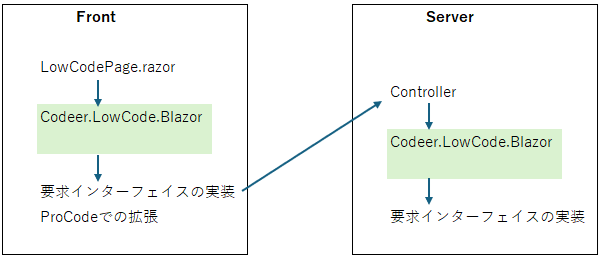
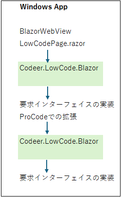
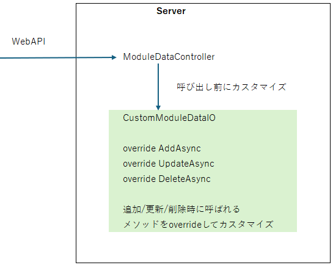

# ユーザーコード

## 全体像
簡略化した全体像です。[テンプレート](https://marketplace.visualstudio.com/items?itemName=Codeer.LowCodeBlazor)を使ってプロジェクトを作成するとユーザーコードの部分も出力されます。
ユーザーコードのLowCodePage.razorがCodeer.LowCode.BlazorのLowCodePageComponentを使ってDesignerでの設定を元に画面を構築します。Codeer.LowCode.Blazorではサーバーへの通信など一部は実装要求のインターフェイスとなっていてそれが処理中にコールバックされます。サーバーへ要求を送ると受け口はユーザーコードで定義したControllerでそこからCodeer.LowCode.Blazorのクラスに渡されてこちらでも設定に沿ってDBなどのデータソースにアクセスして結果をフロントに返します。WinFormsやWPFのクライアントサーバーアプリの場合はWebAPIを使わずに同一インスタンスの中でデータアクセスのロジックが呼び出されます。これはユーザーコードの実装が変わるだけでCodeer.LowCode.Blazorのライブラリの処理は同じものです。このユーザーコードの部分をカスタマイズすることでプロジェクト毎の要件を満たすことができます。

Webアプリ 

Windowsアプリ（クライアントサーバー） 

## プロコードでの拡張
コードビハインド/Pageの実装/Componentの実装/スクリプトAPIの追加 で拡張することができます。
[こちら](../overview/procode.md)を参照お願いします。

## 要求インターフェイス
※それぞれの実装の詳細はテンプレートから出力されるコードを参考にしてください。

### Front
フロントエンドでは以下のインターフェイスを実装して渡します。
| インターフェイス | 説明 |
|----|-----|
| IAppInfoService  | アプリケーションの情報を提供するサービス。|
| IModuleDataService | モジュールデータのサービス。データの取得、更新を行います。|
| INavigationService | 画面遷移を管理するサービス。異なるページ間の移動を制御します。|
| IUIService | ユーザーインターフェース関連のサービス。ダイアログの表示、通知の送信などのUI操作を提供します。|
| ILogger | ログのサービス。|

## Server
サーバーサイドでは以下のインターフェイスを実装して渡します。
| インターフェイス | 説明 |
|----|-----|
| IAuthenticationContext | 認証情報 |
| IDbAccessor | DBアクセス処理 |
| ITemporaryFileManager | テンポラリファイル管理 |

またインターフェイスではないですが ModuleDataIO はカスタマイズすることができる重要なクラスです。テンプレートでは CustomizedModuleDataIO という継承したクラスでカスタマイズしています。
| クラス | 説明 |
|----|-----|
| ModuleDataIO | データの入出力処理の処理を担当。これをカスタマイズすることによってデータ変更履歴を残すこともできる。（テンプレートコードの初期実装でもデータ変更履歴を保存する機能が実装されています。）|

CustomizedModuleDataIOカスタマイズポイント 

