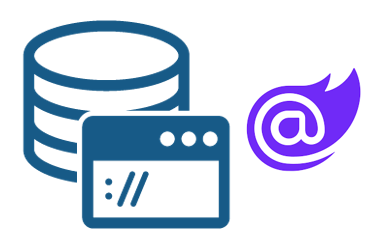

# Codeer.LowCode.Blazor

Codeer.LowCode.Blazor は、**Blazor アプリにローコード機能を組み込むためのライブラリ**です。
デザイナで画面やデータモデルを設定し、ホットリロードで Web アプリに即反映できます。

[サンプルギャラリー](https://lowcodedemo.azurewebsites.net/) ・ [YouTube チュートリアル](https://youtu.be/MchuOxWYR1o?si=7I9FfQB55dP9ctY-) ・ [製品ページ](https://www.codeer.co.jp/LowCode)

---

## 目的別の入り口

| あなたの状況 | 最短ルート |
|---|---|
| **まず何ができるか知りたい** | → [Codeer.LowCode.Blazor とは](JP/introduction/what_is_lowcode.md) |
| **とりあえず動かしてみたい** | → [クイックスタート（10 分）](JP/quickstart/quickstart.md) |
| **段階的に力をつけたい** | → [チュートリアル](#3-チュートリアル段階的に学ぶ) |
| **特定の機能の作り方を知りたい** | → [ガイド](#4-ガイド目的別の作り方) |
| **全仕様を引きたい** | → [リファレンス](#5-リファレンス全仕様) |
| **困っている / 動かない** | → [トラブルシューティング](JP/Help/troubleshooting.md) |

---

## 1. はじめに

Codeer.LowCode.Blazor を触り始める前に、全体像を掴むためのセクションです。

- [Codeer.LowCode.Blazor とは](JP/introduction/what_is_lowcode.md) — できること・3 つの開発スタイル・対応 DB
- [コア概念](JP/introduction/concepts.md) — PageFrame / Module / Field / Layout / Script の関係
- [入手とライセンス](JP/introduction/installation.md) — Visual Studio 拡張のインストール・ライセンス種別
- [オプション: VS Code を使う](JP/overview/vscode.md) — Visual Studio の代わりに VS Code で開発・ビルド・発行

---

## 2. クイックスタート

サンプル入りプロジェクトを最短で動かして感触をつかむセクションです。

- [クイックスタート（10 分）](JP/quickstart/quickstart.md) — サンプル入りプロジェクトを作成して Web で動かす

---

## 3. チュートリアル（段階的に学ぶ）

クイックスタートの次の一歩。**上から順番に**手を動かしていけば、少しずつ機能を使いこなせるようになります。

1. [はじめてのモジュール作成（30 分）](JP/tutorials/first_module.md) — DB と連動した CRUD 画面を作る
2. [モジュール連携](JP/tutorials/tutorial_modules.md) — LinkField・ModuleSearcher・2 つのリストの連動
3. [検索を作り込む](JP/tutorials/tutorial_search.md) — And/Or の組合せ・初期値・複数レイアウト・URL 連動
4. [スクリプトの基本](JP/tutorials/tutorial_script.md) — ボタンイベント・Field 操作・メッセージ表示・バリデーション
5. [Excel 帳票と PDF 出力](JP/tutorials/tutorial_excel_pdf.md) — テンプレートで帳票を作り、PDF に変換
6. [WebAPI 連携](JP/tutorials/tutorial_webapi.md) — 外部 API・カスタム Controller・JsonObject
7. [認証を有効にする](JP/tutorials/tutorial_auth.md) — CurrentUserModule・アプリ/画面/モジュール/データ単位の認可

---

## 4. ガイド（目的別の作り方）

「こういうことをやりたい」から逆引きで読めるセクションです。

### アプリ作成パターン (デザインパターン集)

- [アプリ作成パターン入口](JP/patterns/patterns.md) — PatternShowcase テンプレートを起点にした各種パターンのインデックス
- [データ構造のパターン](JP/patterns/data_shape.md) — 単一CRUD / ヘッダ詳細 / マスタ参照 / 多対多 / ツリー / 双方向ID持ち合い / 状態遷移 / 履歴 / 論理削除 / システムフィールド

### モジュールの作り方

- [基本的な作成方法と DB 接続](JP/designer/create_module_with_db_simple.md)
- [モジュール作成時の注意点](JP/Help/PointToNote_CreateModule.md)
- [Excel から画面と DDL を作成](JP/designer/import_module_from_excel.md)
- [既存 DB からモジュールを一括作成](JP/designer/import_modules_from_db.md)
- [AI でモジュールを作成](JP/ai/ai_modules.md)

### データベース活用

- [Query フィールド](JP/db/query_field.md) — カスタム SQL で一覧を作る
- [ExecuteSql フィールド](JP/db/execute_sql_field.md) — 任意の SQL を実行する

### スクリプトでよくやること（Tips）

- [Text フィールドを読み取り専用にする](JP/Examples/Tips_IsViewOnly.md)
- [AnchorTag のサイズ調整](JP/Examples/Tips_AnchorTagSizeSetting.md)
- [Label の位置調整](JP/Examples/Tips_LabelPositionSetting.md)
- [検索条件に初期値を設定](JP/Examples/Tips_SearchCriteriaInitialValueSetting.md)
- [Submit 時に処理を追加](JP/Examples/Tips_AddProcessingSubmit.md)
- [ModuleSearcher で他モジュールにアクセス](JP/Examples/Tips_ModuleSearcher.md)
- [リスト同士の連携](JP/Examples/DoubleList.md)
- [メールを送信する](JP/Examples/SendingMail.md)

### 認証・認可

- [認証 / 認可の概要](JP/authorization/authorization.md)

### AI 連携

- [AI 概要](JP/ai/ai_overview.md)
- [AI を使うための設定](JP/ai/ai_setup.md)
- [AITextAnalyzerField](JP/ai/AITextAnalyzerField.md)
- [AI でクエリを作成](JP/ai/ai_query.md)
- [Claude Code でデザインプロジェクトを編集](JP/ai/claude_code_designer.md)

### プロコード拡張

- [プロコード概要](JP/overview/procode.md)
- [ユーザーコード](JP/user_code/user_code.md)

### 見た目・スタイル

- [CSS](JP/look_and_feel/css.md)
- [カスタムスタイル](JP/look_and_feel/custom_styles.md)
- [Fluent Design](JP/look_and_feel/fluent_design.md)
- [Material Design](JP/look_and_feel/material_design.md)

### デプロイ

- [Visual Studio ソリューション構成とデプロイ](JP/overview/vs_projects.md)
- [デプロイフォルダ](JP/overview/deploy_folder.md)
- [Web サーバーへのデプロイ](JP/overview/server_deploy.md)

### テスト

- [PageObject のエクスポート（自動テスト）](JP/designer/export_pageobject.md)

### 困ったとき

- [トラブルシューティング](JP/Help/troubleshooting.md) — 症状から逆引きで対処を探す

### サードパーティ UI ライブラリとの連携

- [MudBlazor サンプル](https://lowcodedemo.azurewebsites.net/MudBlazor/MudBlazorHome)
- [Radzen.Blazor サンプル](https://lowcodedemo.azurewebsites.net/RadzenBlazor/RadzenBlazorHome)
- [IgniteUI サンプル](https://lowcodedemo.azurewebsites.net/Bootstrap/ChartSample)

---

## 5. リファレンス（全仕様）

項目ごとに詳しく引くためのセクションです。

### デザイナ

- [デザイナ概要](JP/designer/designer.md)
- [app.clprj](JP/designer/app_clprj.md) — アプリ全体のプロジェクト設定
- [designer.settings](JP/designer/designer_settings.md) — Data Source 等の設定
- [PageFrame](JP/designer/page_frame.md) — アプリの外枠
- [モジュールページ種別](JP/designer/page_types.md) — ListToDetail / List / Detail / Auto の使い分け
- [デザイナのカスタマイズ](JP/designer/designer-customize.md)
- [検索コンポーネントのカスタマイズ](JP/designer/designer-match-customize.md)

### モジュール

- [Module 概要](JP/module/module.md)
- [全体設定](JP/module/module_general.md)
- [詳細設定](JP/module/module_detail.md)
- [一覧設定](JP/module/module_list.md)
- [検索設定](JP/module/module_search.md)
- [Document Outline と Property パネル](JP/module/DocumentOutline.md)
- [データモデルと Module の関係](JP/data_model/data-model.md)

### レイアウト

- [レイアウト（Grid / Canvas / Flow）](JP/module/layout.md)

### Field（入力・表示部品）

- [Field 概要・System Field](JP/fields/field.md)
- [Field 共通プロパティ](JP/fields/common_properties.md)

#### 入力系

- [TextField (テキスト)](JP/fields/Text.md) — 文字列入力（1 行／複数行）
- [NumberField (数値)](JP/fields/Number.md) — 数値・スライダー・桁数制限
- [BooleanField (ブール)](JP/fields/Boolean.md) — チェックボックス／スイッチ／トグル
- [DateField (日付)](JP/fields/Date.md) — 日付のみ
- [DateTimeField (日時)](JP/fields/DateTime.md) — 年月日＋時刻
- [TimeField (時刻)](JP/fields/Time.md) — 時刻のみ
- [PasswordField (パスワード)](JP/fields/Password.md) — パスワード（PasswordHash と組み合わせ）
- [FileField (ファイル)](JP/fields/File.md) — ファイルアップロード

#### 選択系

- [SelectField (セレクト)](JP/fields/Select.md) — プルダウン
- [RadioGroupField (ラジオボタングループ)](JP/fields/RadioGroup.md) — ラジオ選択値の本体
- [RadioButtonField (ラジオボタン)](JP/fields/RadioButton.md) — RadioGroup 内の選択肢
- [LinkField (リンク)](JP/fields/Link.md) — 他モジュールを検索ダイアログで選択

#### 表示系

- [LabelField (ラベル)](JP/fields/Label.md) — 見出し・キャプション
- [AnchorTagField (アンカータグ)](JP/fields/AnchorTag.md) — ハイパーリンク
- [IdField (ID)](JP/fields/Id.md) — 主キー／外部キー
- [ImageViewerField (画像表示)](JP/fields/ImageViewer.md) — 画像表示
- [MarkupStringField (マークアップストリング)](JP/fields/MarkupString.md) — HTML 直接表示

#### 構造系

- [ListField (リスト)](JP/fields/List.md) — テーブル形式
- [DetailListField (詳細リスト)](JP/fields/DetailList.md) — カード形式
- [TileListField (タイルリスト)](JP/fields/TileList.md) — タイル形式
- [ListNumberField (リスト番号)](JP/fields/ListNumber.md) — 行番号列
- [ListPagingField (ページ送り)](JP/fields/ListPaging.md) — ページャーを独立配置
- [ModuleField (モジュール)](JP/fields/Module.md) — 他モジュールの埋め込み
- [SearchField (検索)](JP/fields/Search.md) — 検索バー

#### 操作系

- [ButtonField (ボタン)](JP/fields/Button.md) — クリックでスクリプト実行
- [SubmitButtonField (サブミットボタン)](JP/fields/SubmitButton.md) — 標準の登録・更新
- [AutoSubmitField (自動サブミット)](JP/fields/AutoSubmit.md) — 変更を自動で保存
- [CopyModuleButtonField (モジュールコピーボタン)](JP/fields/CopyModuleButton.md) — データをコピーして新規作成
- [ViewEditToggleButtonField (閲覧編集切り替えボタン)](JP/fields/ViewEditToggleButton.md) — 閲覧／編集モードのトグル
- [ContextMenuField (コンテキストメニュー)](JP/fields/ContextMenu.md) — 右クリックメニュー

#### メニュー系（PageFrame 連携）

- [HeaderMenuField / SidebarMenuField](JP/fields/PageFrameMenu.md) — カスタムヘッダー／サイドバーモジュール内で使用

#### 特殊

- [ProCodeField (プロコード)](JP/fields/ProCode.md) — 独自 Blazor コンポーネント埋込
- [OptimisticLockingField (楽観ロック)](JP/fields/OptimisticLocking.md) — 楽観ロック用 System Field

#### DB 系（DB 操作に特化）

- [QueryField (Query)](JP/db/query_field.md) — 任意の SELECT 文の結果を画面で扱う
- [ExecuteSqlField (ExecuteSql)](JP/db/execute_sql_field.md) — INSERT/UPDATE/ストアド等を指定タイミングで実行
- [JsonField (JSON)](JP/db/json_field.md) — 複数値を JSON 文字列としてまとめて 1 列に保存

### スクリプト

- [スクリプト概要](JP/script/script.md) — 入口・どこに書くか・学ぶ順番
- [スクリプト構文リファレンス](JP/script/script_syntax.md) — 構文・型変換・名前解決
- [組み込みサービスとテンプレート由来サービス](JP/script/script_services.md) — Logger / NavigationService / Toaster / WebApiService / Excel など
- [ModuleSearcher / BatchSearcher](JP/script/script_module_searcher.md) — 他モジュールの検索
- [スクリプトの拡張](JP/script/script_extend.md) — `AddType` / `AddService` で独自サービスを足す
- [スクリプトデバッガ](JP/script/script_debugger.md)

### プロジェクト構成

- [概略](JP/overview/overview.md)
- [Visual Studio ソリューション構成](JP/overview/vs_projects.md)
- [ユーザーコード](JP/user_code/user_code.md)

### ライセンス登録詳細

- [ライセンスについて（種別と登録方法の全体）](JP/overview/about_license.md)
- [オンライン登録](JP/overview/license_online_registration.md) / [オフライン登録](JP/overview/license_web_registration.md)
- [Windows CLI 登録](JP/overview/licence_windows_cli_registration.md) / [Linux 登録](JP/overview/license_linux_registration.md)
- [ドメインライセンス登録](JP/overview/domain_license_registration.md) / [解除](JP/overview/domain_license_cancellation.md)
- [LicenseRegister アプリ](JP/overview/license_license_register_application.md)

---

## 6. リリースノート

- [破壊的変更一覧](JP/breaking_changes/breaking_changes.md)

---

## 動画

- [動画ガイド一覧](JP/movies.md)

---

## ライセンス情報

Codeer.LowCode.Blazor のライセンスは以下の通りです。

- **試用版**: 評価目的のみ 30 日間無料
- **商用利用**: 開発・本番運用ともにライセンス購入が必要
- **コミュニティ利用**: 申請により無償ライセンス発行（[Codeer](https://www.codeer.co.jp/LowCode) へお問い合わせ）

詳細:

- [ソフトウェアライセンス契約書（原本・英語）](https://www.nuget.org/packages/Codeer.LowCode.Blazor/1.0.9/License)
- [日本語版](JP/LicenseJP.md)（※英語版と齟齬がある場合は英語版が優先）
- [ライセンス種別と登録方法の全体](JP/overview/about_license.md)

ご購入・お問い合わせ: [codeer.co.jp/LowCode](https://www.codeer.co.jp/LowCode)
