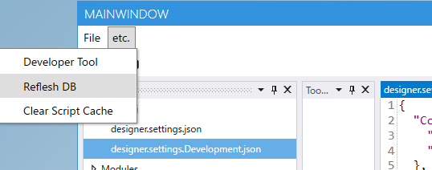

# Codeer.LowCode.Blazer

## Codeer.LowCode.Blazer とは

## Getting Started

## Tutorial

## デザイナー
- UIの作成
  - ドラッグアンドドロップでUIを作成

## デプロイ
- Local
- Cloud

## データベース
### 開発時
- デザイナーの `app.cfprj` > `designer.settings.Development.json` に定義
```json
{
"ConnectionStrings": {
"Main": "Server=xxx.postgres.database.azure.com;Database=sample;Port=5432;Username=scott;Password=tiger;",
"SampleSQLite": "Data Source=C:\\Codeer.LowCode.Local\\Data\\sqlite_sample.db;Version=3;"
}
```
設定後，にRefresh DB を実行後，デザイナーで選択可能



### 実行時
- Solution > appsettings.json > appsettings.Developement.json に定義

### production環境
- 環境変数で設定


## コンセプト
### modules

### system fields
- LogicalDelete
- UpdatedAt
- Creator
- CratedAt
- Updater
- UpdatedAt
- OptimisticLock

### common fields
- Anchor Tag
- ApprovalFlow
- Boolean
- Button
- Date
- DateTime
- DetailList
- File
- Id
- ImageViewer
- Label
- Link
- List
- MarkupString
- Number
- OptimisticLocking
- Password
- Select
- Text
- Time

#### 1 : N 
- List
- DetailList
#### file
```sql
CREATE TABLE temporary_files (
    id bigint GENERATED BY DEFAULT AS IDENTITY,
    guid uuid NOT NULL,
    created_date_time timestamp without time zone NULL,
    CONSTRAINT pk_temporary_files PRIMARY KEY (id)
);
```
### メニューの設定方法 
- PageFrames > MainPageFrame.frame
 
  - Title
    - '/' で区切ることで階層表示を設定できる
  - Layout
    - T.B.D
  - Module
    - メニュークリック後のmoduleを選択する
  - LayoutType
    - List 一覧画面を表示する
    - Detail 詳細画面を表示する
